# FounderBlaze

> **An entire company — distilled into seven AI services.**

FounderBlaze is an **application** where solo founders chat with an **entrypoint AI agent** that analyzes the request and **delegates** to specialized multi-agent pipelines — promo videos, product demos, competitor reports, investor outreach packs, Reddit engagement playbooks, production-ready brand kits, and desktop/mobile UI appkit packs. Pipelines run on **Genblaze**, deliverables land on **Backblaze B2**, and the same catalog is exposed over **A2MCP** jobs plus a real **MCP** tool server.

This is not a template library. **This is an ENTIRE collection of non-engineering departments — automated — for the one-person billion-dollar company era.**

---

## Table of Contents

1. [Important Links](#important-links)
2. [The Problem](#the-problem)
3. [The Solution — FounderBlaze](#the-solution--founderblaze)
4. [Genblaze — Pipeline Runtime](#genblaze--pipeline-runtime)
5. [Backblaze B2 — Artifact Storage](#backblaze-b2--artifact-storage)
6. [Entrypoint Agent and MCP Server](#entrypoint-agent-and-mcp-server)
7. [Platform Architecture](#platform-architecture)
8. [Service 1 — Promo Video](#service-1--promo-video)
9. [Service 2 — Automated Product Demo](#service-2--automated-product-demo)
10. [Service 3 — Social Listening](#service-3--social-listening)
11. [Service 4 — Outreach](#service-4--outreach)
12. [Service 5 — Competitor Research](#service-5--competitor-research)
13. [Service 6 — Brand Kit](#service-6--brand-kit)
14. [Service 7 — App Kit](#service-7--app-kit)
15. [Universal API Reference](#universal-api-reference)
16. [Conclusion](#conclusion)

---

## Important Links

| Resource | Link |
|----------|------|
| **Demo Video** | |
| **Live product URL** | |

---

## The Problem

Picture this.

It is 11:47 PM on a Tuesday. You are the founder. You are also the CEO, the product manager, the engineer, the designer, the brand studio, the researcher, and — whether you signed up for it or not — **the entire company**.

You just shipped something you are genuinely proud of. The product works. Early users love it. You know, in your bones, that this could be big. But you still need to look real, get found, and raise — and there is nobody else on payroll to do it.

So you open seventeen tabs.

One tab is Canva, where you are squinting at a logo that looks like it was made in 2011. Another is a competitor's landing page — slick, confident, with a demo video that makes *their* mediocre product look revolutionary. A third tab is a spreadsheet of investors you found on Crunchbase at 2 AM last week, half of them wrong, none of them with verified contact info. A fourth is Reddit, where someone in r/SaaS is literally asking for exactly what you built — and you have no idea how to reply without sounding like a spam bot.

You need a promo video. You need a product demo. You need to know who your competitors are and how you stack up. You need a brand identity that does not embarrass you on Product Hunt. You need UI mockups that look like a real product, not wireframes from 2014. You need investor outreach materials that do not read like they were generated by a tired intern. You need to find the conversations happening *right now* where your product is the answer.

A funded startup throws $15,000 a month at an agency and gets all of this. You have $47 in your business account and whatever is left of your sanity.

---

### The One-Person Billion-Dollar Company Is Not a Fantasy Anymore

We are living through a structural shift in how companies get built.

AI collapsed the cost of writing code. No-code tools collapsed the cost of design. Cloud infrastructure collapsed the cost of scale. The result is a new archetype: **the solo founder who builds, ships, and scales a product that would have required a 20-person team five years ago.**

Pieter Levels runs multiple seven-figure products alone. Indie hackers routinely hit $10K MRR with zero employees. The phrase "solopreneur" stopped being a lifestyle blog keyword and started being a legitimate business model — one that VCs are now actively funding.

But here is the cruel asymmetry: **building got cheap. Looking real, getting distributed, and raising did not.**

The grunt work of running a company without a team — brand, UI, demos, competitive intel, community, investor outreach — still eats weeks of a solo founder's calendar. Every hour spent making a demo video is an hour not spent talking to users. Every hour spent manually scraping competitor pricing pages is an hour not spent fixing the bug that is causing churn.

Solo founders are winning on product. They are losing on **everything that is not code**.

They do not need another SaaS dashboard. They do not need another "AI writing assistant" that outputs generic LinkedIn posts. They need **the operational output of an entire company** — research reports, videos, brand assets, UI mocks, outreach packs — delivered on demand, without hiring, without retainers, without the 6-week agency timeline.

That gap is exactly what FounderBlaze exists to close.

---

## The Solution — FounderBlaze

**FounderBlaze is an entire company for solo founders — an app plus an entrypoint AI agent that routes work to seven specialized multi-agent services.**

From your product URL to a polished promo video. From a natural-language script to a narrated screen recording of your live app. From a brand name and a two-sentence brief to a downloadable ZIP of logos, fonts, colors, and social banners. From a product name and idea to desktop + mobile UI mock screens styled to that brand. From your website and revenue spreadsheet to an investor intelligence report with verified contacts. From your product category to a five-competitor analysis with SWOT, pricing matrices, and positioning maps. From your landing page to a curated list of Reddit threads with draft responses ready to post.

**A to Z. One platform. Seven services. Zero headcount.**

---

### What FounderBlaze Does (High Level)

| Service | What You Get |
|---------|--------------|
| **Promo Video** | AI-generated promotional video from your product URL |
| **Automated Product Demo** | Narrated screen recording following your script |
| **Social Listening** | Reddit thread discovery + draft engagement comments (PDF) |
| **Outreach** | Investor intelligence report from website + revenue data |
| **Competitor Research** | Full competitor analysis report (PDF) |
| **Brand Kit** | Complete brand identity ZIP (logos, fonts, colors, assets) |
| **App Kit** | Desktop + mobile UI mock ZIP for every planned screen |

Every service follows the same contract:

1. **You describe the ask** — in chat, via the agent API, or as a structured A2MCP/MCP tool call.
2. **The entrypoint agent gathers required inputs** — it will not start a job until every required field is present.
3. **FounderBlaze runs a Genblaze multi-agent pipeline** — scraping, LLM reasoning, media generation, PDF/ZIP compilation.
4. **You poll (or wait for the agent)** until artifacts are ready.
5. **You download deliverables** — MP4, PDF, or ZIP from **Backblaze B2** (presigned or public URLs).

No agency retainers. No six-week creative cycle. **One request, one delegated pipeline, one deliverable.**

---

### Why Solo Founders Win With FounderBlaze

**Speed.** What takes a brand studio, designer, and GTM team two weeks takes FounderBlaze under five minutes. Ship your Product Hunt launch with a demo video the same day you finish the feature.

**Delegation, not dashboards.** Talk to one agent; it routes to the right service pipeline. You stay in product, not in tab hell.

**Quality.** These are not template fills. Each pipeline chains specialized AI agents with best-in-class external tools — Firecrawl for browser automation, Gemini for reasoning and images, Segmind Seedance for promo video, LMNT for demo narration, Exa for investor search, Tavily for social discovery.

**Agent-native.** The same seven tools power the chat UI, the FastAPI agent (`POST /v1/agent/run`), and a real **MCP** server (`founderblaze-mcp` / `/mcp`) that creates A2MCP jobs under the hood.

**Async by design.** Long-running pipelines do not block your HTTP connection. Create a job, get a `job_id`, poll until complete — or let the entrypoint agent poll and summarize for you.

---

## Genblaze — Pipeline Runtime

Genblaze is **load-bearing** for FounderBlaze. It is not an optional SDK bolted on for convenience — it **is** the multi-agent execution engine that every service runs on. The entrypoint agent, MCP tools, and A2MCP gateway only create and poll jobs; Genblaze *is* the service brain that turns typed input into an asset graph and a durable deliverable.

### What Genblaze is in this repo

FounderBlaze consumes Genblaze as editable path dependencies (wired in [`packages/founderblaze/pyproject.toml`](https://github.com/Marshal-AM/founderblaze/blob/main/packages/founderblaze/pyproject.toml#L46-L50) → `[tool.uv.sources]`). 

| Package | Role | Declared in |
|---------|------|-------------|
| `genblaze-core` | `Pipeline`, `SyncProvider`, `Modality`, `ObjectStorageSink`, `KeyStrategy`, run/manifest model | [`pyproject.toml` L47](https://github.com/Marshal-AM/founderblaze/blob/main/packages/founderblaze/pyproject.toml#L47) |
| `genblaze-google` | Gemini text / image / multimodal providers used inside service steps | [`pyproject.toml` L50](https://github.com/Marshal-AM/founderblaze/blob/main/packages/founderblaze/pyproject.toml#L50) |
| `genblaze-s3` | `S3StorageBackend.for_backblaze(...)` — S3-compatible B2 backend for the sink | [`pyproject.toml` L48](https://github.com/Marshal-AM/founderblaze/blob/main/packages/founderblaze/pyproject.toml#L48) |
| `genblaze-lmnt` | LMNT TTS connector (Automated Product Demo narration) | [`pyproject.toml` L49](https://github.com/Marshal-AM/founderblaze/blob/main/packages/founderblaze/pyproject.toml#L49) |

### How a service becomes a Genblaze pipeline

Every live service follows the same contract:

1. **Build a `Pipeline(name, tenant_id=job_id, project_id=…)`** and chain `.step(provider, model=…, modality=…, input_from=…)` for fan-in.
2. **Run with an optional sink:** `Pipeline.run(sink=build_b2_sink(...), on_step_complete=…, pipeline_timeout=…)`.
3. **Pick the primary asset** from the finished run (`pick_final_video_asset` / `pick_final_pdf_asset` / service-local `pick_final_zip_asset`).
4. **Finalize Genblaze provenance** via `finalize_run_provenance` (+ `finalize_chart_provenance` when insight charts exist), then `merge_provenance` onto the job artifact dict.

Temporal does not reimplement that graph. The worker activity calls `run_*_pipeline(...)` and wires Genblaze step events into job `step` + heartbeats through [`make_on_step_complete`](https://github.com/Marshal-AM/founderblaze/blob/main/packages/founderblaze/src/founderblaze/core/temporal_bridge.py#L9).

### Code map — Genblaze entrypoints

| Service | Pipeline entry | Genblaze shape |
|---------|----------------|----------------|
| Promo Video | [`run_promo_video_pipeline`](https://github.com/Marshal-AM/founderblaze/blob/main/packages/founderblaze/src/founderblaze/promo_video/pipeline.py#L35) | Research → Script → Seedance (`VIDEO`), then a follow-up emit pipeline that `.run(sink=…)` so only the final MP4 hits B2 |
| Automated Product Demo | [`run_apd_pipeline`](https://github.com/Marshal-AM/founderblaze/blob/main/packages/founderblaze/src/founderblaze/apd/pipeline.py#L28) | Plan (`TEXT`) → Record (`VIDEO`) → Assemble (`VIDEO` / mix) → sink |
| Social Listening | [`run_social_listening_pipeline`](https://github.com/Marshal-AM/founderblaze/blob/main/packages/founderblaze/src/founderblaze/social_listening/pipeline.py#L31) | Discover → Threads → Draft/Compliance → VisualInsights (`IMAGE`) → CompileReport → sink |
| Outreach | [`run_outreach_pipeline`](https://github.com/Marshal-AM/founderblaze/blob/main/packages/founderblaze/src/founderblaze/outreach/pipeline.py#L35) | Sheet → Website → Revenue → Investors → Portfolio → Partners → Enrich → VisualInsights → CompileReport → sink |
| Competitor Research | [`run_competitor_research_pipeline`](https://github.com/Marshal-AM/founderblaze/blob/main/packages/founderblaze/src/founderblaze/competitor_research/pipeline.py#L36) | Find → Evidence → Features → Pricing → Positioning → VisualInsights → CompileReport → **required** sink |
| Brand Kit | [`run_brand_kit_pipeline`](https://github.com/Marshal-AM/founderblaze/blob/main/packages/founderblaze/src/founderblaze/brand_kit/pipeline.py#L33) | Analyze → Logos → Palette → Fonts → Visuals → Icons → Banner → Zip → sink |
| App Kit | [`run_app_kit_pipeline`](https://github.com/Marshal-AM/founderblaze/blob/main/packages/founderblaze/src/founderblaze/app_kit/pipeline.py#L29) | PlanScreens → BrandContext → Screens (`IMAGE`) → Zip → sink |

Shared Genblaze↔storage glue:

- [`core/storage/b2.py`](https://github.com/Marshal-AM/founderblaze/blob/main/packages/founderblaze/src/founderblaze/core/storage/b2.py) — [`build_b2_sink`](https://github.com/Marshal-AM/founderblaze/blob/main/packages/founderblaze/src/founderblaze/core/storage/b2.py#L29), [`pick_final_video_asset`](https://github.com/Marshal-AM/founderblaze/blob/main/packages/founderblaze/src/founderblaze/core/storage/b2.py#L121), [`pick_final_pdf_asset`](https://github.com/Marshal-AM/founderblaze/blob/main/packages/founderblaze/src/founderblaze/core/storage/b2.py#L148), [`resolve_download_url`](https://github.com/Marshal-AM/founderblaze/blob/main/packages/founderblaze/src/founderblaze/core/storage/b2.py#L56)
- [`core/storage/provenance.py`](https://github.com/Marshal-AM/founderblaze/blob/main/packages/founderblaze/src/founderblaze/core/storage/provenance.py) — [`finalize_run_provenance`](https://github.com/Marshal-AM/founderblaze/blob/main/packages/founderblaze/src/founderblaze/core/storage/provenance.py#L69), [`finalize_chart_provenance`](https://github.com/Marshal-AM/founderblaze/blob/main/packages/founderblaze/src/founderblaze/core/storage/provenance.py#L209), [`merge_provenance`](https://github.com/Marshal-AM/founderblaze/blob/main/packages/founderblaze/src/founderblaze/core/storage/provenance.py#L289)

### Why Genblaze is load-bearing

Without Genblaze there is **no shared step graph**, **no uniform run/asset model**, and **no provenance chain** tying a job to its outputs. Swap it out and you rewrite every product pipeline from scratch — Temporal, FastAPI, and MCP would have nothing durable to invoke.

---

## Backblaze B2 — Artifact Storage

Backblaze B2 is **load-bearing** for FounderBlaze. It is the **sole** durable object store for user-facing deliverables on the live Python path. Genblaze produces the asset graph; B2 is where founders (and agents) actually download the file.

### How Genblaze and Backblaze connect

FounderBlaze never talks to B2 with ad-hoc SDKs in each service. One adapter builds a Genblaze sink on top of the Genblaze S3 connector:

**[`b2.py`](https://github.com/Marshal-AM/founderblaze/blob/main/packages/founderblaze/src/founderblaze/core/storage/b2.py)**

| Function | What it does |
|----------|----------------|
| [`build_b2_backend`](https://github.com/Marshal-AM/founderblaze/blob/main/packages/founderblaze/src/founderblaze/core/storage/b2.py#L16) | `S3StorageBackend.for_backblaze(bucket, region, key_id, app_key, public_url_base)` after `Settings.require_b2()` |
| [`build_b2_sink(service=…)`](https://github.com/Marshal-AM/founderblaze/blob/main/packages/founderblaze/src/founderblaze/core/storage/b2.py#L29) | Wraps that backend in Genblaze `ObjectStorageSink` with prefix `founderblaze/{service}` and `KeyStrategy.HIERARCHICAL` |
| [`resolve_download_url(object_key)`](https://github.com/Marshal-AM/founderblaze/blob/main/packages/founderblaze/src/founderblaze/core/storage/b2.py#L56) | Client-facing URL — public base when TTL ≤ 0, else presigned GET |
| [`pick_final_video_asset`](https://github.com/Marshal-AM/founderblaze/blob/main/packages/founderblaze/src/founderblaze/core/storage/b2.py#L121) / [`pick_final_pdf_asset`](https://github.com/Marshal-AM/founderblaze/blob/main/packages/founderblaze/src/founderblaze/core/storage/b2.py#L148) | Walk the finished Genblaze run reverse and find the primary media asset |
| [`upload_local_file`](https://github.com/Marshal-AM/founderblaze/blob/main/packages/founderblaze/src/founderblaze/core/storage/b2.py#L81) | Direct `backend.put` fallback (e.g. assemble edge cases) |
| [`object_key_from_asset_url`](https://github.com/Marshal-AM/founderblaze/blob/main/packages/founderblaze/src/founderblaze/core/storage/b2.py#L99) | Best-effort key parse from Genblaze/B2 URLs |

When a pipeline calls `Pipeline.run(sink=build_b2_sink(service="brand-kit"))`, Genblaze uploads step assets under that hierarchical prefix. After the run, FounderBlaze:

1. Picks the primary local path ([`pick_primary_local_path`](https://github.com/Marshal-AM/founderblaze/blob/main/packages/founderblaze/src/founderblaze/core/storage/provenance.py#L27) in [`provenance.py`](https://github.com/Marshal-AM/founderblaze/blob/main/packages/founderblaze/src/founderblaze/core/storage/provenance.py))
2. Calls [`finalize_run_provenance`](https://github.com/Marshal-AM/founderblaze/blob/main/packages/founderblaze/src/founderblaze/core/storage/provenance.py#L69) — verifies the Genblaze manifest, writes `{object_key}.genblaze.json`, optionally uploads the sidecar beside the object
3. Merges provenance fields onto the artifact via [`merge_provenance`](https://github.com/Marshal-AM/founderblaze/blob/main/packages/founderblaze/src/founderblaze/core/storage/provenance.py#L289)

**Modes:** MP4 uses **pointer** provenance; PDF / ZIP use **sidecar** provenance. Insight charts (outreach / social / competitor) go through [`finalize_chart_provenance`](https://github.com/Marshal-AM/founderblaze/blob/main/packages/founderblaze/src/founderblaze/core/storage/provenance.py#L209).

### Where objects live

| Service slug | B2 prefix | Primary artifact |
|--------------|-----------|------------------|
| `promo-video` | `founderblaze/promo-video/` | MP4 |
| `automated-product-demo` | `founderblaze/automated-product-demo/` | MP4 |
| `social-listening` | `founderblaze/social-listening/` | PDF (+ chart PNGs) |
| `outreach` | `founderblaze/outreach/` | PDF (+ chart PNGs) |
| `competitor-research` | `founderblaze/competitor-research/` | PDF (+ chart PNGs) |
| `brand-kit` | `founderblaze/brand-kit/` | ZIP |
| `app-kit` | `founderblaze/app-kit/` | ZIP |

### How download URLs reach the caller

- Pipeline result stores `object_key` + URL on the artifact.
- On job poll, the A2MCP gateway refreshes URLs in [`apps/api/.../main.py`](https://github.com/Marshal-AM/founderblaze/blob/main/apps/api/src/founderblaze_api/main.py#L80) via `resolve_download_url(item["object_key"])` so clients always get a live link (presigned TTL or public base).
- Config: `B2_KEY_ID`, `B2_APP_KEY`, `B2_BUCKET`, `B2_REGION` (required); `B2_URL_TTL_SECONDS`, `B2_PUBLIC_URL_BASE` (optional) — see [`core/config.py`](https://github.com/Marshal-AM/founderblaze/blob/main/packages/founderblaze/src/founderblaze/core/config.py#L49).

### Why Backblaze is load-bearing

A completed job with no downloadable file is useless. Chat replies and job polls surface **B2 URLs** in `artifacts[]`. Provenance verify/embed assumes B2 object keys. There is **no alternate primary store** for live Python pipelines. If B2 is down or misconfigured, founders get no promo video, no PDF, no brand/app ZIP — the product stops at the last mile.

---

## Entrypoint Agent and MCP Server

FounderBlaze has one **catalog of seven tools** shared by the chat UI, the agent HTTP API, and a real MCP server. Both agent and MCP execute through the same path into the A2MCP job gateway.

| Name | What it is |
|------|------------|
| **A2MCP** | FounderBlaze async job HTTP protocol (`apps/api` on port 4021) — create/poll jobs |
| **MCP** | Anthropic Model Context Protocol tool server wrapping that same catalog |

### Entrypoint agent (`apps/agent`, port 4022)

- Users talk via **Next.js chat** (`apps/chat`, `NEXT_PUBLIC_AGENT_URL`) or Postman: `POST /v1/agent/run` with `{ message, session_id? }`.
- Gemini (`AGENT_GEMINI_MODEL`) runs a tool loop in `founderblaze.agent.runner`. It **must not invent URLs** — a hard gate blocks tool execution until every required field appears in the user's messages.
- On an allowed call, the runner invokes shared `run_tool_call` → `A2MCPClient` → `POST /v1/services/{service}/jobs`, then polls until complete and summarizes artifacts for the user.
- Also exposes `GET /v1/tools`, `GET /health`, and mounts MCP streamable HTTP at `/mcp`.

### MCP server (`founderblaze.mcp_server`)

- Official MCP Python SDK: one tool per catalog service (input schemas from the same Pydantic models as A2MCP).
- **Stdio:** `uv run --package founderblaze founderblaze-mcp` (Cursor / Claude Desktop).
- **HTTP:** mounted on the agent app at `/mcp`.
- `tools/list` and `tools/call` use the same `run_tool_call` helper as the Gemini agent — no second execution path.

```text
Chat UI / Cursor MCP / Postman
        |
        v
  apps/agent  --Gemini tools--+
        |                     |
        | /mcp (MCP HTTP)     |
        v                     v
  mcp_server + a2mcp tools  ->  run_tool_call
                                  |
                                  v
                         A2MCP apps/api :4021
                                  |
                                  v
                         Temporal worker -> Genblaze -> B2
```

---

## Platform Architecture

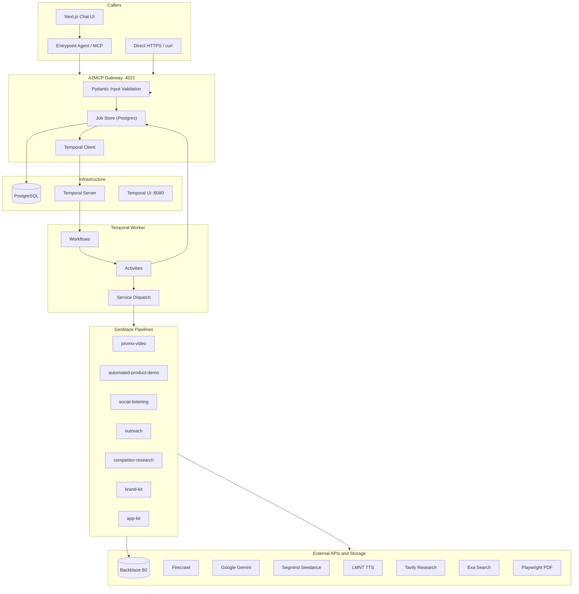

### Monorepo Structure

```
FounderBlaze/
├── apps/
│   ├── api/                  # FastAPI A2MCP gateway — discovery, job CRUD
│   ├── worker/               # Temporal worker — workflows + activities
│   ├── agent/                # Entrypoint Gemini agent + MCP HTTP mount
│   └── chat/                 # Next.js chat UI
├── packages/
│   └── founderblaze/         # Core, seven Genblaze pipelines, a2mcp, mcp_server, agent
├── docs/                     # Feature contracts, PRD, runbooks
├── infra/docker/             # Postgres, Temporal compose
└── reference/genblaze/       # Local Genblaze SDK (gitignored path dependency)
```

### Tech Stack

| Layer | Technology |
|-------|------------|
| Runtime | Python ≥3.11, `uv` workspace |
| HTTP | FastAPI + Uvicorn |
| Validation | Pydantic |
| Jobs | PostgreSQL (`asyncpg`) |
| Orchestration | Temporal (Python SDK) |
| Pipelines | Genblaze (`genblaze_core`, `genblaze_google`, `genblaze_s3`, …) |
| Agent / MCP | Gemini tool-loop + official MCP Python SDK |
| LLMs | Google Gemini |
| Browser / Scrape | Firecrawl, Jina Reader, Playwright |
| Search | Serper → Brave → DuckDuckGo (failover), Exa, Tavily |
| Media | Segmind Seedance, LMNT TTS, ffmpeg / ffprobe |
| Storage | Backblaze B2 |

---

## Service 1 — Promo Video

> **Drop a URL. Get a cinematic ad. No agency. No timeline. No excuses.**

Your product deserves a launch video that makes people stop scrolling. Not a screen recording with royalty-free ukulele music. Not a Canva template with your logo pasted on top. A **real promotional spot** — with a hook, a big idea, cinematic shots, and your actual product UI woven in at exactly the right moment.

Promo Video takes nothing but your product URL and returns a polished MP4 generated by **ByteDance Seedance 2.0**, directed by a multimodal Gemini creative director that has actually *looked at* your website. It discovers your most important pages, captures hero screenshots, writes a killer ad script with shot-by-shot direction, and submits the whole thing to AI video generation — synced voiceover, music, and visuals included.

**SLA:** ~5 minutes · **Output:** Backblaze-hosted MP4 URL

### Genblaze usage

Promo Video is a **two-phase Genblaze execution**: a generation DAG that keeps the Seedance MP4 local, then a tiny emit/persist DAG whose only job is to hand that `file://` asset to Genblaze’s `ObjectStorageSink` (B2). Entry: [`run_promo_video_pipeline`](https://github.com/Marshal-AM/founderblaze/blob/main/packages/founderblaze/src/founderblaze/promo_video/pipeline.py#L35).

**Phase 1 — generate (no sink)** — [`Pipeline("promo-video")`](https://github.com/Marshal-AM/founderblaze/blob/main/packages/founderblaze/src/founderblaze/promo_video/pipeline.py#L85) → [`.step` research](https://github.com/Marshal-AM/founderblaze/blob/main/packages/founderblaze/src/founderblaze/promo_video/pipeline.py#L89) (`Modality.TEXT` [L96](https://github.com/Marshal-AM/founderblaze/blob/main/packages/founderblaze/src/founderblaze/promo_video/pipeline.py#L96)) → [`.step` script](https://github.com/Marshal-AM/founderblaze/blob/main/packages/founderblaze/src/founderblaze/promo_video/pipeline.py#L97) (`Modality.TEXT` [L106](https://github.com/Marshal-AM/founderblaze/blob/main/packages/founderblaze/src/founderblaze/promo_video/pipeline.py#L106)) → [`.step` Seedance](https://github.com/Marshal-AM/founderblaze/blob/main/packages/founderblaze/src/founderblaze/promo_video/pipeline.py#L108) (`Modality.VIDEO` [L116](https://github.com/Marshal-AM/founderblaze/blob/main/packages/founderblaze/src/founderblaze/promo_video/pipeline.py#L116)) → [`.run`](https://github.com/Marshal-AM/founderblaze/blob/main/packages/founderblaze/src/founderblaze/promo_video/pipeline.py#L118) without a sink.

**Phase 2 — emit to B2** — with upload: [`Pipeline("promo-video-upload")`](https://github.com/Marshal-AM/founderblaze/blob/main/packages/founderblaze/src/founderblaze/promo_video/pipeline.py#L127) → [`.step` EmitFinalVideo](https://github.com/Marshal-AM/founderblaze/blob/main/packages/founderblaze/src/founderblaze/promo_video/pipeline.py#L132) (`Modality.VIDEO` [L135](https://github.com/Marshal-AM/founderblaze/blob/main/packages/founderblaze/src/founderblaze/promo_video/pipeline.py#L135)) → [`.run(sink=…)`](https://github.com/Marshal-AM/founderblaze/blob/main/packages/founderblaze/src/founderblaze/promo_video/pipeline.py#L137). Local-only variant: [`Pipeline("promo-video-local")`](https://github.com/Marshal-AM/founderblaze/blob/main/packages/founderblaze/src/founderblaze/promo_video/pipeline.py#L145)–[`.run`](https://github.com/Marshal-AM/founderblaze/blob/main/packages/founderblaze/src/founderblaze/promo_video/pipeline.py#L155).

**SyncProviders (each is a Genblaze `SyncProvider` with `ProviderCapabilities`):**

| Provider | Role | Links |
|----------|------|-------|
| `ProductResearchProvider` | Site research step | [class](https://github.com/Marshal-AM/founderblaze/blob/main/packages/founderblaze/src/founderblaze/promo_video/research_provider.py#L16), [capabilities](https://github.com/Marshal-AM/founderblaze/blob/main/packages/founderblaze/src/founderblaze/promo_video/research_provider.py#L33) (`Modality.TEXT`) |
| `ScriptProvider` | Creative script / shot list | [class](https://github.com/Marshal-AM/founderblaze/blob/main/packages/founderblaze/src/founderblaze/promo_video/script_provider.py#L16), [capabilities](https://github.com/Marshal-AM/founderblaze/blob/main/packages/founderblaze/src/founderblaze/promo_video/script_provider.py#L41) |
| `SeedanceProvider` | Segmind video gen as `Modality.VIDEO` | [class](https://github.com/Marshal-AM/founderblaze/blob/main/packages/founderblaze/src/founderblaze/promo_video/seedance_provider.py#L28), [capabilities](https://github.com/Marshal-AM/founderblaze/blob/main/packages/founderblaze/src/founderblaze/promo_video/seedance_provider.py#L57) |
| `EmitFinalVideoProvider` | Re-emit final MP4 for sink upload | [class](https://github.com/Marshal-AM/founderblaze/blob/main/packages/founderblaze/src/founderblaze/promo_video/emit_provider.py#L13), [capabilities](https://github.com/Marshal-AM/founderblaze/blob/main/packages/founderblaze/src/founderblaze/promo_video/emit_provider.py#L22) |
| `PersistVideoProvider` | Persist helper provider | [class](https://github.com/Marshal-AM/founderblaze/blob/main/packages/founderblaze/src/founderblaze/promo_video/persist_provider.py#L15), [capabilities](https://github.com/Marshal-AM/founderblaze/blob/main/packages/founderblaze/src/founderblaze/promo_video/persist_provider.py#L30) |
| `ConcatVideoProvider` | Optional concat path | [class](https://github.com/Marshal-AM/founderblaze/blob/main/packages/founderblaze/src/founderblaze/promo_video/concat_provider.py#L15), [capabilities](https://github.com/Marshal-AM/founderblaze/blob/main/packages/founderblaze/src/founderblaze/promo_video/concat_provider.py#L24) |

**`genblaze_google` text calls** — [`from genblaze_google import chat`](https://github.com/Marshal-AM/founderblaze/blob/main/packages/founderblaze/src/founderblaze/promo_video/gemini_chat.py#L9); used at [`chat(...)` L33](https://github.com/Marshal-AM/founderblaze/blob/main/packages/founderblaze/src/founderblaze/promo_video/gemini_chat.py#L33) and grounded [`chat(... tools=)` L65](https://github.com/Marshal-AM/founderblaze/blob/main/packages/founderblaze/src/founderblaze/promo_video/gemini_chat.py#L65). Script step imports that helper via [`gemini_json`](https://github.com/Marshal-AM/founderblaze/blob/main/packages/founderblaze/src/founderblaze/promo_video/script_provider.py#L11).

**Genblaze `Asset` helpers** — [`from genblaze_core import Asset`](https://github.com/Marshal-AM/founderblaze/blob/main/packages/founderblaze/src/founderblaze/promo_video/_assets.py#L9); constructors at [L26](https://github.com/Marshal-AM/founderblaze/blob/main/packages/founderblaze/src/founderblaze/promo_video/_assets.py#L26) / [L42](https://github.com/Marshal-AM/founderblaze/blob/main/packages/founderblaze/src/founderblaze/promo_video/_assets.py#L42).

**After run** — [`pick_final_video_asset`](https://github.com/Marshal-AM/founderblaze/blob/main/packages/founderblaze/src/founderblaze/promo_video/pipeline.py#L161), [`finalize_run_provenance`](https://github.com/Marshal-AM/founderblaze/blob/main/packages/founderblaze/src/founderblaze/promo_video/pipeline.py#L175), [`merge_provenance`](https://github.com/Marshal-AM/founderblaze/blob/main/packages/founderblaze/src/founderblaze/promo_video/pipeline.py#L184). Sink built at [`build_b2_sink(service="promo-video")`](https://github.com/Marshal-AM/founderblaze/blob/main/packages/founderblaze/src/founderblaze/promo_video/pipeline.py#L78). Worker step events: [`make_on_step_complete`](https://github.com/Marshal-AM/founderblaze/blob/main/packages/founderblaze/src/founderblaze/core/temporal_bridge.py#L9).

### Backblaze usage

**Code:** [`build_b2_sink`](https://github.com/Marshal-AM/founderblaze/blob/main/packages/founderblaze/src/founderblaze/core/storage/b2.py#L29) → [`pick_final_video_asset`](https://github.com/Marshal-AM/founderblaze/blob/main/packages/founderblaze/src/founderblaze/core/storage/b2.py#L121) → [`resolve_download_url`](https://github.com/Marshal-AM/founderblaze/blob/main/packages/founderblaze/src/founderblaze/core/storage/b2.py#L56) → [`finalize_run_provenance`](https://github.com/Marshal-AM/founderblaze/blob/main/packages/founderblaze/src/founderblaze/core/storage/provenance.py#L69) (`mode="pointer"`) → [`merge_provenance`](https://github.com/Marshal-AM/founderblaze/blob/main/packages/founderblaze/src/founderblaze/core/storage/provenance.py#L289) — called from [`run_promo_video_pipeline`](https://github.com/Marshal-AM/founderblaze/blob/main/packages/founderblaze/src/founderblaze/promo_video/pipeline.py#L35).

Prefix: `founderblaze/promo-video/…`. **B2 is the durable store of record for the finished MP4** — Seedance may host a transient render URL during generation, but the job artifact returned to agents/API is the B2 object (+ `.genblaze.json` pointer provenance).

---

### The Pitch

Imagine hiring a creative director, a DP, a copywriter, and a motion designer — then compressing their entire workflow into a single API call that costs less than a coffee.

That is Promo Video.

You send `https://yourproduct.com`. FounderBlaze crawls your site, identifies the pages that matter (homepage, pricing, features, signup), captures pixel-perfect viewport screenshots at 1440×900, uploads them as reference images, and feeds them — along with your product context — into Gemini 3.1 Flash Lite running a **creative-director-grade prompt** that forbids generic SaaS-ad energy. The model outputs a full ad concept: big idea, voiceover script, shot list with cinematic vs. product-proof beats, and a complete Seedance-ready generation prompt.

Then Segmind Seedance 2.0 takes over. It generates a **15-second (configurable) promotional video** with synced audio, using your real UI screenshots as reference images at the exact moments the script calls for product proof. The result is a shareable MP4 URL — ready for Product Hunt, Twitter, your landing page, or a paid ad campaign.

No storyboard meetings. No revision rounds. No Fiverr roulette.

---

### Pipeline Diagram

```mermaid
flowchart LR
    subgraph Input["A2MCP Input"]
        URL["product_url"]
        DUR["duration (4–15s)"]
        RES["resolution (480p–4k)"]
        MP["max_pages (1–9)"]
    end

    subgraph Phase1["Phase 1 — Discover"]
        FCMap["Firecrawl Map"]
        Heuristic["URL Heuristic Filter"]
        GeminiRank["Gemini Page Ranker"]
    end

    subgraph Phase2["Phase 2 — Capture"]
        FCScrape["Firecrawl Viewport Scrape"]
        PNG["1440×900 PNG Screenshots"]
    end

    subgraph Phase3["Phase 3 — Upload"]
        SupaUp["Backblaze B2 Upload"]
        PubURLs["Public Image URLs"]
    end

    subgraph Phase4["Phase 4 — Script"]
        MultiGem["Multimodal Gemini"]
        Script["Ad Script + Shot List"]
        SDPrompt["Seedance Prompt"]
    end

    subgraph Phase5["Phase 5 — Video"]
        SDSubmit["Segmind Seedance 2.0 Submit"]
        SDPoll["Async Poll (≤5 min)"]
        MP4["MP4 Artifact URL"]
    end

    URL --> FCMap
    DUR --> SDSubmit
    RES --> SDSubmit
    MP --> GeminiRank

    FCMap --> Heuristic --> GeminiRank
    GeminiRank --> FCScrape --> PNG
    PNG --> SupaUp --> PubURLs
    PubURLs --> MultiGem
    PNG --> MultiGem
    MultiGem --> Script --> SDPrompt
    SDPrompt --> SDSubmit
    PubURLs --> SDSubmit
    SDSubmit --> SDPoll --> MP4
```

---

### End-to-End Sequence

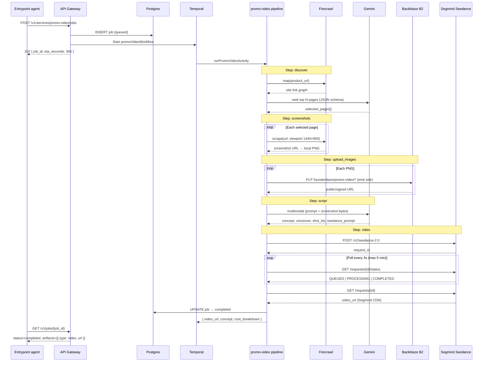

---

### How It Works — Phase by Phase

#### Phase 1: `discover` — Site Intelligence

The pipeline starts by understanding *what* your product is and *which pages* best represent it on camera.

1. **Firecrawl Map** — The service calls `Firecrawl.map(product_url)` with up to 5 retries and exponential backoff. This returns the full internal link graph of your site — every URL Firecrawl can reach from your root domain.

2. **URL Deduplication & Normalization** — URLs are deduplicated (hash-stripped, trailing-slash normalized) and capped at 300 candidates. If the root URL is missing from the map result, it is prepended manually.

3. **Heuristic Pre-Filter** (when >300 URLs) — Pattern matching prioritizes high-value paths (`/pricing`, `/features`, `/signup`, `/demo`, `/docs`) and skips noise (`/blog`, `/legal`, `/privacy`, paginated content, static assets).

4. **Gemini Page Ranker** — `gemini-3.1-flash-lite` receives the candidate URL list and selects up to `max_pages` (default 6) with structured JSON output enforced via `responseSchema`. Each selection includes a `url` and a human-readable `reason` (e.g., "Core pricing page showing tier structure"). If Gemini returns no valid URLs, the pipeline falls back to the first N candidates from the map.

**Intermediate artifact:** `selected_pages.json` written to the ephemeral work directory.


---

#### Phase 2: `screenshots` — Visual Capture

With the page shortlist locked, the pipeline captures **above-the-fold hero shots** — not full-page scroll captures.

For each selected page:

1. **Firecrawl Viewport Scrape** — `app.scrape(url, { formats: [{ type: "screenshot", fullPage: false, viewport: { width: 1440, height: 900 }, quality: 85 }], waitFor: 2000 })`. The 2-second wait allows lazy-loaded content to render.

2. **Screenshot Download** — The returned screenshot URL is fetched and saved locally as a PNG. Files smaller than 800 bytes are rejected as corrupt.

3. **Retry Logic** — Each page gets 2 attempts with 1.5s backoff. Firecrawl scrape calls retry up to 4 times via `withRetries`.

**Output:** Array of `ScreenshotCapture` objects — `{ url, reason, localPath, bytes }`.


---

#### Phase 3: `upload_images` — Reference Image Hosting

Seedance 2.0 accepts **public HTTPS URLs** as reference images — not local file paths. Screenshots must be reachable before video submission.

1. Reference screenshots are staged as HTTPS URLs for Seedance (vendor-facing during generation).
2. After Seedance finishes, the **emit** Genblaze pipeline uploads the final MP4 through `build_b2_sink(service="promo-video")` under `founderblaze/promo-video/…`.
3. Reference images are indexed as `image 1`, `image 2`, … for downstream prompt citation.

**Important:** Seedance may return a transient CDN URL while rendering. The **job artifact** returned to API/agent callers is always the **Backblaze B2** object (plus Genblaze pointer provenance) — not Segmind as the store of record.

**Intermediate artifact:** `image_urls.json` mapping each reference image to its page URL, reason, local path, and public URL.

---

#### Phase 4: `script` — Creative Direction (Multimodal Gemini)

This is where Promo Video separates itself from "URL → template video" tools.

Gemini receives:
- A **4,000+ token creative-director system prompt** that explicitly forbids generic SaaS walkthroughs
- The product URL, target duration, and aspect ratio (16:9)
- A catalog of available reference screenshots (`image 1: screenshot of /pricing — shows tier cards`)
- **Raw screenshot bytes** as inline multimodal parts (base64-encoded PNG/JPEG/WebP)

The model must return structured JSON:

| Field | Purpose |
|-------|---------|
| `concept` | Short title + one-line premise |
| `big_idea` | The metaphor, hook, or emotional core — specific to *this* product |
| `tone` | Tone keywords (e.g., "cheeky, fast, slightly unhinged") |
| `voiceover` | Full spoken script, word-counted to fit the exact duration at trailer pace |
| `shot_list[]` | Contiguous, non-overlapping shots from `0s` to `{duration}s` |
| `seedance_prompt` | Complete, ready-to-send Seedance 2.0 generation prompt |

Each shot in `shot_list` is typed as either:

- **`cinematic`** — Fully AI-generated content (people, environments, metaphors). No `image_refs`. This should be the *majority* of runtime.
- **`product_proof`** — Real UI from a specific screenshot, cited as `"image N"`. Used sparingly at reveal moments.

The prompt enforces hard constraints: exact duration, VO word budget (~2.5–3 words/second), at least one real UI appearance, contiguous shot timing, specific music/SFX direction (no "upbeat corporate background music"), and a deliberate brand endcard.

**Intermediate artifact:** `script.json`


---

#### Phase 5: `video` — Seedance 2.0 Generation

The final phase submits the creative package to **Segmind's Seedance 2.0 API**.

**Submit payload:**

```json
{
  "prompt": "<full seedance_prompt from script phase>",
  "duration": 15,
  "resolution": "720p",
  "aspect_ratio": "16:9",
  "bitrate_mode": "standard",
  "generate_audio": true,
  "seed": -1,
  "reference_images": [
    "https://s3.us-east-005.backblazeb2.com/your-bucket/founderblaze/promo-video/...png",
    "https://s3.us-east-005.backblazeb2.com/your-bucket/founderblaze/promo-video/...png"
  ]
}
```

**Async lifecycle:**

1. `POST https://api.segmind.com/v2/seedance-2.0` → returns `request_id`
2. Poll `GET /v2/requests/{id}/status` every **3 seconds** for up to **5 minutes**
3. Status transitions: `QUEUED` → `PROCESSING` → `COMPLETED`
4. On completion, fetch `GET /v2/requests/{id}` → extract `video_url` from response
5. Optionally download to local `promo.mp4` in the work directory for validation

**Failure modes handled:**
- Transient HTTP errors (408, 429, 5xx) — retried during polling
- `422` / `FAILED` status — hard fail with full error body
- Timeout after 5 minutes — error message includes `--resume {request_id}` hint for CLI recovery
- Binary-only responses (no public URL) — **job fails**; Promo Video requires a Segmind-hosted URL as the artifact


**Intermediate artifact:** `run_summary.json`, `seedance_result.json`

---

### Internal Tools & Dependencies

| Tool | Role in Promo Video | Module |
|------|---------------------|--------|
| **Firecrawl** | Site mapping + viewport screenshot capture | `discover.ts`, `screenshots.ts` |
| **Google Gemini 3.1 Flash Lite** | Page ranking (text) + ad script writing (multimodal) | `discover.ts`, `script.ts` |
| **Segmind Seedance 2.0** | AI video generation with synced audio | `video.ts` |
| **Backblaze B2** | Final MP4 + provenance (`founderblaze/promo-video/`) | [`b2.py`](https://github.com/Marshal-AM/founderblaze/blob/main/packages/founderblaze/src/founderblaze/core/storage/b2.py), [`provenance.py`](https://github.com/Marshal-AM/founderblaze/blob/main/packages/founderblaze/src/founderblaze/core/storage/provenance.py) |
| **Temporal** | Durable workflow orchestration, heartbeats, retries | `apps/orchestrator` |
| **PostgreSQL** | Job state, step tracking, artifact URLs | `@founderblaze/db` |
| **Zod** | Input/output validation at API and pipeline boundaries | `schema.ts`, `@founderblaze/schemas` |

#### Required Environment Variables

```bash
# Firecrawl — site discovery & screenshots
FIRECRAWL_API_KEY=fc-...
FIRECRAWL_API_URL=              # optional custom endpoint

# Gemini — page ranking & script generation
GEMINI_API_KEY=...
GEMINI_TEXT_MODEL=gemini-3.1-flash-lite   # optional override

# Segmind — Seedance 2.0 video generation
SEGMIND_API_KEY=...

# Backblaze B2 — reference image storage (screenshots only)
B2_KEY_ID=
B2_APP_KEY=
B2_BUCKET=
B2_REGION=us-east-005
```

---

### A2MCP Request Body

**Endpoint:** `POST /v1/services/promo-video/jobs`


#### Full Request Example

```json
{
  "input": {
    "product_url": "https://www.notion.so",
    "duration": 15,
    "resolution": "720p",
    "max_pages": 6
  },
  "callback_url": "https://your-app.com/webhooks/founderblaze",
  "priority": "normal"
}
```

#### Input Schema (`PromoVideoInputSchema`)

| Field | Required | Type | Default | Constraints |
|-------|----------|------|---------|-------------|
| `product_url` | **Yes** | `string (URL)` | — | Valid HTTPS/HTTP URL of the product to promote |
| `duration` | No | `integer` | `15` | Must be one of: `4`, `5`, `6`, `8`, `10`, `12`, `15` (Seedance-supported durations) |
| `resolution` | No | `string` | `"720p"` | One of: `"480p"`, `"720p"`, `"1080p"`, `"4k"` |
| `max_pages` | No | `integer` | `6` | Min `1`, max `9` — number of site pages to screenshot and use as reference |

#### Minimal Request (defaults applied)

```json
{
  "input": {
    "product_url": "https://linear.app"
  }
}
```

This runs a **15-second, 720p, 6-page** promo with all defaults.

#### cURL Example (local dev)

```bash
curl -X POST http://localhost:4021/v1/services/promo-video/jobs \
  -H "Content-Type: application/json" \
  -H "X-Idempotency-Key: promo-linear-$(date +%s)" \
  -d '{
    "input": {
      "product_url": "https://linear.app",
      "duration": 15,
      "resolution": "720p",
      "max_pages": 6
    }
  }'
```

#### Create Response (`202 Accepted`)

```json
{
  "job_id": "a1b2c3d4-e5f6-7890-abcd-ef1234567890",
  "eta_seconds": 300,
  "status_url": "/v1/jobs/a1b2c3d4-e5f6-7890-abcd-ef1234567890",
  "status": "queued"
}
```

#### Poll Response — In Progress

```json
{
  "id": "a1b2c3d4-e5f6-7890-abcd-ef1234567890",
  "service": "promo-video",
  "status": "running",
  "step": "script",
  "artifacts": [],
  "cost_breakdown": [],
  "error": null,
  "created_at": "2026-07-27T10:00:00.000Z",
  "updated_at": "2026-07-27T10:03:22.000Z",
  "eta_seconds": 300
}
```

The `step` field reflects the current pipeline phase: `discover` → `screenshots` → `upload_images` → `script` → `video`.

---

## Service 2 — Automated Product Demo

> **Write a sentence. Watch your product demo itself.**

Product demos are the highest-converting asset in a founder's arsenal — and the most painful to produce. Recording yourself clicking through your app at 1 AM, re-doing takes because you stumbled over a word, syncing audio in iMovie, exporting, re-exporting because the aspect ratio is wrong — it is a tax every solo founder pays before every launch.

Automated Product Demo eliminates that tax entirely. You provide a **live website URL** and a **natural-language script** describing what you want shown. FounderBlaze plans atomic browser steps with Gemini, executes them on your real product via Firecrawl's interact API, captures every frame through Playwright CDP screencast, generates grounded narration with Deepgram Aura TTS, and assembles a polished narrated MP4 with ffmpeg — uploaded to Backblaze B2 and ready to embed.

This is not a screen recording you made manually. This is your product, on your live site, performing the exact workflow you described — with professional voiceover synced to every click.

**SLA:** ~5 minutes · **Output:** Backblaze-hosted narrated MP4

### Genblaze usage

APD is a **single three-step Genblaze DAG** that plans browser actions, records a screencast, then assembles a narrated MP4 and uploads it through Genblaze’s sink. Entry: [`run_apd_pipeline`](https://github.com/Marshal-AM/founderblaze/blob/main/packages/founderblaze/src/founderblaze/apd/pipeline.py#L28) (docstring notes `ObjectStorageSink` at [L39](https://github.com/Marshal-AM/founderblaze/blob/main/packages/founderblaze/src/founderblaze/apd/pipeline.py#L39)–[L41](https://github.com/Marshal-AM/founderblaze/blob/main/packages/founderblaze/src/founderblaze/apd/pipeline.py#L41)).

**Pipeline graph** — [`from genblaze_core import Modality, Pipeline, StepType`](https://github.com/Marshal-AM/founderblaze/blob/main/packages/founderblaze/src/founderblaze/apd/pipeline.py#L8); sink at [`build_b2_sink(service="automated-product-demo")`](https://github.com/Marshal-AM/founderblaze/blob/main/packages/founderblaze/src/founderblaze/apd/pipeline.py#L69); [`Pipeline("apd")`](https://github.com/Marshal-AM/founderblaze/blob/main/packages/founderblaze/src/founderblaze/apd/pipeline.py#L75) → [`.step` Plan](https://github.com/Marshal-AM/founderblaze/blob/main/packages/founderblaze/src/founderblaze/apd/pipeline.py#L80) (`Modality.TEXT` [L88](https://github.com/Marshal-AM/founderblaze/blob/main/packages/founderblaze/src/founderblaze/apd/pipeline.py#L88)) → [`.step` Record](https://github.com/Marshal-AM/founderblaze/blob/main/packages/founderblaze/src/founderblaze/apd/pipeline.py#L90) (`Modality.VIDEO` [L97](https://github.com/Marshal-AM/founderblaze/blob/main/packages/founderblaze/src/founderblaze/apd/pipeline.py#L97)) → [`.step` Assemble](https://github.com/Marshal-AM/founderblaze/blob/main/packages/founderblaze/src/founderblaze/apd/pipeline.py#L100) (`Modality.VIDEO` [L106](https://github.com/Marshal-AM/founderblaze/blob/main/packages/founderblaze/src/founderblaze/apd/pipeline.py#L106)) → [`.run(sink=…)`](https://github.com/Marshal-AM/founderblaze/blob/main/packages/founderblaze/src/founderblaze/apd/pipeline.py#L110).

**SyncProviders:**

| Provider | Role | Links |
|----------|------|-------|
| `PlanProvider` | Gemini plan as `SyncProvider` | [class](https://github.com/Marshal-AM/founderblaze/blob/main/packages/founderblaze/src/founderblaze/apd/plan_provider.py#L18), [capabilities](https://github.com/Marshal-AM/founderblaze/blob/main/packages/founderblaze/src/founderblaze/apd/plan_provider.py#L35), [`Asset` emit L75](https://github.com/Marshal-AM/founderblaze/blob/main/packages/founderblaze/src/founderblaze/apd/plan_provider.py#L75) |
| `RecordProvider` | Firecrawl + Playwright CDP as Genblaze video step | [class](https://github.com/Marshal-AM/founderblaze/blob/main/packages/founderblaze/src/founderblaze/apd/record_provider.py#L17), [capabilities](https://github.com/Marshal-AM/founderblaze/blob/main/packages/founderblaze/src/founderblaze/apd/record_provider.py#L34), [`Asset` L100](https://github.com/Marshal-AM/founderblaze/blob/main/packages/founderblaze/src/founderblaze/apd/record_provider.py#L100) |
| `AssembleProvider` | Narration + ffmpeg mux; sets Genblaze `StepType.MIX` | [class](https://github.com/Marshal-AM/founderblaze/blob/main/packages/founderblaze/src/founderblaze/apd/assemble_provider.py#L17), [import `StepType`](https://github.com/Marshal-AM/founderblaze/blob/main/packages/founderblaze/src/founderblaze/apd/assemble_provider.py#L12), [capabilities](https://github.com/Marshal-AM/founderblaze/blob/main/packages/founderblaze/src/founderblaze/apd/assemble_provider.py#L38), [`StepType.MIX` L149](https://github.com/Marshal-AM/founderblaze/blob/main/packages/founderblaze/src/founderblaze/apd/assemble_provider.py#L149), [`Asset` L142](https://github.com/Marshal-AM/founderblaze/blob/main/packages/founderblaze/src/founderblaze/apd/assemble_provider.py#L142) |

**`genblaze_google`** — [`from genblaze_google import chat`](https://github.com/Marshal-AM/founderblaze/blob/main/packages/founderblaze/src/founderblaze/apd/plan_provider.py#L13); plan call [`chat(model, prompt=…)` L63](https://github.com/Marshal-AM/founderblaze/blob/main/packages/founderblaze/src/founderblaze/apd/plan_provider.py#L63). (Narration uses the LMNT SDK directly inside `AssembleProvider`, not a Genblaze LMNT step wrapper.)

**After run** — [`pick_final_video_asset` L120](https://github.com/Marshal-AM/founderblaze/blob/main/packages/founderblaze/src/founderblaze/apd/pipeline.py#L120), [`finalize_run_provenance` L125](https://github.com/Marshal-AM/founderblaze/blob/main/packages/founderblaze/src/founderblaze/apd/pipeline.py#L125), [`merge_provenance` L134](https://github.com/Marshal-AM/founderblaze/blob/main/packages/founderblaze/src/founderblaze/apd/pipeline.py#L134). Temporal: [`make_on_step_complete`](https://github.com/Marshal-AM/founderblaze/blob/main/packages/founderblaze/src/founderblaze/core/temporal_bridge.py#L9).

### Backblaze usage

**Code:** after `.run(sink=…)`, [`pick_final_video_asset`](https://github.com/Marshal-AM/founderblaze/blob/main/packages/founderblaze/src/founderblaze/core/storage/b2.py#L121) → [`resolve_download_url`](https://github.com/Marshal-AM/founderblaze/blob/main/packages/founderblaze/src/founderblaze/core/storage/b2.py#L56) → [`finalize_run_provenance`](https://github.com/Marshal-AM/founderblaze/blob/main/packages/founderblaze/src/founderblaze/core/storage/provenance.py#L69) (`mode="pointer"`) → [`merge_provenance`](https://github.com/Marshal-AM/founderblaze/blob/main/packages/founderblaze/src/founderblaze/core/storage/provenance.py#L289).

Prefix: `founderblaze/automated-product-demo/…`. The narrated MP4 on B2 is the sole job deliverable; optional `--no-b2` / `upload_to_b2=False` keeps a local `file://` artifact for CLI smoke only.

---

### The Pitch

Imagine handing a demo script to a product marketer who never sleeps, never stumbles, and never charges by the hour.

That is Automated Product Demo.

You write: *"Create a form with name and email, then show the share link."* FounderBlaze's planner breaks that into atomic browser actions — click the New Form button, type into the name field, type into the email field, click Create, navigate to the share panel. Each action runs against your **live website** through Firecrawl's browser agent. Playwright attaches over CDP and records JPEG screencast frames at 90% quality while the agent works. When recording finishes, the remote browser session closes immediately — you are not billed for TTS or ffmpeg time.

Then Gemini rewrites each step's narration based on what **actually happened** on screen (not just what was planned). Deepgram Aura synthesizes each line to WAV. ffmpeg builds per-step video segments, pads frames to match audio duration, muxes narration, and concatenates everything into a single `demo.mp4`.

The result: a narrated walkthrough of your real product, suitable for landing pages, onboarding flows, investor decks, and support docs.

No Loom. No retakes. No timeline.

---

### Pipeline Diagram

```mermaid
flowchart LR
    subgraph Input["A2MCP Input"]
        URL["website_url"]
        SCRIPT["script (NL demo instructions)"]
    end

    subgraph Phase1["Phase 1 — Plan"]
        GeminiPlan["Gemini Step Planner"]
        Steps["Atomic Browser Steps"]
    end

    subgraph Phase2["Phase 2 — Record"]
        FCScrape["Firecrawl Scrape"]
        FCInteract["Firecrawl /interact"]
        CDP["Playwright CDP Screencast"]
        Frames["JPEG Frame Buffer"]
    end

    subgraph Phase3["Phase 3 — Narrate"]
        GeminiNarr["Gemini Grounded Narration"]
        DG["Deepgram Aura TTS"]
        WAV["Per-Step WAV Clips"]
    end

    subgraph Phase4["Phase 4 — Assemble"]
        FFBuild["ffmpeg Segment Build"]
        FFPad["Frame Padding (tpad)"]
        FFMux["Audio/Video Mux (AAC)"]
        FFConcat["Segment Concat"]
    end

    subgraph Phase5["Phase 5 — Upload"]
        SupaUp["Backblaze B2 Upload"]
        MP4["Narrated MP4 URL"]
    end

    URL --> FCScrape
    SCRIPT --> GeminiPlan --> Steps
    FCScrape --> FCInteract
    Steps --> FCInteract
    FCInteract --> CDP --> Frames
    Steps --> GeminiNarr
    Frames --> FFBuild
    GeminiNarr --> DG --> WAV
    WAV --> FFMux
    FFBuild --> FFPad --> FFMux --> FFConcat --> SupaUp --> MP4
```

---

### End-to-End Sequence

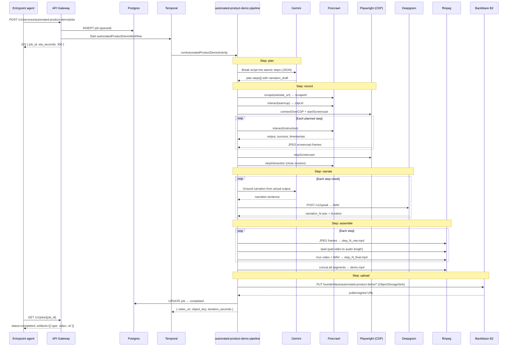

---

### How It Works — Phase by Phase

#### Phase 1: `plan` — Demo Step Decomposition

The pipeline receives your natural-language demo script and converts it into a sequence of **atomic browser actions** that Firecrawl's `/interact` API can execute one at a time.

1. **Gemini Planner** — `gemini-3.1-flash-lite` receives the target `website_url` and your freeform `script`, with strict rules:
   - Each step must be a **single action** (one click, one field fill, one navigation, one scroll).
   - No compound instructions ("click X and then type Y" is forbidden).
   - Instructions are natural-language prompts a browser agent can follow on the live page.
   - Each step includes a `narration_draft` — one short conversational sentence (under 12 words) for voiceover.
   - The page is assumed already open at the target URL (no redundant "open URL" step unless navigating elsewhere).
   - Typical demos run **4–12 steps** unless the script clearly requires more.

2. **Structured Output** — Response is enforced via `responseSchema` / `responseJsonSchema`:

```json
{
  "steps": [
    {
      "id": 1,
      "instruction": "Click the 'New Project' button in the top navigation bar.",
      "narration_draft": "Let's start by creating a new project."
    },
    {
      "id": 2,
      "instruction": "Type 'Demo Launch' into the project name field.",
      "narration_draft": "Give it a name."
    }
  ]
}
```

3. **ID Normalization** — Step IDs are renumbered sequentially starting at 1, regardless of what Gemini returned.

**Intermediate artifact:** `plan.json` written to the ephemeral work directory.


---

#### Phase 2: `record` — Live Browser Execution + Screencast

This is the most technically complex phase. FounderBlaze drives your **real live website** in a remote browser and captures every pixel.

**Step 2a — Firecrawl Scrape (Session Bootstrap)**

```typescript
const result = await firecrawl.scrape(website_url, { formats: ["markdown"] });
const scrapeId = result.metadata.scrapeId;
```

The scrape establishes a persistent browser session. The `scrapeId` is required for all subsequent `/interact` calls. If `metadata.scrapeId` is missing, the pipeline hard-fails — there is no interact session without it.

**Step 2b — Warmup Interact (CDP Handoff)**

Before recording, the pipeline sends a warmup prompt:

> *"Confirm the page has fully loaded and is interactive. Do not click, type, scroll, or navigate. Reply briefly when ready."*

Firecrawl responds with a `cdpUrl` — a Chrome DevTools Protocol WebSocket endpoint. This URL is what Playwright connects to for screencast capture. The warmup call retries up to **6 times** with exponential backoff (handling transient 404 "Job not found" errors from Firecrawl DB replica lag).

**Step 2c — Playwright CDP Screencast**

```typescript
const browser = await chromium.connectOverCDP(cdpUrl);
const cdp = await context.newCDPSession(page);
await cdp.send("Page.startScreencast", {
  format: "jpeg",
  quality: 90,
  everyNthFrame: 1,
});
```

Playwright attaches to the remote browser over CDP and starts a JPEG screencast at **90% quality, every frame**. Each `Page.screencastFrame` event is acknowledged and buffered with a millisecond timestamp.

**Step 2d — Step Execution**

For each planned step, the pipeline calls:

```typescript
const response = await firecrawl.interact(scrapeId, { prompt: step.instruction });
```

Each interact call records:
- `start` / `end` timestamps (mapped to screencast frames)
- `output` — what the Firecrawl agent reported happened
- `success` — whether the action completed
- `liveViewUrl` — optional debug URL for the remote session
- `error` — if the step failed

Failed steps are logged but do not abort the pipeline — narration will reflect what actually happened (or failed).

**Step 2e — Stop Recording & Close Session**

After all steps complete:
1. Screencast stops → frames saved as `frame_000001.jpg`, `frame_000002.jpg`, …
2. `stopInteraction(scrapeId)` closes the Firecrawl session immediately
3. Browser cleanup runs **before** TTS/ffmpeg — you are not billed for remote browser time during post-production

**Critical design decision:** The remote browser session is closed as soon as recording finishes. Narration synthesis and video assembly happen entirely locally.

**Intermediate artifacts:** `frames/`, `frames_meta.json`, `step_log.json`


---

#### Phase 3: `narrate` — Grounded Voiceover Generation

Unlike Promo Video (where narration is baked into Seedance), Automated Product Demo generates **per-step narration clips** that are muxed onto the screencast in assembly.

For each `StepResult`:

1. **Gemini Grounding** — The narrator receives:
   - Your original demo goal (`script`)
   - The step's planned instruction
   - What **actually happened** (`step.output` from Firecrawl)
   - The planner's `narration_draft` as optional reference

   It writes **one short, natural sentence** (under 20 words) in present tense, conversational and confident. If the agent reported a real price, label, or UI state, the narration reflects it.

2. **Deepgram Aura TTS** — Each narration line is synthesized via:

```http
POST https://api.deepgram.com/v1/speak?model=aura-2-thalia-en&encoding=linear16&container=wav
Authorization: Token {DEEPGRAM_API_KEY}
Content-Type: application/json

{ "text": "Let's create a new form with name and email fields." }
```

Default voice: **`aura-2-thalia-en`** (configurable via `DEEPGRAM_TTS_MODEL`).

Output: `audio/narration_1.wav`, `audio/narration_2.wav`, … with duration measured via ffprobe.


---

#### Phase 4: `assemble` — ffmpeg Video Production

The assembly engine transforms raw JPEG screencast frames + WAV narration into a single MP4.

**Per-step processing:**

1. **Frame Slicing** — Screencast frames are sliced by step timestamps (`step.start` → `step.end`). If no frames fall in the window, the nearest prior frame is used.

2. **Video Build** — JPEG frames are concatenated into `step_N_raw.mp4` via ffmpeg's concat demuxer at a computed FPS (clamped 5–30 fps based on frame count / step duration).

3. **Frame Padding** — If the raw video is shorter than the narration audio, ffmpeg `tpad=stop_mode=clone` holds the last frame until audio completes.

4. **Audio/Video Mux** — Video + WAV are muxed with `-shortest`, encoding video as H.264 (`libx264`, `yuv420p`) and audio as AAC.

5. **Final Concat** — All `step_N_final.mp4` segments are concatenated into `demo.mp4`. ffmpeg tries stream copy first (`-c copy`); falls back to re-encode if codecs mismatch.

**ffmpeg requirements:** System `ffmpeg` + `ffprobe` on PATH, or bundled via `ffmpeg-static` / `ffprobe-static` npm packages. Validated at pipeline start via `requireMediaBins()`.


---

#### Phase 5: `upload` — Artifact Delivery

Automated Product Demo uploads the finished video through Genblaze `ObjectStorageSink` via `build_b2_sink(service="automated-product-demo")` (same pattern as Promo Video’s emit → B2 path).

- **Prefix:** `founderblaze/automated-product-demo/…`
- **URL:** Presigned or public Backblaze B2 object URL from `resolve_download_url`
- **Provenance:** `finalize_run_provenance(..., mode="pointer")` → `{object_key}.genblaze.json`

The job artifact includes both `url` and `object_key` for programmatic access.


**Cleanup:** The ephemeral work directory (`apd-{uuid}/`) is deleted after upload, including all frames, audio, and intermediate segments.

---

### Internal Tools & Dependencies

| Tool | Role in Automated Product Demo | Module |
|------|-------------------------------|--------|
| **Firecrawl** | Scrape session bootstrap + `/interact` browser agent | `browser.ts` |
| **Playwright** | CDP connection + JPEG screencast capture | `browser.ts` |
| **Google Gemini 3.1 Flash Lite** | Step planning + grounded narration writing | `planner.ts`, `narrator.ts` |
| **Deepgram Aura TTS** | Per-step voiceover synthesis (WAV) | `tts.ts` |
| **ffmpeg / ffprobe** | Frame→video build, padding, mux, concat | `assemble.ts`, `media.ts` |
| **Backblaze B2** | Final MP4 + provenance (`founderblaze/automated-product-demo/`) | [`apd/pipeline.py`](https://github.com/Marshal-AM/founderblaze/blob/main/packages/founderblaze/src/founderblaze/apd/pipeline.py), [`b2.py`](https://github.com/Marshal-AM/founderblaze/blob/main/packages/founderblaze/src/founderblaze/core/storage/b2.py) |
| **Temporal** | Durable workflow orchestration, heartbeats, retries | `apps/orchestrator` |
| **PostgreSQL** | Job state, step tracking, artifact URLs | `@founderblaze/db` |
| **Zod** | Input/output validation at API and pipeline boundaries | `schema.ts`, `@founderblaze/schemas` |

#### Required Environment Variables

```bash
# Firecrawl — scrape session + browser interact
FIRECRAWL_API_KEY=fc-...

# Gemini — step planning + narration grounding
GEMINI_API_KEY=...
GEMINI_TEXT_MODEL=gemini-3.1-flash-lite   # optional override

# Deepgram — TTS narration
DEEPGRAM_API_KEY=...
DEEPGRAM_TTS_MODEL=aura-2-thalia-en       # optional override

# Backblaze B2 — final demo MP4 storage
B2_KEY_ID=
B2_APP_KEY=
B2_BUCKET=
B2_REGION=us-east-005
B2_URL_TTL_SECONDS=604800
```

#### System Requirements

- **ffmpeg** and **ffprobe** must be available on the worker host (system install or `ffmpeg-static` / `ffprobe-static` npm packages).
- Node.js ≥20 for the orchestrator worker process.

---

### A2MCP Request Body

**Endpoint:** `POST /v1/services/automated-product-demo/jobs`


#### Full Request Example

```json
{
  "input": {
    "website_url": "https://tally.so",
    "script": "Create a form with name and email fields, then show the share link."
  },
  "callback_url": "https://your-app.com/webhooks/founderblaze",
  "priority": "normal"
}
```

#### Input Schema (`AutomatedProductDemoInputSchema`)

| Field | Required | Type | Constraints |
|-------|----------|------|-------------|
| `website_url` | **Yes** | `string (URL)` | Valid HTTPS/HTTP URL of the live product to demo |
| `script` | **Yes** | `string` | Natural-language demo instructions — what to show and in what order. Minimum 1 character. Describe the workflow you want recorded (e.g., "Sign up, create a project, invite a teammate"). |

#### Minimal Request

```json
{
  "input": {
    "website_url": "https://linear.app",
    "script": "Create a new issue, assign it to yourself, and move it to In Progress."
  }
}
```

#### cURL Example (local dev)

```bash
curl -X POST http://localhost:4021/v1/services/automated-product-demo/jobs \
  -H "Content-Type: application/json" \
  -H "X-Idempotency-Key: apd-tally-$(date +%s)" \
  -d '{
    "input": {
      "website_url": "https://tally.so",
      "script": "Create a form with name and email fields, then show the share link."
    }
  }'
```

#### Create Response (`202 Accepted`)

```json
{
  "job_id": "b2c3d4e5-f6a7-8901-bcde-f12345678901",
  "eta_seconds": 300,
  "status_url": "/v1/jobs/b2c3d4e5-f6a7-8901-bcde-f12345678901",
  "status": "queued"
}
```

#### Poll Response — In Progress

```json
{
  "id": "b2c3d4e5-f6a7-8901-bcde-f12345678901",
  "service": "automated-product-demo",
  "status": "running",
  "step": "record",
  "artifacts": [],
  "cost_breakdown": [],
  "error": null,
  "created_at": "2026-07-27T11:00:00.000Z",
  "updated_at": "2026-07-27T11:04:15.000Z",
  "eta_seconds": 300
}
```

The `step` field reflects the current pipeline phase: `plan` → `record` → `narrate` → `assemble` → `upload`.

#### Poll Response — Completed

```json
{
  "id": "b2c3d4e5-f6a7-8901-bcde-f12345678901",
  "service": "automated-product-demo",
  "status": "completed",
  "step": "upload",
  "artifacts": [
    {
      "type": "video",
      "url": "https://s3.us-east-005.backblazeb2.com/your-bucket/founderblaze/demos/2026-07-27T11-12-00-abc12345.mp4",
      "object_key": "demos/2026-07-27T11-12-00-abc12345.mp4",
      "mime_type": "video/mp4"
    }
  ],
  "cost_breakdown": [
    { "vendor": "llm", "operation": "plan", "amount_usd": 0.01 },
    { "vendor": "browser", "operation": "record", "amount_usd": 0.50 },
    { "vendor": "tts", "operation": "narrate", "amount_usd": 0.05 },
    { "vendor": "media", "operation": "assemble", "amount_usd": 0.01 },
    { "vendor": "storage", "operation": "upload", "amount_usd": 0.01 }
  ],
  "error": null,
  "created_at": "2026-07-27T11:00:00.000Z",
  "updated_at": "2026-07-27T11:12:30.000Z",
  "eta_seconds": 300
}
```

---

### Temporal Orchestration

Automated Product Demo uses a **single-activity workflow** — one durable Temporal activity wraps the entire `runPipeline()` call, including browser session management and ffmpeg assembly.

```typescript
// apps/orchestrator/src/workflows/automatedProductDemo.ts
export async function automatedProductDemoWorkflow(input) {
  await short.markJobRunning(input.job_id);

  const result = await long.runAutomatedProductDemoActivity({
    job_id: input.job_id,
    website_url: input.website_url,
    script: input.script,
  });

  await short.completeJob(input.job_id, {
    artifacts: [{
      type: "video",
      url: result.video_url,
      object_key: result.object_key,
      mime_type: "video/mp4",
    }],
    cost_breakdown: result.cost_breakdown,
  });
}
```

| Activity Config | Value | Reason |
|-----------------|-------|--------|
| `startToCloseTimeout` | 5 minutes | Browser interact + ffmpeg assembly |
| `heartbeatTimeout` | 2 minutes | Detect stuck activities during browser sessions |
| `maximumAttempts` | 2 | Retry once on transient failure |
| Heartbeat interval | 30 seconds | Keeps activity alive during record/assemble phases |

Inside the activity, `onStep` callbacks update the job's `step` field in Postgres and emit Temporal heartbeats with the current phase.

The pipeline also registers cleanup hooks to close the Firecrawl browser session on process signals — preventing orphaned remote browser sessions that continue billing.

---

### Error Handling & Edge Cases

| Scenario | Behavior |
|----------|----------|
| Firecrawl scrape missing `scrapeId` | Hard fail — cannot start interact session |
| Warmup interact returns no `cdpUrl` | Hard fail — cannot attach screencast recorder |
| Transient interact 404 ("Job not found") | Retried up to 6 times with exponential backoff |
| Individual step interact fails | Step marked `success: false`; pipeline continues |
| Zero screencast frames captured | Hard fail — cannot assemble video |
| No steps executed | Hard fail |
| Gemini planner returns non-JSON | Hard fail with truncated response |
| Missing narration clip for a step | Hard fail during assembly |
| No frames for a step window | Uses nearest prior frame; hard fail if none exist |
| ffmpeg / ffprobe not found | Hard fail at pipeline start with install instructions |
| Deepgram TTS API error | Hard fail for that narration line |
| Backblaze B2 upload failure | Hard fail; temp work dir still cleaned up in `finally` |
| Pipeline error at any phase | Browser session closed in catch + finally blocks |
| Duplicate job (same idempotency key) | Returns existing job instead of creating duplicate |

---

### Promo Video vs Automated Product Demo

Both services produce MP4 videos, but they solve fundamentally different problems:

| Dimension | Promo Video | Automated Product Demo |
|-----------|-------------|------------------------|
| **Input** | Product URL only | Website URL + NL script |
| **Output style** | Cinematic AI-generated ad | Live screen recording + narration |
| **Browser** | Static screenshots only | Full interact session on live site |
| **Video engine** | Segmind Seedance 2.0 | ffmpeg (real screencast frames) |
| **Narration** | Baked into Seedance audio | Deepgram TTS per step, muxed in ffmpeg |
| **Hosting** | Backblaze B2 (`founderblaze/promo-video/`) | Backblaze B2 (`founderblaze/automated-product-demo/`) |
| **Best for** | Launch ads, social clips, Product Hunt hero | Onboarding docs, feature walkthroughs, sales demos |
| **SLA** | 5 min | 5 min |

Use **Promo Video** when you need a polished ad that stops the scroll. Use **Automated Product Demo** when you need to show your product actually working.

---

## Service 3 — Social Listening

> **Your product URL in. Reddit conversations out — with replies already written.**

Every solo founder knows the feeling: you built something that solves a real problem, you scroll Reddit, and there it is — someone in r/SaaS asking *exactly* for what you made. Three hours ago. With 47 upvotes. And you have no idea how to reply without sounding like a shill.

Social Listening fixes that. Drop in your product URL. FounderBlaze researches your product, discovers live Reddit threads where people are actively seeking solutions like yours, drafts natural peer-tone comments for each thread, runs compliance checks to kill spammy language, and delivers a **PDF engagement playbook** — thread links, context, and copy-paste-ready replies you review and post yourself.

This is not auto-posting. This is not spam automation. This is **intelligence** — the research and drafting work of a community manager, delivered as a structured report in under five minutes.

**SLA:** ~5 minutes · **Output:** Backblaze-hosted PDF + Reddit thread URLs

### Genblaze usage

Social Listening is a **five-step Genblaze DAG**: product profile → thread discovery → draft/compliance → Gemini chart images → PDF compile, then sink upload. Entry: [`run_social_listening_pipeline`](https://github.com/Marshal-AM/founderblaze/blob/main/packages/founderblaze/src/founderblaze/social_listening/pipeline.py#L31).

**Pipeline graph** — [`from genblaze_core import Modality, Pipeline`](https://github.com/Marshal-AM/founderblaze/blob/main/packages/founderblaze/src/founderblaze/social_listening/pipeline.py#L8); sink [`build_b2_sink(service="social-listening")`](https://github.com/Marshal-AM/founderblaze/blob/main/packages/founderblaze/src/founderblaze/social_listening/pipeline.py#L63); [`Pipeline("social-listening")`](https://github.com/Marshal-AM/founderblaze/blob/main/packages/founderblaze/src/founderblaze/social_listening/pipeline.py#L72) → [ProductDiscover `.step` L77](https://github.com/Marshal-AM/founderblaze/blob/main/packages/founderblaze/src/founderblaze/social_listening/pipeline.py#L77) (`TEXT` [L86](https://github.com/Marshal-AM/founderblaze/blob/main/packages/founderblaze/src/founderblaze/social_listening/pipeline.py#L86)) → [ThreadDiscover L88](https://github.com/Marshal-AM/founderblaze/blob/main/packages/founderblaze/src/founderblaze/social_listening/pipeline.py#L88) (`TEXT` [L91](https://github.com/Marshal-AM/founderblaze/blob/main/packages/founderblaze/src/founderblaze/social_listening/pipeline.py#L91)) → [DraftCompliance L94](https://github.com/Marshal-AM/founderblaze/blob/main/packages/founderblaze/src/founderblaze/social_listening/pipeline.py#L94) (`TEXT` [L97](https://github.com/Marshal-AM/founderblaze/blob/main/packages/founderblaze/src/founderblaze/social_listening/pipeline.py#L97)) → [VisualInsights L100](https://github.com/Marshal-AM/founderblaze/blob/main/packages/founderblaze/src/founderblaze/social_listening/pipeline.py#L100) (`IMAGE` [L107](https://github.com/Marshal-AM/founderblaze/blob/main/packages/founderblaze/src/founderblaze/social_listening/pipeline.py#L107)) → [CompileReport L110](https://github.com/Marshal-AM/founderblaze/blob/main/packages/founderblaze/src/founderblaze/social_listening/pipeline.py#L110) (`TEXT` [L113](https://github.com/Marshal-AM/founderblaze/blob/main/packages/founderblaze/src/founderblaze/social_listening/pipeline.py#L113)) → [`.run(sink=…)` L116](https://github.com/Marshal-AM/founderblaze/blob/main/packages/founderblaze/src/founderblaze/social_listening/pipeline.py#L116). Fan-in via `input_from` so compile sees drafts + charts.

**SyncProviders:**

| Provider | Role | Links |
|----------|------|-------|
| `ProductDiscoverProvider` | Landing-page → product profile | [class](https://github.com/Marshal-AM/founderblaze/blob/main/packages/founderblaze/src/founderblaze/social_listening/product_provider.py#L23), [capabilities](https://github.com/Marshal-AM/founderblaze/blob/main/packages/founderblaze/src/founderblaze/social_listening/product_provider.py#L44) |
| `ThreadDiscoverProvider` | Tavily / thread research | [class](https://github.com/Marshal-AM/founderblaze/blob/main/packages/founderblaze/src/founderblaze/social_listening/threads_provider.py#L19), [capabilities](https://github.com/Marshal-AM/founderblaze/blob/main/packages/founderblaze/src/founderblaze/social_listening/threads_provider.py#L34) |
| `DraftComplianceProvider` | Draft + compliance gate | [class](https://github.com/Marshal-AM/founderblaze/blob/main/packages/founderblaze/src/founderblaze/social_listening/draft_provider.py#L20), [capabilities](https://github.com/Marshal-AM/founderblaze/blob/main/packages/founderblaze/src/founderblaze/social_listening/draft_provider.py#L35) |
| `VisualInsightsProvider` | Chart images via Genblaze Gemini | [class](https://github.com/Marshal-AM/founderblaze/blob/main/packages/founderblaze/src/founderblaze/social_listening/insights_provider.py#L32), [capabilities](https://github.com/Marshal-AM/founderblaze/blob/main/packages/founderblaze/src/founderblaze/social_listening/insights_provider.py#L51) |
| `CompileReportProvider` | PDF compile step | [class](https://github.com/Marshal-AM/founderblaze/blob/main/packages/founderblaze/src/founderblaze/social_listening/report_provider.py#L18), [capabilities](https://github.com/Marshal-AM/founderblaze/blob/main/packages/founderblaze/src/founderblaze/social_listening/report_provider.py#L27) |

**`genblaze_google`:**

- Text: [`from genblaze_google import chat`](https://github.com/Marshal-AM/founderblaze/blob/main/packages/founderblaze/src/founderblaze/social_listening/gemini_chat.py#L9), [`chat(...)` L27](https://github.com/Marshal-AM/founderblaze/blob/main/packages/founderblaze/src/founderblaze/social_listening/gemini_chat.py#L27).
- Images: [`from genblaze_google import GeminiImageProvider`](https://github.com/Marshal-AM/founderblaze/blob/main/packages/founderblaze/src/founderblaze/social_listening/insights_provider.py#L13), plus Genblaze [`Step`](https://github.com/Marshal-AM/founderblaze/blob/main/packages/founderblaze/src/founderblaze/social_listening/insights_provider.py#L12); construct [`GeminiImageProvider(...)` L79](https://github.com/Marshal-AM/founderblaze/blob/main/packages/founderblaze/src/founderblaze/social_listening/insights_provider.py#L79); step modality [`Modality.IMAGE` L110](https://github.com/Marshal-AM/founderblaze/blob/main/packages/founderblaze/src/founderblaze/social_listening/insights_provider.py#L110).

**`Asset` helpers** — [`_assets.py` import](https://github.com/Marshal-AM/founderblaze/blob/main/packages/founderblaze/src/founderblaze/social_listening/_assets.py#L9), [L26](https://github.com/Marshal-AM/founderblaze/blob/main/packages/founderblaze/src/founderblaze/social_listening/_assets.py#L26), [L42](https://github.com/Marshal-AM/founderblaze/blob/main/packages/founderblaze/src/founderblaze/social_listening/_assets.py#L42).

**After run** — [`pick_final_pdf_asset` L124](https://github.com/Marshal-AM/founderblaze/blob/main/packages/founderblaze/src/founderblaze/social_listening/pipeline.py#L124), [`finalize_run_provenance` L129](https://github.com/Marshal-AM/founderblaze/blob/main/packages/founderblaze/src/founderblaze/social_listening/pipeline.py#L129), [`finalize_chart_provenance` L139](https://github.com/Marshal-AM/founderblaze/blob/main/packages/founderblaze/src/founderblaze/social_listening/pipeline.py#L139), [`merge_provenance` L146](https://github.com/Marshal-AM/founderblaze/blob/main/packages/founderblaze/src/founderblaze/social_listening/pipeline.py#L146).

### Backblaze usage

**Code:** [`pick_final_pdf_asset`](https://github.com/Marshal-AM/founderblaze/blob/main/packages/founderblaze/src/founderblaze/core/storage/b2.py#L148) → [`finalize_run_provenance`](https://github.com/Marshal-AM/founderblaze/blob/main/packages/founderblaze/src/founderblaze/core/storage/provenance.py#L69) (`mode="sidecar"`) → [`finalize_chart_provenance`](https://github.com/Marshal-AM/founderblaze/blob/main/packages/founderblaze/src/founderblaze/core/storage/provenance.py#L209) → [`merge_provenance`](https://github.com/Marshal-AM/founderblaze/blob/main/packages/founderblaze/src/founderblaze/core/storage/provenance.py#L289). Thread URLs are extra non-B2 metadata artifacts on the job.

Prefix: `founderblaze/social-listening/…` for the PDF and chart objects. Sidecar: `{object_key}.genblaze.json` beside the report.

### Add-ons

**Visual community intelligence.** After drafts, a `VisualInsightsProvider` synthesizes Gemini chart images (engagement funnel, territory map, pain clusters) and embeds them in the PDF “Community intelligence” section. Charts are also uploaded to B2 with provenance as `insight_chart` artifacts.

---

### The Pitch

Imagine hiring a Reddit-native community strategist who reads your landing page, understands your ICP, searches every relevant subreddit for people asking for your exact solution, and hands you a briefing doc with five perfect replies — ready to copy, personalize, and post.

That is Social Listening.

You send `https://yourproduct.com`. Groq reads your site, extracts a product profile (name, one-liner, audience, pain keywords, target subreddits). Another Groq call converts that into a **seeker pain statement** — phrased as "someone who complains about X and wishes Y" — which Tavily Research uses to find real Reddit threads where people are looking for tools like yours. Tavily returns structured JSON: thread URLs, titles, context, and often a suggested comment draft.

FounderBlaze then runs each thread through a **quality funnel**: deduplication, Groq draft refinement (peer tone, no URLs, product mentioned once), and compliance gating (regex + LLM review). Surviving recommendations are compiled into a branded PDF via pdfkit and uploaded to Backblaze B2.

You get a document you can open on your phone, tap a thread link, read the suggested reply, and post it in thirty seconds. No guessing. No "hey guys check out my startup." No ban risk from bot posting.

**The cheapest service in the suite. The highest ROI for early-stage distribution.**

---

### Pipeline Diagram

```mermaid
flowchart LR
    subgraph Input["A2MCP Input"]
        URL["product_url"]
        MAX["max_posts (1–20)"]
    end

    subgraph Phase1["Phase 1 — discover_product"]
        Fetch["Site Corpus Fetch"]
        Chunk["Text Chunking"]
        GroqExtract["Groq Per-Chunk Fact Extract"]
        GroqMerge["Groq → ProductConfig"]
    end

    subgraph Phase2["Phase 2 — discover_threads"]
        NeedStmt["Groq Need Statement"]
        Tavily["Tavily Research API"]
        Normalize["URL Validation + Normalize"]
        Events["NormalizedEvent[]"]
    end

    subgraph Phase3["Phase 3 — draft"]
        Dedup["Dedup + Thread Cooldown"]
        GroqDraft["Groq Comment Draft"]
        Compliance["Compliance Gate"]
        Ready["Included Recommendations"]
    end

    subgraph Phase4["Phase 4 — compile_report"]
        PDFKit["pdfkit PDF Render"]
        SupaUp["Backblaze B2 Upload"]
        PDF["Engagement PDF URL"]
    end

    URL --> Fetch --> Chunk --> GroqExtract --> GroqMerge
    MAX --> GroqMerge
    GroqMerge --> NeedStmt --> Tavily --> Normalize --> Events
    Events --> Dedup --> GroqDraft --> Compliance --> Ready
    Ready --> PDFKit --> SupaUp --> PDF
```

---

### End-to-End Sequence

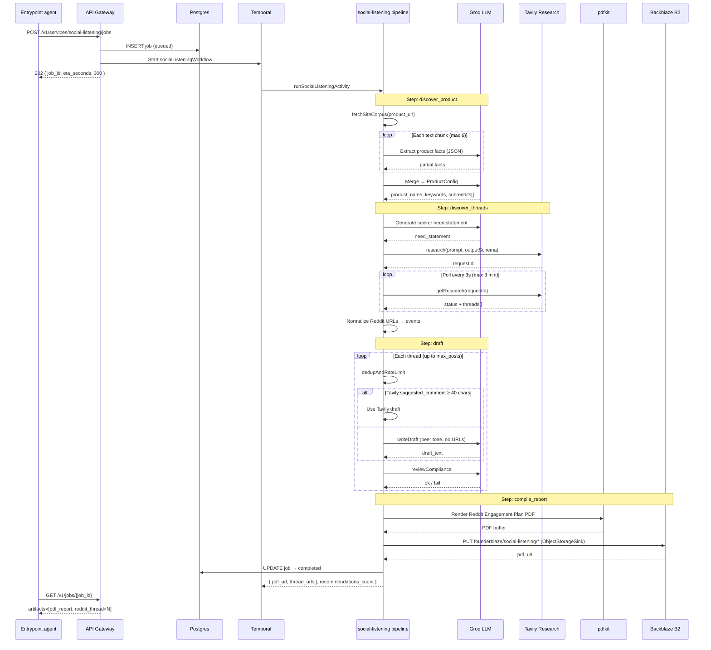

---

### How It Works — Phase by Phase

#### Phase 1: `discover_product` — Product Intelligence from URL

Before searching Reddit, the pipeline must understand *what* your product is, *who* it serves, and *where* those people hang out online.

**Step 1a — Site Corpus Fetch**

The service fetches text from your product URL (homepage + light related paths) via `fetchSiteCorpus()`. This avoids blowing Groq token limits by controlling fetch scope locally rather than asking the LLM to browse.

**Step 1b — Chunked Fact Extraction**

Site text is split into chunks (~2,800 chars each, max 6 chunks). For each chunk, Groq (`openai/gpt-oss-120b` by default) extracts structured facts:

```json
{
  "product_name": "FounderBlaze",
  "one_liner": "AI marketing suite for solo founders",
  "audience": "solo founders, indie hackers",
  "problem": "marketing grunt work without a team",
  "capabilities": ["promo video", "competitor research", "brand kit"],
  "keywords": ["solo founder marketing", "AI go-to-market", "product launch tools"]
}
```

Only facts present in the chunk are extracted — no hallucinated marketing fluff.

**Step 1c — Product Profile Merge**

A second Groq call merges all chunk extractions into a full `ProductConfig`:

| Field | Purpose |
|-------|---------|
| `product_name` | Brand name for comment drafting |
| `one_liner` | Short description |
| `description` | Extended context for drafts |
| `disclosure_line` | FTC-style disclosure (includes "disclosure" + domain) |
| `keywords` | 8–20 pain/search phrases |
| `subreddits` | 4–6 target communities (bare names, no `r/`) |
| `max_posts_per_cycle` | Default 5–8 (overridden by `max_posts` input) |
| `window_hours` | Scheduling window (default 24h) |


---

#### Phase 2: `discover_threads` — Tavily Reddit Research

With a product profile locked, the pipeline finds **live seeker threads** on Reddit.

**Step 2a — Need Statement Generation**

Groq converts the product profile into a single **seeker pain sentence** — describing the *person and their pain*, not the product brand:

> *"someone building an AI agent who complains about juggling separate API keys and subscriptions, and wishes there was one unified way to discover and pay for tools per call"*

This sentence goes inside Tavily's research prompt template:

```
Fetch Reddit posts where {NEED_STATEMENT} I want ONLY reddit posts and NOTHING else.
```

If Groq fails or returns weak output, a deterministic fallback need statement is constructed from `one_liner` + keywords.

**Step 2b — Tavily Research (Structured JSON)**

```typescript
const created = await tavily.research(prompt, {
  model: "mini",  // or "pro" / "auto"
  outputSchema: REDDIT_THREADS_OUTPUT_SCHEMA,
});
```

The output schema enforces:

```json
{
  "threads": [
    {
      "url": "https://www.reddit.com/r/SaaS/comments/abc123/looking_for_marketing_tool/",
      "title": "Looking for a marketing tool that doesn't require a team",
      "selftext": "I'm a solo founder and need help with...",
      "subreddit": "SaaS",
      "why": "OP is actively seeking a solo-founder marketing solution",
      "suggested_comment": "Have you looked at tools that automate..."
    }
  ]
}
```

**Research rules baked into the prompt:**
- ONLY real `reddit.com/r/.../comments/.../` URLs
- ONLY seeker posts (people asking for recommendations)
- EXCLUDE founder launches ("I built", "just launched", "feedback on my")
- Do not invent URLs
- Max threads capped by `max_posts` input

**Step 2c — Async Polling**

Tavily Research runs asynchronously. The pipeline polls `getResearch(requestId)` every **3 seconds** for up to **3 minutes** until status is `completed` or `failed`.

**Step 2d — URL Normalization & Fallback**

Discovered threads pass through strict URL validation:
- Must be `reddit.com` domain
- Must match `/r/{sub}/comments/{id}/` pattern
- Deduplicated by normalized URL

If structured output returns 0 threads, the pipeline **falls back to Tavily Search** (`includeDomains: ["reddit.com"]`) as a cheaper discovery path.

Each hit is converted to a `NormalizedEvent` with platform metadata, permalink, thread context, and optional `suggested_reply` from Tavily.


---

#### Phase 3: `draft` — Comment Generation & Quality Funnel

Each discovered thread enters a multi-stage funnel. Only threads that pass every gate become **included recommendations** in the final PDF.

**Gate 1 — Dedup & Rate Limit**

```typescript
const dedup = await dedupAndRateLimit(event);
```

| Check | Behavior |
|-------|----------|
| Event already seen | Skip — `already_scheduled_or_posted` |
| Same thread posted recently | Skip — `thread_cooldown_{N}m` (default 360 min) |

Cooldown is **per-thread**, not per-subreddit — blocking an entire community would wrongly exclude valid threads.

**Gate 2 — Draft Generation**

If Tavily returned a `suggested_comment` ≥ 40 characters, it is used directly. Otherwise, Groq generates a fresh draft via `writeDraft()`:

- **Peer tone** — helpful advice first, product mentioned once casually
- **No URLs** — stripped via regex (`https?://`, domain names)
- **No CTAs** — no "check out", "sign up", "pricing"
- **2–4 short paragraphs** — Reddit-native length
- **Few-shot examples** — top 4 past successful replies (via local embeddings) inform tone

If the model forgets the product name, it is appended: *"I've had decent luck with {product_name} for that kind of setup."*

Drafts are capped at 1,200 characters.

**Gate 3 — Compliance Review**

Two-layer compliance gate:

**Layer 1 — Deterministic regex checks (instant fail):**

| Rule | Fail reason |
|------|-------------|
| Length < 40 or > 1,400 chars | `length_out_of_bounds` |
| Contains URL or domain (.com, .ai, etc.) | `contains_link_or_domain` |
| Contains "Disclosure:" boilerplate | `looks_like_ad_disclosure` |
| Missing product name | `missing_product_name` |
| Promotional CTA language | `promotional_cta` |

**Layer 2 — Groq LLM review:**

The compliance agent reads the thread + draft and returns `{ ok: boolean, notes: string }`. It fails drafts that are mostly ads, ignore the thread context, or read like marketing copy.

Threads that fail any gate are recorded as **skipped** with a `skip_reason`. Threads that pass become **included** recommendations.


---

#### Phase 4: `compile_report` — PDF Engagement Playbook

Included recommendations are compiled into a professional PDF using **pdfkit** (no browser required).

**PDF structure:**

1. **Header** — "Reddit Engagement Plan", product name, one-liner, website link
2. **Target subreddits** — list of communities researched
3. **Suggested comments** — for each included thread:
   - Subreddit label (`r/SaaS`)
   - Thread title (clickable)
   - Permalink (clickable URL)
   - Thread context ("Why this thread matches")
   - **Comment to post** — full copy-paste draft
   - Draft rationale notes

The PDF is uploaded to **Backblaze B2** under `founderblaze/social-listening/…` via Genblaze `ObjectStorageSink` (`build_b2_sink(service="social-listening")`).

**Cost tracked:** (included in pipeline overhead; storage ~negligible)

---

### Internal Tools & Dependencies

| Tool | Role in Social Listening | Module |
|------|-------------------------|--------|
| **Groq (`gpt-oss-120b`)** | Product discovery, need statements, comment drafting, compliance review | `product/discover.ts`, `product/needStatement.ts`, `agents/draft.ts`, `agents/compliance.ts` |
| **Tavily Research** | Reddit thread discovery with structured JSON output | `ingest/tavilyReddit.ts`, `ingest/tavilyIngest.ts` |
| **Tavily Search** | Fallback discovery when Research returns 0 threads | `ingest/tavilyReddit.ts` |
| **Local Embeddings** | Few-shot tone matching for draft generation | `embeddings/local.ts` |
| **pdfkit** | PDF report rendering (no browser) | `report/compileReport.ts` |
| **Backblaze B2** | PDF + charts (`founderblaze/social-listening/`) | [`social_listening/pipeline.py`](https://github.com/Marshal-AM/founderblaze/blob/main/packages/founderblaze/src/founderblaze/social_listening/pipeline.py), [`b2.py`](https://github.com/Marshal-AM/founderblaze/blob/main/packages/founderblaze/src/founderblaze/core/storage/b2.py) |
| **Temporal** | Durable workflow orchestration, heartbeats | `apps/orchestrator` |
| **PostgreSQL** | Job state, step tracking, artifact URLs | `@founderblaze/db` |
| **Zod** | Input/output validation | `schema.ts`, `@founderblaze/schemas` |

#### Required Environment Variables

```bash
# Groq — product research, drafting, compliance
GROQ_API_KEY=...
GROQ_MODEL=openai/gpt-oss-120b          # optional override

# Tavily — Reddit thread discovery
TAVILY_API_KEY=...
TAVILY_RESEARCH_MODEL=mini              # mini | pro | auto
TAVILY_REDDIT_MODE=research             # must be "research"
TAVILY_REDDIT_LIMIT=10                  # max threads to discover
TAVILY_POLL_MS=3000
TAVILY_RESEARCH_TIMEOUT_MS=180000

# Product discovery tuning
PRODUCT_CHUNK_SIZE=2800
PRODUCT_MAX_CHUNKS=6

# Dedup
THREAD_COOLDOWN_MINUTES=360

# Backblaze B2 — PDF report storage
B2_KEY_ID=
B2_APP_KEY=
B2_BUCKET=
B2_REGION=us-east-005
```

---

### A2MCP Request Body

**Endpoint:** `POST /v1/services/social-listening/jobs`


#### Full Request Example

```json
{
  "input": {
    "product_url": "https://www.notion.so",
    "max_posts": 5
  },
  "callback_url": "https://your-app.com/webhooks/founderblaze",
  "priority": "normal"
}
```

#### Input Schema (`SocialListeningInputSchema`)

| Field | Required | Type | Default | Constraints |
|-------|----------|------|---------|-------------|
| `product_url` | **Yes** | `string (URL)` | — | Valid HTTPS/HTTP URL of the product to research |
| `max_posts` | No | `integer` | `5` (from product profile) | Min `1`, max `20` — cap on threads to include in the report |
| `live` | No | `boolean` | `false` | **Deprecated — ignored.** Pipeline does not auto-post to Reddit. |

> **Important:** The `live` field exists in the schema for backward compatibility but is **completely ignored**. Social Listening returns a PDF report with copy-paste drafts. You post manually.

#### Minimal Request

```json
{
  "input": {
    "product_url": "https://linear.app"
  }
}
```

#### cURL Example (local dev)

```bash
curl -X POST http://localhost:4021/v1/services/social-listening/jobs \
  -H "Content-Type: application/json" \
  -H "X-Idempotency-Key: sl-linear-$(date +%s)" \
  -d '{
    "input": {
      "product_url": "https://linear.app",
      "max_posts": 5
    }
  }'
```

#### Create Response (`202 Accepted`)

```json
{
  "job_id": "c3d4e5f6-a7b8-9012-cdef-123456789012",
  "eta_seconds": 300,
  "status_url": "/v1/jobs/c3d4e5f6-a7b8-9012-cdef-123456789012",
  "status": "queued"
}
```

#### Poll Response — In Progress

```json
{
  "id": "c3d4e5f6-a7b8-9012-cdef-123456789012",
  "service": "social-listening",
  "status": "running",
  "step": "discover_threads",
  "artifacts": [],
  "cost_breakdown": [],
  "error": null,
  "created_at": "2026-07-27T12:00:00.000Z",
  "updated_at": "2026-07-27T12:02:30.000Z",
  "eta_seconds": 300
}
```

The `step` field reflects the current pipeline phase: `discover_product` → `discover_threads` → `draft` → `compile_report`.

#### Poll Response — Completed

```json
{
  "id": "c3d4e5f6-a7b8-9012-cdef-123456789012",
  "service": "social-listening",
  "status": "completed",
  "step": "compile_report",
  "artifacts": [
    {
      "type": "pdf_report",
      "url": "https://s3.us-east-005.backblazeb2.com/your-bucket/founderblaze/reddit/2026-07-27T12-08-00-abc12345-notion-reddit-1730000000.pdf",
      "object_key": "reddit/2026-07-27T12-08-00-abc12345-notion-reddit-1730000000.pdf",
      "mime_type": "application/pdf"
    },
    {
      "type": "reddit_thread",
      "url": "https://www.reddit.com/r/SaaS/comments/abc123/looking_for_project_management/",
      "mime_type": "text/uri-list"
    },
    {
      "type": "reddit_thread",
      "url": "https://www.reddit.com/r/startups/comments/def456/best_tools_for_solo_founders/",
      "mime_type": "text/uri-list"
    }
  ],
  "cost_breakdown": [
    { "vendor": "llm", "operation": "discover_product", "amount_usd": 0.02 },
    { "vendor": "tavily", "operation": "reddit_research", "amount_usd": 0.03 },
    { "vendor": "llm", "operation": "draft", "amount_usd": 0.25 }
  ],
  "error": null,
  "created_at": "2026-07-27T12:00:00.000Z",
  "updated_at": "2026-07-27T12:08:15.000Z",
  "eta_seconds": 300
}
```

The job response body also includes structured `recommendations[]` with `target_permalink`, `draft_text`, `title`, `status` (`included` | `skipped`), `community`, and `skip_reason` for programmatic consumption.

---

### Temporal Orchestration

Social Listening uses a **single-activity workflow** — one durable Temporal activity wraps the entire `runPipeline()` call.

```typescript
// apps/orchestrator/src/workflows/socialListening.ts
export async function socialListeningWorkflow(input) {
  await short.markJobRunning(input.job_id);

  const result = await long.runSocialListeningActivity({
    job_id: input.job_id,
    product_url: input.product_url,
    max_posts: input.max_posts,
  });

  await short.completeJob(input.job_id, {
    artifacts: [
      { type: "pdf_report", url: result.pdf_url, object_key: result.object_key },
      ...result.thread_urls.map(url => ({
        type: "reddit_thread", url, mime_type: "text/uri-list",
      })),
    ],
    cost_breakdown: result.cost_breakdown,
  });
}
```

| Activity Config | Value | Reason |
|-----------------|-------|--------|
| `startToCloseTimeout` | 5 minutes | Tavily Research polling + multi-thread drafting |
| `heartbeatTimeout` | 2 minutes | Detect stuck activities during Tavily poll |
| `maximumAttempts` | 1 | No retry on full pipeline (avoid duplicate drafts) |
| Heartbeat interval | 30 seconds | Keeps activity alive during research poll |

---

### Error Handling & Edge Cases

| Scenario | Behavior |
|----------|----------|
| `TAVILY_API_KEY` missing | Hard fail at ingest — "TAVILY_API_KEY is required" |
| Invalid product URL | Hard fail during `discover_product` |
| Groq chunk extraction fails | Partial facts omitted; merge still proceeds |
| Need statement LLM fails | Deterministic fallback from one_liner + keywords |
| Tavily Research times out (>3 min) | Hard fail with last status |
| Tavily Research returns 0 threads | Falls back to Tavily Search |
| Tavily Search also returns 0 | Empty report — 0 included recommendations |
| Thread fails dedup | Skipped with reason; pipeline continues |
| Draft generation fails for a thread | Skipped with reason; pipeline continues |
| Compliance fails (regex or LLM) | Skipped with reason; pipeline continues |
| All threads skipped | PDF generated with 0 suggested comments |
| Backblaze B2 not configured | Hard fail at `compile_report` |
| Duplicate job (same idempotency key) | Returns existing job |

---

### Why Report-Only (No Auto-Posting)

Social Listening deliberately **does not post to Reddit on your behalf**. This is a product decision, not a missing feature:

1. **Platform risk** — Reddit aggressively bans automated posting. Manual review protects your account.
2. **Quality control** — You know your voice. A 10-second personalization pass beats a bot posting generic copy.
3. **Compliance** — FTC disclosure requirements vary by context. You decide when and how to disclose.
4. **Agent safety** — A2MCP agents should not perform irreversible public actions without human approval.

The PDF is designed for **human-in-the-loop execution**: open report → tap thread → read context → paste draft → post.

---

## Service 4 — Outreach

> **Your website + revenue sheet in. Investor intelligence report out.**

Fundraising is a full-time job that solo founders cannot afford to have. You need to know which VCs actually invest in your category and stage. You need to know what their portfolio companies were earning *before* they got funded — so you can answer "are we too early?" with data, not hope. You need partner names, LinkedIn profiles, and public contact paths — not a stale Crunchbase export from 2023.

Outreach is FounderBlaze's **investor intelligence engine**. Send your company website and a public revenue spreadsheet URL. The pipeline visits your site with Groq Compound, analyzes every sheet in your workbook, searches Exa for thesis-fit investors, benchmarks pre-investment portfolio revenue, finds partner contacts with public socials, enriches each person with targeted Exa searches, and compiles everything into a **professional PDF report** uploaded to Backblaze B2.

No cold email blasts. No CRM setup. No $500/month data subscriptions. **One API call. One PDF. Everything you need to start outreach with confidence.**

**SLA:** ~5 minutes · **Output:** Backblaze-hosted investor intelligence PDF

### Genblaze usage

Outreach is a **nine-step Genblaze DAG**. Every research/enrichment/report stage is a `SyncProvider`; Gemini/Exa work runs *inside* those steps. Entry: [`run_outreach_pipeline`](https://github.com/Marshal-AM/founderblaze/blob/main/packages/founderblaze/src/founderblaze/outreach/pipeline.py#L35).

**Pipeline graph** — [`from genblaze_core import Modality, Pipeline`](https://github.com/Marshal-AM/founderblaze/blob/main/packages/founderblaze/src/founderblaze/outreach/pipeline.py#L8); sink [`build_b2_sink(service="outreach")`](https://github.com/Marshal-AM/founderblaze/blob/main/packages/founderblaze/src/founderblaze/outreach/pipeline.py#L67); [`Pipeline("outreach")`](https://github.com/Marshal-AM/founderblaze/blob/main/packages/founderblaze/src/founderblaze/outreach/pipeline.py#L74) then chained steps:

| # | Step | Modality link | `.step` link |
|---|------|---------------|--------------|
| 0 | Sheet download | [TEXT L86](https://github.com/Marshal-AM/founderblaze/blob/main/packages/founderblaze/src/founderblaze/outreach/pipeline.py#L86) | [L79](https://github.com/Marshal-AM/founderblaze/blob/main/packages/founderblaze/src/founderblaze/outreach/pipeline.py#L79) |
| 1 | Website analyze | [TEXT L96](https://github.com/Marshal-AM/founderblaze/blob/main/packages/founderblaze/src/founderblaze/outreach/pipeline.py#L96) | [L88](https://github.com/Marshal-AM/founderblaze/blob/main/packages/founderblaze/src/founderblaze/outreach/pipeline.py#L88) |
| 2 | Revenue | [TEXT L101](https://github.com/Marshal-AM/founderblaze/blob/main/packages/founderblaze/src/founderblaze/outreach/pipeline.py#L101) | [L98](https://github.com/Marshal-AM/founderblaze/blob/main/packages/founderblaze/src/founderblaze/outreach/pipeline.py#L98) |
| 3 | Investors | [TEXT L109](https://github.com/Marshal-AM/founderblaze/blob/main/packages/founderblaze/src/founderblaze/outreach/pipeline.py#L109) | [L104](https://github.com/Marshal-AM/founderblaze/blob/main/packages/founderblaze/src/founderblaze/outreach/pipeline.py#L104) |
| 4 | Portfolio | [TEXT L117](https://github.com/Marshal-AM/founderblaze/blob/main/packages/founderblaze/src/founderblaze/outreach/pipeline.py#L117) | [L112](https://github.com/Marshal-AM/founderblaze/blob/main/packages/founderblaze/src/founderblaze/outreach/pipeline.py#L112) |
| 5 | Partners | [TEXT L125](https://github.com/Marshal-AM/founderblaze/blob/main/packages/founderblaze/src/founderblaze/outreach/pipeline.py#L125) | [L120](https://github.com/Marshal-AM/founderblaze/blob/main/packages/founderblaze/src/founderblaze/outreach/pipeline.py#L120) |
| 6 | Enrich | [TEXT L131](https://github.com/Marshal-AM/founderblaze/blob/main/packages/founderblaze/src/founderblaze/outreach/pipeline.py#L131) | [L128](https://github.com/Marshal-AM/founderblaze/blob/main/packages/founderblaze/src/founderblaze/outreach/pipeline.py#L128) |
| 7 | VisualInsights | [IMAGE L141](https://github.com/Marshal-AM/founderblaze/blob/main/packages/founderblaze/src/founderblaze/outreach/pipeline.py#L141) | [L134](https://github.com/Marshal-AM/founderblaze/blob/main/packages/founderblaze/src/founderblaze/outreach/pipeline.py#L134) |
| 8 | CompileReport | [TEXT L147](https://github.com/Marshal-AM/founderblaze/blob/main/packages/founderblaze/src/founderblaze/outreach/pipeline.py#L147) | [L144](https://github.com/Marshal-AM/founderblaze/blob/main/packages/founderblaze/src/founderblaze/outreach/pipeline.py#L144) |

Run: [`.run(sink=…)` L150](https://github.com/Marshal-AM/founderblaze/blob/main/packages/founderblaze/src/founderblaze/outreach/pipeline.py#L150).

**SyncProviders:**

| Provider | Links |
|----------|-------|
| `SheetDownloadProvider` | [class](https://github.com/Marshal-AM/founderblaze/blob/main/packages/founderblaze/src/founderblaze/outreach/sheet_download_provider.py#L17), [capabilities](https://github.com/Marshal-AM/founderblaze/blob/main/packages/founderblaze/src/founderblaze/outreach/sheet_download_provider.py#L34) |
| `WebsiteAnalyzeProvider` | [class](https://github.com/Marshal-AM/founderblaze/blob/main/packages/founderblaze/src/founderblaze/outreach/website_provider.py#L16), [capabilities](https://github.com/Marshal-AM/founderblaze/blob/main/packages/founderblaze/src/founderblaze/outreach/website_provider.py#L35) |
| `RevenueAnalyzeProvider` | [class](https://github.com/Marshal-AM/founderblaze/blob/main/packages/founderblaze/src/founderblaze/outreach/revenue_provider.py#L16), [capabilities](https://github.com/Marshal-AM/founderblaze/blob/main/packages/founderblaze/src/founderblaze/outreach/revenue_provider.py#L31) |
| `InvestorFinderProvider` | [class](https://github.com/Marshal-AM/founderblaze/blob/main/packages/founderblaze/src/founderblaze/outreach/investor_provider.py#L20), [capabilities](https://github.com/Marshal-AM/founderblaze/blob/main/packages/founderblaze/src/founderblaze/outreach/investor_provider.py#L35) |
| `PortfolioBenchmarkProvider` | [class](https://github.com/Marshal-AM/founderblaze/blob/main/packages/founderblaze/src/founderblaze/outreach/portfolio_provider.py#L20), [capabilities](https://github.com/Marshal-AM/founderblaze/blob/main/packages/founderblaze/src/founderblaze/outreach/portfolio_provider.py#L35) |
| `PartnerContactsProvider` | [class](https://github.com/Marshal-AM/founderblaze/blob/main/packages/founderblaze/src/founderblaze/outreach/partners_provider.py#L24), [capabilities](https://github.com/Marshal-AM/founderblaze/blob/main/packages/founderblaze/src/founderblaze/outreach/partners_provider.py#L39) |
| `ContactEnrichProvider` | [class](https://github.com/Marshal-AM/founderblaze/blob/main/packages/founderblaze/src/founderblaze/outreach/enrich_provider.py#L21), [capabilities](https://github.com/Marshal-AM/founderblaze/blob/main/packages/founderblaze/src/founderblaze/outreach/enrich_provider.py#L34) |
| `VisualInsightsProvider` | [class](https://github.com/Marshal-AM/founderblaze/blob/main/packages/founderblaze/src/founderblaze/outreach/insights_provider.py#L38), [capabilities](https://github.com/Marshal-AM/founderblaze/blob/main/packages/founderblaze/src/founderblaze/outreach/insights_provider.py#L57) |
| `CompileReportProvider` | [class](https://github.com/Marshal-AM/founderblaze/blob/main/packages/founderblaze/src/founderblaze/outreach/report_provider.py#L19), [capabilities](https://github.com/Marshal-AM/founderblaze/blob/main/packages/founderblaze/src/founderblaze/outreach/report_provider.py#L28) |

**`genblaze_google`:**

- Text: [`chat` import](https://github.com/Marshal-AM/founderblaze/blob/main/packages/founderblaze/src/founderblaze/outreach/gemini_chat.py#L9), [`chat(...)` L27](https://github.com/Marshal-AM/founderblaze/blob/main/packages/founderblaze/src/founderblaze/outreach/gemini_chat.py#L27).
- Images: [`GeminiImageProvider` import](https://github.com/Marshal-AM/founderblaze/blob/main/packages/founderblaze/src/founderblaze/outreach/insights_provider.py#L13), Genblaze [`Step`](https://github.com/Marshal-AM/founderblaze/blob/main/packages/founderblaze/src/founderblaze/outreach/insights_provider.py#L12), construct [L88](https://github.com/Marshal-AM/founderblaze/blob/main/packages/founderblaze/src/founderblaze/outreach/insights_provider.py#L88), modality [L104](https://github.com/Marshal-AM/founderblaze/blob/main/packages/founderblaze/src/founderblaze/outreach/insights_provider.py#L104).

**`Asset` helpers** — [import](https://github.com/Marshal-AM/founderblaze/blob/main/packages/founderblaze/src/founderblaze/outreach/_assets.py#L9), [L26](https://github.com/Marshal-AM/founderblaze/blob/main/packages/founderblaze/src/founderblaze/outreach/_assets.py#L26), [L42](https://github.com/Marshal-AM/founderblaze/blob/main/packages/founderblaze/src/founderblaze/outreach/_assets.py#L42).

**After run** — [`pick_final_pdf_asset` L158](https://github.com/Marshal-AM/founderblaze/blob/main/packages/founderblaze/src/founderblaze/outreach/pipeline.py#L158), [`finalize_run_provenance` L163](https://github.com/Marshal-AM/founderblaze/blob/main/packages/founderblaze/src/founderblaze/outreach/pipeline.py#L163), [`finalize_chart_provenance` L173](https://github.com/Marshal-AM/founderblaze/blob/main/packages/founderblaze/src/founderblaze/outreach/pipeline.py#L173), [`merge_provenance` L177](https://github.com/Marshal-AM/founderblaze/blob/main/packages/founderblaze/src/founderblaze/outreach/pipeline.py#L177).

### Backblaze usage

**Code:** [`pick_final_pdf_asset`](https://github.com/Marshal-AM/founderblaze/blob/main/packages/founderblaze/src/founderblaze/core/storage/b2.py#L148) → [`finalize_run_provenance`](https://github.com/Marshal-AM/founderblaze/blob/main/packages/founderblaze/src/founderblaze/core/storage/provenance.py#L69) (`mode="sidecar"`) → [`finalize_chart_provenance`](https://github.com/Marshal-AM/founderblaze/blob/main/packages/founderblaze/src/founderblaze/core/storage/provenance.py#L209) → [`merge_provenance`](https://github.com/Marshal-AM/founderblaze/blob/main/packages/founderblaze/src/founderblaze/core/storage/provenance.py#L289).

Prefix: `founderblaze/outreach/…`. Completed jobs expose B2 URLs in `artifacts[]`; the API re-signs them on poll via [`resolve_download_url`](https://github.com/Marshal-AM/founderblaze/blob/main/apps/api/src/founderblaze_api/main.py#L80).

### Add-ons

**Visual diligence charts.** A late-pipeline `VisualInsightsProvider` renders seven Gemini charts (revenue benchmark, fit matrix, conflict web, priority ladder, cadence tracker, check-size, thesis cards) and embeds them in PDF §02 “Visual diligence,” with chart objects persisted on B2.

---

### The Pitch

Imagine handing a first-time founder a briefing document that a Series A fundraising consultant would charge $5,000 to produce — and getting it back in under five minutes in a single pipeline run.

That is Outreach.

You provide two inputs: `website_url` and `sheet_url`. FounderBlaze's multi-agent pipeline does the rest:

1. **Website Analyst** — Groq Compound actually visits your site (`visit_website` + `web_search` tools) and returns a factual product summary
2. **Revenue Analyst** — Groq reads every sheet in your `.xlsx`/`.csv` workbook and synthesizes ARR, MRR, growth trajectory, and cross-sheet insights
3. **Investor Finder** — Groq crafts precision Exa queries; Exa deep-searches for VCs and angels that match your category and stage; Groq synthesizes a ranked shortlist
4. **Portfolio Benchmark** — Exa finds pre-investment ARR/MRR/revenue of portfolio companies at those firms — so you know if you're in range
5. **Partner Contacts** — Exa discovers named partners/GPs with LinkedIn, email, and Twitter profiles
6. **Contact Enricher** — One targeted Exa search per person to fill gaps in social profiles
7. **Report Compiler** — Playwright renders a branded HTML template to PDF and uploads to Backblaze B2

The result is a single PDF you can attach to your deck prep notes, share with advisors, or use to prioritize your warm intro requests.

**This is not a mail merge tool. This is fundraising research — automated.**

---

### Pipeline Diagram

```mermaid
flowchart LR
    subgraph Input["A2MCP Input"]
        WEB["website_url"]
        SHEET["sheet_url"]
    end

    subgraph Phase0["Phase 0 — download_sheet"]
        DL["Fetch Spreadsheet"]
        Temp["Temp .xlsx/.csv"]
    end

    subgraph Phase1["Phase 1 — website"]
        Compound["Groq Compound"]
        ProdSum["Product Summary"]
    end

    subgraph Phase2["Phase 2 — revenue"]
        XLSX["Sheet Loader (xlsx)"]
        GroqRev["Groq Revenue Analyst"]
        PerfSum["Performance Summary"]
    end

    subgraph Phase3["Phase 3 — investors"]
        GroqIQ["Groq Exa Query Planner"]
        ExaInv["Exa Deep Search"]
        InvSum["Investor Shortlist"]
    end

    subgraph Phase4["Phase 4 — portfolio"]
        GroqPQ["Groq Portfolio Query"]
        ExaPort["Exa Benchmark Search"]
        BenchSum["Pre-Investment Revenue Benchmarks"]
    end

    subgraph Phase5["Phase 5 — partners"]
        GroqCQ["Groq Contact Query"]
        ExaPart["Exa Partner Search"]
        Contacts["Partner Contact List"]
    end

    subgraph Phase6["Phase 6 — enrich"]
        ExaPer["Exa Per-Person Search"]
        Enriched["Enriched Contacts"]
    end

    subgraph Phase7["Phase 7 — report"]
        HTML["HTML Template"]
        PW["Playwright → PDF"]
        SupaUp["Backblaze B2 Upload"]
        PDF["Investor PDF URL"]
    end

    WEB --> Compound --> ProdSum
    SHEET --> DL --> Temp --> XLSX --> GroqRev --> PerfSum
    ProdSum --> GroqIQ
    PerfSum --> GroqIQ
    GroqIQ --> ExaInv --> InvSum
    InvSum --> GroqPQ
    ProdSum --> GroqPQ
    PerfSum --> GroqPQ
    GroqPQ --> ExaPort --> BenchSum
    InvSum --> GroqCQ --> ExaPart --> Contacts
    Contacts --> ExaPer --> Enriched
    ProdSum --> HTML
    PerfSum --> HTML
    InvSum --> HTML
    BenchSum --> HTML
    Enriched --> HTML
    HTML --> PW --> SupaUp --> PDF
```

---

### End-to-End Sequence

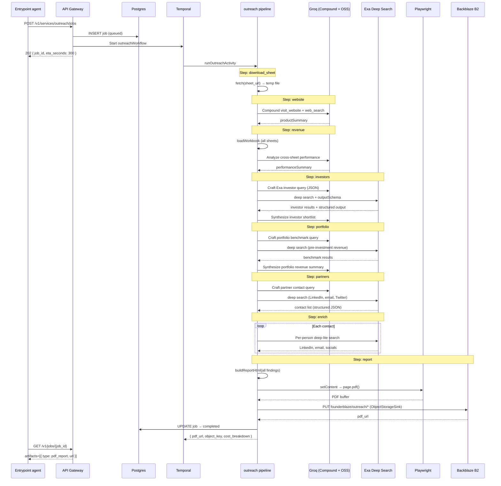

---

### How It Works — Phase by Phase

#### Phase 0: `download_sheet` — Spreadsheet Ingestion

The API accepts a **public URL** to your revenue workbook. The pipeline downloads it to a temp file before analysis.

```typescript
const res = await fetch(sheet_url);
// Saved to: /tmp/founderblaze-outreach/sheet-{timestamp}-{uuid}.xlsx
```

**Supported formats:** `.xlsx`, `.xls`, `.csv`, `.ods`, `.xlsm`, `.xlsb`

The `sheet_url` must be publicly accessible (CDN link, S3 presigned URL, Google Drive direct download link, etc.). The pipeline does not authenticate to private Google Sheets — host the file at a fetchable URL.

> **Note:** `sheet_path` (local filesystem path) exists for CLI/offline runs only. A2MCP API calls require `sheet_url`.

---

#### Phase 1: `website` — Product Analysis (Groq Compound)

The website analyst uses **Groq Compound** — a model with built-in tool execution — to actually visit your site.

```typescript
await groq.chat.completions.create({
  model: "groq/compound",
  compound_custom: {
    tools: { enabled_tools: ["visit_website", "web_search"] },
  },
  messages: [/* analyze product */],
});
```

**Tools invoked:**
- `visit_website` — reads primary site content directly
- `web_search` — supplements with third-party context when needed

**Output:** A 3–5 sentence factual product summary covering:
1. Product name
2. What it does (1–2 sentences)
3. Target audience
4. Notable capabilities (max 4 bullets)

No investor pitch tone. No fluff. Primary site content preferred over third-party commentary.


---

#### Phase 2: `revenue` — Spreadsheet Performance Analysis

The revenue analyst loads **every non-empty sheet** from your workbook via the `xlsx` library and feeds the full content to Groq.

**Sheet loader behavior:**
- Reads all sheets (not just the first tab)
- Converts each sheet to CSV text (capped at 25,000 chars per sheet, 80,000 total)
- Scores sheets for revenue relevance (ARR, MRR, churn, customers keywords)
- Passes sheet metadata: name, row count, column headers

**Groq analysis prompt asks for:**
1. Revenue overview (ARR/MRR/metrics across sheets)
2. Trajectory (growth, decline, flat — with evidence)
3. Cross-sheet insights (how customers, MRR, and churn relate)
4. Notable patterns (seasonality, concentration, segment mix)
5. Risks / gaps / inconsistencies

**Critical rule:** The model must not invent numbers. If sheets conflict, it calls that out explicitly.


---

#### Phase 3: `investors` — Investor Discovery (Groq + Exa)

This is a **two-stage agent loop**: Groq plans the search, Exa executes it, Groq synthesizes results.

**Stage 1 — Query Planning (Groq JSON):**

```json
{
  "query": "VCs and angel investors that fund B2B SaaS marketing automation tools at $500K–$2M ARR seed stage",
  "additionalQueries": [
    "early stage investors portfolio companies similar to ...",
    "seed stage SaaS investors check size $500K–$2M"
  ]
}
```

Query rules: focus on thesis fit (category, B2B/B2C, stage, geography), mention product category explicitly, prefer queries that surface firm names and portfolio examples.

**Stage 2 — Exa Deep Search:**

```typescript
await exa.search(query, {
  type: "deep",
  numResults: 8,
  additionalQueries: [...],
  outputSchema: {
    investors: [{ name, type, thesis, whyRelevant, examplePortfolioCompanies }]
  },
});
```

**Stage 3 — Synthesis (Groq):**

From Exa evidence, Groq produces:
1. Top relevant investors/firms (name + why they fit)
2. Apparent focus / thesis
3. Example portfolio companies mentioned in results
4. Gaps / low-confidence items


---

#### Phase 4: `portfolio` — Pre-Investment Revenue Benchmarks

Using the investor shortlist as context, the pipeline searches for **what portfolio companies were earning BEFORE those investors funded them**.

**Query planning focus:**
- Pre-seed / seed / Series A traction metrics *before* the round closed
- Investor firm names from the shortlist
- Comparable product categories
- ARR, MRR, revenue run-rate, or customers at time of investment

**Exa structured output schema:**

```json
{
  "benchmarks": [
    {
      "company": "PortfolioCo",
      "investor": "Acme Ventures",
      "round": "Seed",
      "preInvestmentRevenue": "$800K ARR",
      "metricType": "ARR",
      "sourceNote": "TechCrunch article, 2023"
    }
  ]
}
```

**Synthesis output:** Benchmark bullets (company | investor | round | pre-investment revenue | confidence), comparison to your company's metrics (only when numbers are present), and missing/low-confidence data flagged explicitly.


---

#### Phase 5: `partners` — Partner Contact Discovery

The pipeline finds **named partners and GPs** at the target investor firms — with public contact information.

**Exa query targets:**
- Partner / General Partner / Investing Partner names
- LinkedIn URLs (`linkedin.com/in/...`)
- Public emails
- Twitter/X profiles
- Firm team pages and partner bios

**Structured contact output:**

```json
{
  "contacts": [
    {
      "name": "Jane Smith",
      "firm": "Acme Ventures",
      "role": "General Partner",
      "linkedin": "https://linkedin.com/in/janesmith",
      "email": "jane@acme.vc",
      "twitter": "https://x.com/janesmith",
      "otherSocials": [],
      "sourceUrl": "https://acme.vc/team/jane-smith"
    }
  ]
}
```

**Rules:** Deduplicate by name+firm. Prefer partners/GPs over analysts. Never fabricate contact details — empty strings for unknown fields.


---

#### Phase 6: `enrich` — Per-Person Contact Enrichment

For each discovered contact, the pipeline runs an **individual targeted Exa search** to fill gaps in social profiles.

**Per-person query template:**

```
"{Jane Smith}" "{Acme Ventures}" partner LinkedIn email Twitter X personal website social profile
```

**Additional queries:**
- `site:linkedin.com/in` scoped search
- `site:x.com OR site:twitter.com OR site:instagram.com`
- Email/contact search

**Merge logic:**
- Extracts URLs and emails from Exa structured output + result highlights
- Validates emails (no wildcards, no image extensions)
- Identifies LinkedIn, Twitter/X, Instagram, personal websites, GitHub, Medium, Substack
- Filters out firm domains from "personal website" detection
- Preserves existing contact data; enrichment only fills gaps

Configurable via:
- `EXA_PERSON_ENRICHMENT_LIMIT` — cap how many contacts get enriched (0 = all)
- `EXA_PERSON_SEARCH_DELAY_MS` — delay between searches (default 250ms)


---

#### Phase 7: `report` — PDF Compilation & Upload

All pipeline findings are compiled into a **branded HTML report** and rendered to PDF via Playwright.

**Report sections (from `buildReportHtml`):**
1. Product summary (from website analyst)
2. Revenue / performance summary (from spreadsheet analyst)
3. Investor shortlist with thesis fit
4. Portfolio pre-investment revenue benchmarks
5. Partner contacts with LinkedIn, email, Twitter links
6. Source citations from Exa searches

**PDF generation:**

```typescript
const browser = await chromium.launch({ headless: true });
const page = await browser.newPage();
await page.setContent(html, { waitUntil: "networkidle" });
const pdfBytes = await page.pdf({
  format: "A4",
  printBackground: true,
  margin: { top: "12mm", right: "10mm", bottom: "12mm", left: "10mm" },
});
```

PDFs are uploaded through Genblaze’s sink (local workdir is ephemeral). Durable objects live on Backblaze B2 under `founderblaze/outreach/…` via `build_b2_sink(service="outreach")`.


---

### Internal Tools & Dependencies

| Tool | Role in Outreach | Module |
|------|-----------------|--------|
| **Groq Compound** | Live website visit + product summary | `agents/websiteAnalyst.ts` |
| **Groq (`gpt-oss-120b`)** | Revenue analysis, Exa query planning, result synthesis | All agent modules |
| **Groq Key Pool** | Multi-key rotation with 429 cooldown fallback | `clients/groqClient.ts` |
| **Exa Deep Search** | Investor, portfolio, partner, and person searches | `clients/exaClient.ts` |
| **SheetJS (`xlsx`)** | Workbook loading (.xlsx, .csv, etc.) | `clients/sheetLoader.ts` |
| **Playwright** | HTML → PDF rendering | `report/compileReport.ts` |
| **Backblaze B2** | PDF + diligence charts (`founderblaze/outreach/`) | [`outreach/pipeline.py`](https://github.com/Marshal-AM/founderblaze/blob/main/packages/founderblaze/src/founderblaze/outreach/pipeline.py), [`b2.py`](https://github.com/Marshal-AM/founderblaze/blob/main/packages/founderblaze/src/founderblaze/core/storage/b2.py) |
| **Temporal** | Durable workflow orchestration | `apps/orchestrator` |
| **PostgreSQL** | Job state, step tracking | `@founderblaze/db` |
| **Zod** | Input/output validation | `schema.ts`, `@founderblaze/schemas` |

#### Required Environment Variables

```bash
# Groq — Compound (website) + OSS (analysis/synthesis)
GROQ_API_KEY=...
GROQ_API_KEY_1=...              # optional multi-key pool
GROQ_API_KEY_2=...
GROQ_COMPOUND_MODEL=groq/compound
GROQ_SHEET_MODEL=openai/gpt-oss-120b
GROQ_MIN_INTERVAL_MS=2500
GROQ_MAX_CONCURRENCY=1

# Exa — investor/contact search
EXA_SEARCH_API_KEY=...
EXA_SEARCH_TYPE=deep            # deep | deep-lite
EXA_NUM_RESULTS=8
EXA_CONTACT_NUM_RESULTS=10
EXA_PERSON_SEARCH_TYPE=deep-lite
EXA_PERSON_NUM_RESULTS=5
EXA_PERSON_ENRICHMENT_LIMIT=0     # 0 = enrich all contacts
EXA_PERSON_SEARCH_DELAY_MS=250

# Backblaze B2 — PDF report storage
B2_KEY_ID=
B2_APP_KEY=
B2_BUCKET=
B2_REGION=us-east-005
```

---

### A2MCP Request Body

**Endpoint:** `POST /v1/services/outreach/jobs`


#### Full Request Example

```json
{
  "input": {
    "website_url": "https://www.notion.so",
    "sheet_url": "https://cdn.example.com/revenue/notion-metrics.xlsx"
  },
  "callback_url": "https://your-app.com/webhooks/founderblaze",
  "priority": "normal"
}
```

#### Input Schema (`OutreachInputSchema`)

| Field | Required | Type | Constraints |
|-------|----------|------|-------------|
| `website_url` | **Yes** | `string (URL)` | Valid HTTPS/HTTP URL of the company website |
| `sheet_url` | **Yes** (API) | `string (URL)` | Public URL to an `.xlsx`, `.xls`, or `.csv` workbook. Downloaded at runtime. Must be fetchable without auth. |
| `sheet_path` | CLI only | `string` | Local filesystem path — **not available via A2MCP API**. Used by `live-run` scripts only. |

Either `sheet_url` or `sheet_path` must be provided. For API/A2MCP calls, use `sheet_url`.

#### Minimal Request

```json
{
  "input": {
    "website_url": "https://linear.app",
    "sheet_url": "https://storage.example.com/linear-revenue-q2-2026.xlsx"
  }
}
```

#### cURL Example (local dev)

```bash
curl -X POST http://localhost:4021/v1/services/outreach/jobs \
  -H "Content-Type: application/json" \
  -H "X-Idempotency-Key: outreach-linear-$(date +%s)" \
  -d '{
    "input": {
      "website_url": "https://linear.app",
      "sheet_url": "https://cdn.example.com/metrics/linear-revenue.xlsx"
    }
  }'
```

#### Create Response (`202 Accepted`)

```json
{
  "job_id": "d4e5f6a7-b8c9-0123-def0-234567890123",
  "eta_seconds": 300,
  "status_url": "/v1/jobs/d4e5f6a7-b8c9-0123-def0-234567890123",
  "status": "queued"
}
```

#### Poll Response — In Progress

```json
{
  "id": "d4e5f6a7-b8c9-0123-def0-234567890123",
  "service": "outreach",
  "status": "running",
  "step": "investors",
  "artifacts": [],
  "cost_breakdown": [],
  "error": null,
  "created_at": "2026-07-27T13:00:00.000Z",
  "updated_at": "2026-07-27T13:04:00.000Z",
  "eta_seconds": 300
}
```

The `step` field reflects the current pipeline phase: `download_sheet` → `website` → `revenue` → `investors` → `portfolio` → `partners` → `enrich` → `report`.

#### Poll Response — Completed

```json
{
  "id": "d4e5f6a7-b8c9-0123-def0-234567890123",
  "service": "outreach",
  "status": "completed",
  "step": "report",
  "artifacts": [
    {
      "type": "pdf_report",
      "url": "https://s3.us-east-005.backblazeb2.com/your-bucket/founderblaze/outreach/notion-outreach-1730000000.pdf",
      "object_key": "outreach/notion-outreach-1730000000.pdf",
      "mime_type": "application/pdf"
    }
  ],
  "cost_breakdown": [
    { "vendor": "llm", "operation": "website_compound", "amount_usd": 0.05 },
    { "vendor": "llm", "operation": "revenue_sheet", "amount_usd": 0.03 },
    { "vendor": "exa", "operation": "investor_search", "amount_usd": 0.40 },
    { "vendor": "exa", "operation": "portfolio_search", "amount_usd": 0.30 },
    { "vendor": "exa", "operation": "partner_contacts", "amount_usd": 0.40 },
    { "vendor": "exa", "operation": "contact_enrichment", "amount_usd": 0.25, "units": 5 },
    { "vendor": "compute", "operation": "pdf_report", "amount_usd": 0.02 }
  ],
  "error": null,
  "created_at": "2026-07-27T13:00:00.000Z",
  "updated_at": "2026-07-27T13:12:45.000Z",
  "eta_seconds": 300
}
```

The full job output (available in pipeline result) also includes structured sections: `website`, `revenue`, `investors`, `portfolioBenchmarks`, and `partnerContacts` with contact arrays, Exa source URLs, and synthesis summaries.

---

### Temporal Orchestration

Outreach uses a **single-activity workflow** with an extended timeout to accommodate multiple Exa deep searches and per-person enrichment.

```typescript
// apps/orchestrator/src/workflows/outreach.ts
export async function outreachWorkflow(input) {
  await short.markJobRunning(input.job_id);

  const result = await long.runOutreachActivity({
    job_id: input.job_id,
    website_url: input.website_url,
    sheet_url: input.sheet_url,
  });

  await short.completeJob(input.job_id, {
    artifacts: [{
      type: "pdf_report",
      url: result.pdf_url,
      object_key: result.object_key,
      mime_type: "application/pdf",
    }],
    cost_breakdown: result.cost_breakdown,
  });
}
```

| Activity Config | Value | Reason |
|-----------------|-------|--------|
| `startToCloseTimeout` | 5 minutes | Multiple Exa deep searches + per-person enrichment |
| `heartbeatTimeout` | 2 minutes | Exa API calls |
| `maximumAttempts` | 1 | Avoid duplicate Exa searches on retry |
| Heartbeat interval | 30 seconds | Keeps activity alive during Exa polls |

Step updates include optional `detail` (e.g., sheet URL, website URL) for richer job polling visibility.

---

### Error Handling & Edge Cases

| Scenario | Behavior |
|----------|----------|
| `sheet_url` unreachable or non-200 | Hard fail at `download_sheet` |
| Unsupported spreadsheet format | Hard fail in sheet loader |
| Empty workbook (no sheets) | Hard fail |
| Groq Compound returns empty summary | Hard fail at `website` |
| Groq rate limit (429) | Key pool rotates to next key with cooldown |
| All Groq keys exhausted | Hard fail after max attempts |
| Exa API key missing | Hard fail at first Exa call |
| Exa returns 0 investor results | Synthesis proceeds with "(no Exa results)" — low-confidence noted |
| Contact synthesis returns 0 contacts | Hard fail at `partners` |
| Individual enrichment search fails | Contact kept with pre-enrichment data; error logged |
| Playwright/Chromium not installed | Auto-install attempted via `ensureChromiumInstalled()` |
| Backblaze B2 not configured | Hard fail at `report` |
| Duplicate job (same idempotency key) | Returns existing job |

---

### What Outreach Does NOT Do

Clarity on scope boundaries:

1. **No email sending** — Outreach produces intelligence, not outbound mail. You send the emails.
2. **No CRM integration** — Contacts are in the PDF and structured JSON output. Import to your CRM manually.
3. **No guaranteed contact accuracy** — Public social profiles only. Exa evidence is cited; fabricated emails are explicitly forbidden in prompts.
4. **No private sheet auth** — `sheet_url` must be publicly fetchable. Use a presigned S3 URL or direct CDN link.
5. **No warm intro automation** — Partner names and LinkedIn URLs are starting points for *your* network mapping.

---

## Service 5 — Competitor Research

> **Product name in. Full competitive intelligence report out.**

Every founder has been asked: *"Who are your competitors?"* and stumbled through a half-researched answer. You know the big names. You don't know their pricing tiers, their feature gaps, where you sit on a positioning map, or what your SWOT actually looks like with evidence behind it.

Competitor Research is FounderBlaze's **automated competitive intelligence engine** — the flagship pipeline that launched the platform. Send a product name and optional URL. The system discovers up to five direct competitors via multi-provider web search, fetches and cleans public vendor pages through Jina Reader, builds a category-specific feature comparison matrix, extracts pricing tiers from public pages, generates SWOT analysis with a positioning map, and delivers a **branded PDF report** with Backblaze B2 URL.

No G2 subscription. No manual spreadsheet. No consultant retainer. **One API call. One report. Board-ready competitive analysis.**

**SLA:** ~5 minutes · **Output:** Backblaze-hosted competitor analysis PDF

### Genblaze usage

Competitor Research is a **seven-step Genblaze DAG**. Unlike most services, B2 sink attachment is **mandatory** (no `upload_to_b2=False` path). Entry: [`run_competitor_research_pipeline`](https://github.com/Marshal-AM/founderblaze/blob/main/packages/founderblaze/src/founderblaze/competitor_research/pipeline.py#L36).

**Pipeline graph** — [`from genblaze_core import Modality, Pipeline`](https://github.com/Marshal-AM/founderblaze/blob/main/packages/founderblaze/src/founderblaze/competitor_research/pipeline.py#L9); always-on sink [`build_b2_sink(service="competitor-research")` L61](https://github.com/Marshal-AM/founderblaze/blob/main/packages/founderblaze/src/founderblaze/competitor_research/pipeline.py#L61); [`Pipeline("competitor-research")` L77](https://github.com/Marshal-AM/founderblaze/blob/main/packages/founderblaze/src/founderblaze/competitor_research/pipeline.py#L77):

| # | Step | Modality | `.step` |
|---|------|----------|---------|
| 0 | FindCompetitors | [TEXT L90](https://github.com/Marshal-AM/founderblaze/blob/main/packages/founderblaze/src/founderblaze/competitor_research/pipeline.py#L90) | [L82](https://github.com/Marshal-AM/founderblaze/blob/main/packages/founderblaze/src/founderblaze/competitor_research/pipeline.py#L82) |
| 1 | Evidence | [TEXT L95](https://github.com/Marshal-AM/founderblaze/blob/main/packages/founderblaze/src/founderblaze/competitor_research/pipeline.py#L95) | [L92](https://github.com/Marshal-AM/founderblaze/blob/main/packages/founderblaze/src/founderblaze/competitor_research/pipeline.py#L92) |
| 2 | DiffFeatures | [TEXT L101](https://github.com/Marshal-AM/founderblaze/blob/main/packages/founderblaze/src/founderblaze/competitor_research/pipeline.py#L101) | [L98](https://github.com/Marshal-AM/founderblaze/blob/main/packages/founderblaze/src/founderblaze/competitor_research/pipeline.py#L98) |
| 3 | Pricing | [TEXT L107](https://github.com/Marshal-AM/founderblaze/blob/main/packages/founderblaze/src/founderblaze/competitor_research/pipeline.py#L107) | [L104](https://github.com/Marshal-AM/founderblaze/blob/main/packages/founderblaze/src/founderblaze/competitor_research/pipeline.py#L104) |
| 4 | Positioning | [TEXT L113](https://github.com/Marshal-AM/founderblaze/blob/main/packages/founderblaze/src/founderblaze/competitor_research/pipeline.py#L113) | [L110](https://github.com/Marshal-AM/founderblaze/blob/main/packages/founderblaze/src/founderblaze/competitor_research/pipeline.py#L110) |
| 5 | VisualInsights | [IMAGE L123](https://github.com/Marshal-AM/founderblaze/blob/main/packages/founderblaze/src/founderblaze/competitor_research/pipeline.py#L123) | [L116](https://github.com/Marshal-AM/founderblaze/blob/main/packages/founderblaze/src/founderblaze/competitor_research/pipeline.py#L116) |
| 6 | CompileReport | [TEXT L129](https://github.com/Marshal-AM/founderblaze/blob/main/packages/founderblaze/src/founderblaze/competitor_research/pipeline.py#L129) | [L126](https://github.com/Marshal-AM/founderblaze/blob/main/packages/founderblaze/src/founderblaze/competitor_research/pipeline.py#L126) |

Run: [`.run(sink=…)` L132](https://github.com/Marshal-AM/founderblaze/blob/main/packages/founderblaze/src/founderblaze/competitor_research/pipeline.py#L132).

**SyncProviders:**

| Provider | Links |
|----------|-------|
| `FindCompetitorsProvider` | [class](https://github.com/Marshal-AM/founderblaze/blob/main/packages/founderblaze/src/founderblaze/competitor_research/find_competitors_provider.py#L32), [capabilities](https://github.com/Marshal-AM/founderblaze/blob/main/packages/founderblaze/src/founderblaze/competitor_research/find_competitors_provider.py#L51) |
| `GatherEvidenceProvider` | [class](https://github.com/Marshal-AM/founderblaze/blob/main/packages/founderblaze/src/founderblaze/competitor_research/evidence_provider.py#L15), [capabilities](https://github.com/Marshal-AM/founderblaze/blob/main/packages/founderblaze/src/founderblaze/competitor_research/evidence_provider.py#L24) |
| `DiffFeaturesProvider` | [class](https://github.com/Marshal-AM/founderblaze/blob/main/packages/founderblaze/src/founderblaze/competitor_research/features_provider.py#L114), [capabilities](https://github.com/Marshal-AM/founderblaze/blob/main/packages/founderblaze/src/founderblaze/competitor_research/features_provider.py#L126) |
| `ScrapePricingProvider` | [class](https://github.com/Marshal-AM/founderblaze/blob/main/packages/founderblaze/src/founderblaze/competitor_research/pricing_provider.py#L145), [capabilities](https://github.com/Marshal-AM/founderblaze/blob/main/packages/founderblaze/src/founderblaze/competitor_research/pricing_provider.py#L157) |
| `BuildPositioningProvider` | [class](https://github.com/Marshal-AM/founderblaze/blob/main/packages/founderblaze/src/founderblaze/competitor_research/positioning_provider.py#L126), [capabilities](https://github.com/Marshal-AM/founderblaze/blob/main/packages/founderblaze/src/founderblaze/competitor_research/positioning_provider.py#L138) |
| `VisualInsightsProvider` | [class](https://github.com/Marshal-AM/founderblaze/blob/main/packages/founderblaze/src/founderblaze/competitor_research/insights_provider.py#L45), [capabilities](https://github.com/Marshal-AM/founderblaze/blob/main/packages/founderblaze/src/founderblaze/competitor_research/insights_provider.py#L64) |
| `CompileReportProvider` | [class](https://github.com/Marshal-AM/founderblaze/blob/main/packages/founderblaze/src/founderblaze/competitor_research/report_provider.py#L18), [capabilities](https://github.com/Marshal-AM/founderblaze/blob/main/packages/founderblaze/src/founderblaze/competitor_research/report_provider.py#L27) |

**`genblaze_google`:**

- Text: [`chat` import](https://github.com/Marshal-AM/founderblaze/blob/main/packages/founderblaze/src/founderblaze/competitor_research/gemini_chat.py#L9), [`chat(...)` L27](https://github.com/Marshal-AM/founderblaze/blob/main/packages/founderblaze/src/founderblaze/competitor_research/gemini_chat.py#L27).
- Images: [`GeminiImageProvider`](https://github.com/Marshal-AM/founderblaze/blob/main/packages/founderblaze/src/founderblaze/competitor_research/insights_provider.py#L14), Genblaze [`Step`](https://github.com/Marshal-AM/founderblaze/blob/main/packages/founderblaze/src/founderblaze/competitor_research/insights_provider.py#L13), construct [L96](https://github.com/Marshal-AM/founderblaze/blob/main/packages/founderblaze/src/founderblaze/competitor_research/insights_provider.py#L96), modality [L128](https://github.com/Marshal-AM/founderblaze/blob/main/packages/founderblaze/src/founderblaze/competitor_research/insights_provider.py#L128).

**`Asset` helpers** — [import](https://github.com/Marshal-AM/founderblaze/blob/main/packages/founderblaze/src/founderblaze/competitor_research/_assets.py#L9), [L26](https://github.com/Marshal-AM/founderblaze/blob/main/packages/founderblaze/src/founderblaze/competitor_research/_assets.py#L26), [L42](https://github.com/Marshal-AM/founderblaze/blob/main/packages/founderblaze/src/founderblaze/competitor_research/_assets.py#L42).

**After run** — [`pick_final_pdf_asset` L140](https://github.com/Marshal-AM/founderblaze/blob/main/packages/founderblaze/src/founderblaze/competitor_research/pipeline.py#L140), [`finalize_run_provenance` L147](https://github.com/Marshal-AM/founderblaze/blob/main/packages/founderblaze/src/founderblaze/competitor_research/pipeline.py#L147), [`finalize_chart_provenance` L155](https://github.com/Marshal-AM/founderblaze/blob/main/packages/founderblaze/src/founderblaze/competitor_research/pipeline.py#L155), [`merge_provenance` L163](https://github.com/Marshal-AM/founderblaze/blob/main/packages/founderblaze/src/founderblaze/competitor_research/pipeline.py#L163).

### Backblaze usage

**Code:** requires a resolved `object_key` after `.run(sink=…)` → [`finalize_run_provenance`](https://github.com/Marshal-AM/founderblaze/blob/main/packages/founderblaze/src/founderblaze/core/storage/provenance.py#L69) (`mode="sidecar"`) → [`finalize_chart_provenance`](https://github.com/Marshal-AM/founderblaze/blob/main/packages/founderblaze/src/founderblaze/core/storage/provenance.py#L209) → [`merge_provenance`](https://github.com/Marshal-AM/founderblaze/blob/main/packages/founderblaze/src/founderblaze/core/storage/provenance.py#L289). Workdir is `shutil.rmtree`’d in `finally` so local temp files are not the system of record.

Prefix: `founderblaze/competitor-research/…` for the PDF and attack-visual chart PNGs.

### Add-ons

**Attack visuals.** A `VisualInsightsProvider` generates five Gemini charts (steal-share scatter, ICP heat, ICP Venn, threat portfolio, lock-in when public signal exists) embedded in PDF §02 “Attack visuals,” with charts uploaded to B2 alongside the report.


---

### The Pitch

Imagine commissioning a competitive analysis from a strategy consulting firm — competitor identification, feature matrix, pricing comparison, SWOT, positioning map — and getting it back in under five minutes for less than a lunch.

That is Competitor Research.

You send `product_name: "Notion"` and `product_url: "https://www.notion.so"`. Five specialized agents run in sequence:

1. **Competitor Finder** — searches the web (Serper → Brave → DuckDuckGo failover), ranks candidates with Groq, returns up to 5 direct competitors with confidence scores
2. **Feature Diff** — selects category-appropriate comparison dimensions, scores each vendor yes/partial/no/unknown from public page evidence
3. **Pricing Scraper** — extracts public tiers, pricing models (per-seat, freemium, contact-sales), and enterprise flags
4. **Positioning Builder** — generates SWOT, a 2-axis positioning map (price vs. feature breadth), and evidence-backed recommendations
5. **Report Compiler** — renders HTML → PDF via Playwright, uploads to Backblaze B2

Unlike the other services (single-activity workflows), Competitor Research uses **five separate Temporal activities** — each durable, retryable, and visible as a distinct job step when you poll.

This is the report you bring to your investor meeting. This is the analysis you paste into your pitch deck appendix. This is how solo founders compete with teams that have dedicated competitive intelligence analysts.

---

### Pipeline Diagram

```mermaid
flowchart LR
    subgraph Input["A2MCP Input"]
        NAME["product_name"]
        URL["product_url (optional)"]
    end

    subgraph Step1["Step 1 — findCompetitors"]
        WS["Web Search (Serper/Brave/DDG)"]
        Jina1["Jina Reader (product page)"]
        GroqRank["Groq Rank & Filter"]
        CompList["≤5 Competitors"]
    end

    subgraph Step2["Step 2 — diffFeatures"]
        JinaFeat["Jina: / + /features + /product"]
        GroqDims["Groq Category Features"]
        GroqScore["Groq Per-Vendor Scoring"]
        Matrix["Feature Matrix"]
    end

    subgraph Step3["Step 3 — scrapePricing"]
        JinaPrice["Jina: /pricing + /plans"]
        GroqPrice["Groq Tier Extraction"]
        Heuristic["Regex Price Fallback"]
        Pricing["Pricing Comparison"]
    end

    subgraph Step4["Step 4 — buildPositioning"]
        DetMap["Deterministic Position Map"]
        GroqSWOT["Groq SWOT + Recommendations"]
        Position["Positioning Analysis"]
    end

    subgraph Step5["Step 5 — compileReport"]
        HTML["HTML Report Template"]
        PW["Playwright → PDF"]
        SupaUp["Backblaze B2 Upload"]
        PDF["Report PDF URL"]
    end

    NAME --> WS
    URL --> Jina1
    WS --> GroqRank --> CompList
    Jina1 --> GroqRank
    CompList --> JinaFeat
    CompList --> JinaPrice
    JinaFeat --> GroqDims --> GroqScore --> Matrix
    JinaPrice --> GroqPrice --> Pricing
    Heuristic --> Pricing
    Matrix --> DetMap
    Pricing --> DetMap
    DetMap --> GroqSWOT --> Position
    Matrix --> HTML
    Pricing --> HTML
    Position --> HTML
    CompList --> HTML
    HTML --> PW --> SupaUp --> PDF
```

---

### End-to-End Sequence

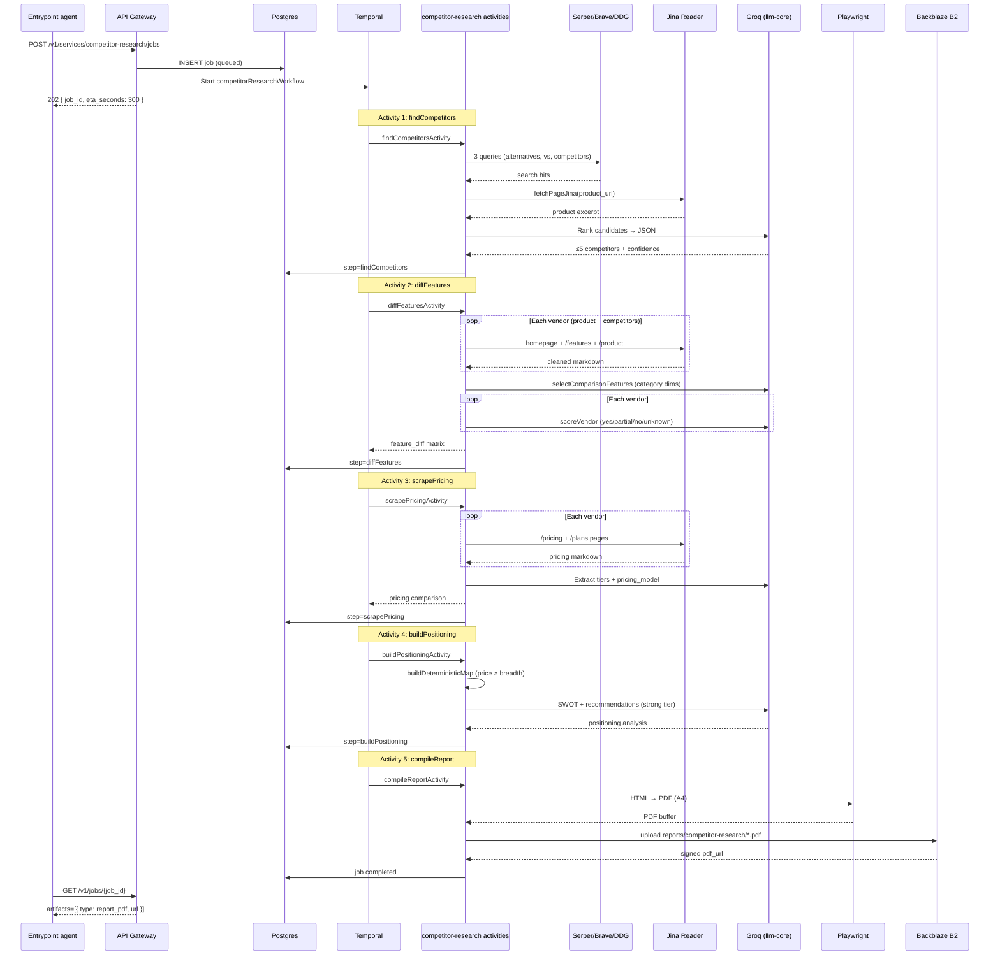

---

### How It Works — Agent by Agent

#### Agent 1: `findCompetitors` — Discovery & Ranking

The pipeline starts by finding **real direct competitors** — same category, same ICP — not blog posts or review aggregators.

**Web search (3 queries):**

```
{product_name} alternatives
{product_name} vs competitors
{product_name} competitors
```

Each query hits `@founderblaze/connectors` `webSearch()` with **provider failover**:

| Priority | Provider | Role |
|----------|----------|------|
| 1 | Serper | Primary |
| 2 | Brave Search API | Failover |
| 3 | DuckDuckGo HTML | Last resort |

**Product page context (optional):**

If `product_url` is provided, Jina Reader fetches the homepage (first 2,500 chars) to ground category understanding.

**Candidate filtering:**

Results are filtered to exclude:
- Same domain as the product
- YouTube, Reddit, Wikipedia, LinkedIn, Facebook, X/Twitter
- Review aggregators (G2, Capterra, GetApp) — often CAPTCHA-blocked

**Groq ranking:**

```json
{
  "competitors": [
    {
      "name": "Coda",
      "url": "https://coda.io",
      "confidence": 0.92,
      "category_match": "collaborative workspace / docs"
    }
  ]
}
```

Rules: 4–5 max, vendor homepages only, drop weak matches. If Groq fails, a heuristic fallback deduplicates by domain and ranks by hit frequency.

---

#### Agent 2: `diffFeatures` — Feature Comparison Matrix

With competitors identified, the pipeline builds a **category-specific feature matrix**.

**Evidence gathering (Jina Reader per vendor):**

For each vendor (your product + up to 5 competitors), fetch:
- Homepage (`/`)
- Features page (`/features`, `/product`)

Markdown is cleaned to strip nav, cookies, footers, and boilerplate — cutting tokens 40–60% with no signal loss.

**Category feature selection (Groq):**

One cheap LLM call analyzes your product page and returns 6–8 **category-appropriate comparison dimensions**:

- PM tools → "Gantt charts", "Sprint boards", "Time tracking"
- API platforms → "Rate limiting", "Webhook support", "SDK coverage"
- Fallback → "Free plan", "Mobile apps", "API", "Integrations", "SSO", "AI features"

**Per-vendor scoring (Groq, one call each):**

For each vendor's page text, Groq assigns each feature:

| Status | Meaning |
|--------|---------|
| `yes` | Text clearly shows the vendor offers it |
| `partial` | Enterprise-only, add-on, or higher tier |
| `no` | Text explicitly says unavailable |
| `unknown` | Not mentioned — never guessed |

Keyword heuristics backfill when LLM returns `unknown`.

**Matrix pruning:**

Features evidenced on fewer than 50% of vendors are dropped. Sparse rows are removed to keep the report actionable.

**Output structure:**

```json
{
  "features": ["Real-time collaboration", "API access", "SSO / SAML"],
  "matrix": {
    "Notion": {
      "Real-time collaboration": { "status": "yes", "evidence_url": "https://notion.so/features" },
      "API access": { "status": "partial", "evidence_url": "..." }
    },
    "Coda": { "...": "..." }
  }
}
```

---

#### Agent 3: `scrapePricing` — Public Pricing Extraction

Parallel in the workflow (sequential in pipeline to avoid Groq rate limits), this agent extracts **public pricing tiers** from vendor pages.

**Evidence paths (Jina Reader):**

```
/pricing
/plans
```

The fetch stops at the first page containing price signals (`$`, `/user`, `/seat`, `free`).

**Groq extraction:**

```json
{
  "product_pricing": {
    "tiers": [
      { "name": "Free", "price": 0, "currency": "USD" },
      { "name": "Plus", "price": 10, "currency": "USD", "period": "month" },
      { "name": "Business", "price": 18, "currency": "USD", "period": "month" }
    ]
  },
  "competitor_pricing": [
    {
      "competitor": "Coda",
      "tiers": [{ "name": "Pro", "price": 12, "currency": "USD", "period": "month" }],
      "pricing_model": "per-seat",
      "enterprise_custom": true
    }
  ]
}
```

**Pricing models detected:** `per-seat`, `flat-rate`, `usage-based`, `freemium`, `contact-sales`

**Heuristic fallback:** Regex price extraction (`$XX/user/mo`) + plan name detection (Free, Pro, Enterprise) when LLM fails. Never invents prices.

---

#### Agent 4: `buildPositioning` — SWOT & Positioning Map

The positioning agent synthesizes feature and pricing evidence into strategic recommendations.

**Deterministic positioning map (always computed):**

A 2-axis scatter plot is built from evidence — never empty:

| Axis | Source |
|------|--------|
| X — Monthly price | Lowest public list price per vendor |
| Y — Feature breadth | Ratio of `yes` + 0.5×`partial` across matrix |

Vendors with undisclosed pricing sit in the right "custom/enterprise" band.

**Groq SWOT synthesis (strong tier):**

```json
{
  "swot": {
    "strengths": ["Evidence-backed capability X", "Competitive pricing at $Y/mo"],
    "weaknesses": ["Gap in SSO vs. Competitor Z"],
    "opportunities": ["Underserved segment where peers lack feature A"],
    "threats": ["Competitor B's enterprise motion"]
  },
  "recommended_positioning": [
    {
      "angle": "Lead with real-time collaboration density",
      "supporting_facts": ["Notion scores yes on 7/8 category features vs. Coda 5/8"]
    }
  ],
  "risks": ["Limited public pricing for 2/5 competitors"]
}
```

Rules: 3–4 recommendations, each must name a peer and cite concrete evidence. On Groq 429 rate limit, retries with fast tier; falls back to deterministic SWOT if both fail.

---

#### Agent 5: `compileReport` — PDF Generation & Delivery

All findings are rendered into a **branded HTML template** and converted to PDF.

**Report sections:**
1. Executive summary
2. Competitor overview (names, URLs, confidence, category match)
3. Feature comparison matrix (color-coded yes/partial/no/unknown)
4. Pricing comparison table
5. Positioning map (2-axis chart)
6. SWOT analysis
7. Recommended positioning angles with supporting facts
8. Risks and data gaps

**PDF pipeline:**

```typescript
const browser = await chromium.launch({ headless: true });
await page.setContent(html, { waitUntil: "networkidle" });
const pdfBytes = await page.pdf({ format: "A4", printBackground: true });
```

Uploaded to Backblaze B2 at `reports/competitor-research/{slug}-{timestamp}.pdf` with **signed URL** (default 7-day TTL via `REPORT_URL_TTL_SECONDS`).

---

### Internal Tools & Dependencies

| Tool | Role in Competitor Research | Module |
|------|----------------------------|--------|
| **Serper / Brave / DuckDuckGo** | Competitor discovery web search (failover chain) | `@founderblaze/connectors` |
| **Jina Reader** | Public page fetch → cleaned markdown | `@founderblaze/connectors` |
| **Groq (`llm-core`)** | Ranking, feature scoring, pricing extraction, SWOT | `@founderblaze/llm-core` |
| **Playwright** | HTML → PDF rendering | `agents/compileReport.ts` |
| **Backblaze B2** | PDF + attack visuals (`founderblaze/competitor-research/`) | [`competitor_research/pipeline.py`](https://github.com/Marshal-AM/founderblaze/blob/main/packages/founderblaze/src/founderblaze/competitor_research/pipeline.py), [`b2.py`](https://github.com/Marshal-AM/founderblaze/blob/main/packages/founderblaze/src/founderblaze/core/storage/b2.py) |
| **Temporal** | Multi-activity durable workflow (5 activities) | `apps/orchestrator` |
| **PostgreSQL** | Job state, per-step visibility | `@founderblaze/db` |
| **Zod** | Input/output validation | `schema.ts`, `@founderblaze/schemas` |

#### Groq Model Tiers (`@founderblaze/llm-core`)

| Tier | Used For |
|------|----------|
| `fast` | Competitor ranking, feature selection, per-vendor scoring, pricing extraction |
| `strong` | SWOT synthesis and positioning recommendations |

#### Required Environment Variables

```bash
# Web search (at least one required)
SERPER_API_KEY=...
BRAVE_SEARCH_API_KEY=...        # fallback
# DuckDuckGo needs no key (last resort)

# Jina Reader — page fetch
JINA_API_KEY=...

# Groq — all LLM agents
GROQ_API_KEY=...

# Backblaze B2 — PDF report storage
B2_KEY_ID=
B2_APP_KEY=
B2_BUCKET=
B2_REGION=us-east-005
REPORT_URL_TTL_SECONDS=604800   # signed URL TTL (default 7 days)
```

---

### A2MCP Request Body

**Endpoint:** `POST /v1/services/competitor-research/jobs`


#### Full Request Example

```json
{
  "input": {
    "product_name": "Notion",
    "product_url": "https://www.notion.so"
  },
  "callback_url": "https://your-app.com/webhooks/founderblaze",
  "priority": "normal"
}
```

#### Input Schema (`CompetitorResearchInputSchema`)

| Field | Required | Type | Constraints |
|-------|----------|------|-------------|
| `product_name` | **Yes** | `string` | Min 1 character — search anchor and report label |
| `product_url` | Recommended | `string (URL)` | Valid URL — ground truth for category, features, and pricing. Strongly recommended for accuracy. |

#### Minimal Request (name only)

```json
{
  "input": {
    "product_name": "Linear"
  }
}
```

Without `product_url`, the pipeline uses Google search as a fallback URL and relies entirely on web search hits for context. **Always provide `product_url` for best results.**

#### cURL Example (local dev)

```bash
curl -X POST http://localhost:4021/v1/services/competitor-research/jobs \
  -H "Content-Type: application/json" \
  -H "X-Idempotency-Key: cr-notion-$(date +%s)" \
  -d '{
    "input": {
      "product_name": "Notion",
      "product_url": "https://www.notion.so"
    }
  }'
```

#### Create Response (`202 Accepted`)

```json
{
  "job_id": "e5f6a7b8-c9d0-1234-ef01-345678901234",
  "eta_seconds": 300,
  "status_url": "/v1/jobs/e5f6a7b8-c9d0-1234-ef01-345678901234",
  "status": "queued"
}
```

#### Poll Response — In Progress

```json
{
  "id": "e5f6a7b8-c9d0-1234-ef01-345678901234",
  "service": "competitor-research",
  "status": "running",
  "step": "scrapePricing",
  "artifacts": [],
  "cost_breakdown": [],
  "error": null,
  "created_at": "2026-07-27T14:00:00.000Z",
  "updated_at": "2026-07-27T14:06:30.000Z",
  "eta_seconds": 300
}
```

The `step` field reflects the current Temporal activity: `findCompetitors` → `diffFeatures` → `scrapePricing` → `buildPositioning` → `compileReport`.

#### Poll Response — Completed

```json
{
  "id": "e5f6a7b8-c9d0-1234-ef01-345678901234",
  "service": "competitor-research",
  "status": "completed",
  "step": "compileReport",
  "artifacts": [
    {
      "type": "report_pdf",
      "url": "https://s3.us-east-005.backblazeb2.com/your-bucket/founderblaze/competitor-research/notion-1730000000.pdf?token=...",
      "object_key": "competitor-research/notion-1730000000.pdf",
      "mime_type": "application/pdf"
    }
  ],
  "cost_breakdown": [
    { "vendor": "discovery", "operation": "findCompetitors", "amount_usd": 0.08 },
    { "vendor": "scrape", "operation": "diffFeatures", "amount_usd": 0.12 },
    { "vendor": "scrape", "operation": "scrapePricing", "amount_usd": 0.10 },
    { "vendor": "llm-core", "operation": "buildPositioning", "amount_usd": 0.04 },
    { "vendor": "render", "operation": "compileReport", "amount_usd": 0.01 }
  ],
  "error": null,
  "created_at": "2026-07-27T14:00:00.000Z",
  "updated_at": "2026-07-27T14:18:00.000Z",
  "eta_seconds": 300
}
```

The full pipeline output also includes structured JSON: `competitors[]`, `feature_diff`, `pricing`, and `positioning` — usable programmatically without parsing the PDF.

---

### Temporal Orchestration — Multi-Activity Workflow

Competitor Research is the **only FounderBlaze service** that uses a **multi-activity Temporal workflow** — five separate durable activities instead of one monolithic pipeline call.

```typescript
// apps/orchestrator/src/workflows/competitorResearch.ts
export async function competitorResearchWorkflow(input) {
  await short.markJobRunning(input.job_id);

  const found = await medium.findCompetitorsActivity(productInput);
  const features = await medium.diffFeaturesActivity({ input, competitors: found.competitors });
  const pricing = await medium.scrapePricingActivity({ input, competitors: found.competitors });
  const positioning = await short.buildPositioningActivity({ productName, feature_diff, pricing });
  const report = await compile.compileReportActivity({ input, competitors, feature_diff, pricing, positioning });

  await short.completeJob(input.job_id, { artifacts, cost_breakdown });
}
```

| Activity | Timeout | Retries | Purpose |
|----------|---------|---------|---------|
| `findCompetitorsActivity` | 5 min | 3 | Web search + Groq ranking |
| `diffFeaturesActivity` | 5 min | 3 | Jina fetch + feature matrix |
| `scrapePricingActivity` | 5 min | 3 | Jina fetch + pricing extraction |
| `buildPositioningActivity` | 5 min | 3 | SWOT + positioning map |
| `compileReportActivity` | 5 min | 2 | Playwright PDF + Backblaze B2 upload |

**Why multi-activity?**

1. **Step visibility** — Poll shows exactly which agent is running (`step: "scrapePricing"`)
2. **Independent retries** — A failed pricing scrape doesn't re-run competitor discovery
3. **Rate limit isolation** — Feature diff and pricing run sequentially to avoid stacking Groq TPM bursts
4. **Temporal durability** — Each activity checkpoint survives worker restarts

---

### Error Handling & Edge Cases

| Scenario | Behavior |
|----------|----------|
| All search providers fail | Hard fail at `findCompetitors` |
| Zero search candidates | Hard fail — "no search candidates found" |
| Groq ranking fails | Heuristic domain-deduplication fallback |
| Zero competitors after fallback | Hard fail |
| Jina fetch fails for a vendor | Try next path (`/features`, `/product`, `/pricing`) |
| All Jina fetches fail for vendor | Empty evidence — features scored as `unknown` |
| Feature selection LLM fails | Generic 6-dimension fallback (Free plan, API, SSO, etc.) |
| Per-vendor scoring LLM fails | Keyword heuristic fallback |
| Pricing LLM fails | Regex + plan-name heuristic extraction |
| Positioning LLM 429 | 2.5s pause → retry with fast tier |
| Positioning retry fails | Deterministic SWOT fallback (map still populated) |
| Backblaze B2 not configured | Hard fail at `compileReport` |
| `compileReport` missing pdf_url | Non-retryable Temporal failure |
| Duplicate job (same idempotency key) | Returns existing job |

---

### Data Sources & Limitations

**What the report uses:**
- Public vendor websites only (homepage, features, pricing pages)
- First-party content via Jina Reader — no review site scraping
- Web search results for competitor discovery

**What the report does NOT include:**
- Private/confidential pricing (contact-sales vendors marked accordingly)
- Real-time revenue or funding data
- Customer reviews or NPS scores
- Non-public feature roadmaps
- Patent or IP analysis

Every claim in the report traces to a public URL in the evidence matrix. When data is unavailable, the report marks it `unknown` or `contact-sales` — never fabricated.

---

## Service 6 — Brand Kit

> **Brand name + brief in. Complete brand identity ZIP out.**

Before you ship, before you launch, before you put anything on Product Hunt — you need to look like you exist. Not like you hacked together a logo in Canva at 3 AM. Like a real company with a real visual identity: logo, colors, fonts, favicons, social banners, and a brand guide you can hand to any designer or developer.

Brand Kit is FounderBlaze's **generative brand identity engine**. Send a brand name and a creative brief. Vertex AI Gemini analyzes the brief and proposes logo concept angles with a curated Google Fonts pairing. Gemini's image model generates multiple logo concepts. node-vibrant extracts a real color palette from your chosen mark. Google Fonts are downloaded as TTF files. sharp renders icons, favicons, and specimen images. Vertex generates full-bleed social banners. Everything is zipped and uploaded to Backblaze B2 — ready to download, deploy, and ship.

No design agency. No Fiverr roulette. No $2,000 brand workshop. **One API call. One ZIP. A complete brand.**

**SLA:** ~5 minutes · **Output:** Backblaze-hosted brand kit ZIP

### Genblaze usage

Brand Kit is an **eight-step Genblaze DAG** mixing Gemini text (`genblaze_google.chat`), Gemini image (`GeminiImageProvider`), and local palette/fonts/icon/banner/zip providers — all as `SyncProvider`s with fan-in via `input_from`. Entry: [`run_brand_kit_pipeline`](https://github.com/Marshal-AM/founderblaze/blob/main/packages/founderblaze/src/founderblaze/brand_kit/pipeline.py#L33).

**Pipeline graph** — [`from genblaze_core import Modality, Pipeline`](https://github.com/Marshal-AM/founderblaze/blob/main/packages/founderblaze/src/founderblaze/brand_kit/pipeline.py#L8); sink [`build_b2_sink(service="brand-kit")` L61](https://github.com/Marshal-AM/founderblaze/blob/main/packages/founderblaze/src/founderblaze/brand_kit/pipeline.py#L61); [`Pipeline("brand-kit")` L67](https://github.com/Marshal-AM/founderblaze/blob/main/packages/founderblaze/src/founderblaze/brand_kit/pipeline.py#L67):

| # | Step | Modality | `.step` |
|---|------|----------|---------|
| 0 | Analyze | [TEXT L81](https://github.com/Marshal-AM/founderblaze/blob/main/packages/founderblaze/src/founderblaze/brand_kit/pipeline.py#L81) | [L72](https://github.com/Marshal-AM/founderblaze/blob/main/packages/founderblaze/src/founderblaze/brand_kit/pipeline.py#L72) |
| 1 | LogoConcepts | [IMAGE L91](https://github.com/Marshal-AM/founderblaze/blob/main/packages/founderblaze/src/founderblaze/brand_kit/pipeline.py#L91) | [L83](https://github.com/Marshal-AM/founderblaze/blob/main/packages/founderblaze/src/founderblaze/brand_kit/pipeline.py#L83) |
| 2 | Palette | [TEXT L97](https://github.com/Marshal-AM/founderblaze/blob/main/packages/founderblaze/src/founderblaze/brand_kit/pipeline.py#L97) | [L94](https://github.com/Marshal-AM/founderblaze/blob/main/packages/founderblaze/src/founderblaze/brand_kit/pipeline.py#L94) |
| 3 | Fonts | [TEXT L103](https://github.com/Marshal-AM/founderblaze/blob/main/packages/founderblaze/src/founderblaze/brand_kit/pipeline.py#L103) | [L100](https://github.com/Marshal-AM/founderblaze/blob/main/packages/founderblaze/src/founderblaze/brand_kit/pipeline.py#L100) |
| 4 | Visuals | [IMAGE L109](https://github.com/Marshal-AM/founderblaze/blob/main/packages/founderblaze/src/founderblaze/brand_kit/pipeline.py#L109) | [L106](https://github.com/Marshal-AM/founderblaze/blob/main/packages/founderblaze/src/founderblaze/brand_kit/pipeline.py#L106) |
| 5 | Icons | [IMAGE L115](https://github.com/Marshal-AM/founderblaze/blob/main/packages/founderblaze/src/founderblaze/brand_kit/pipeline.py#L115) | [L112](https://github.com/Marshal-AM/founderblaze/blob/main/packages/founderblaze/src/founderblaze/brand_kit/pipeline.py#L112) |
| 6 | Banner | [IMAGE L127](https://github.com/Marshal-AM/founderblaze/blob/main/packages/founderblaze/src/founderblaze/brand_kit/pipeline.py#L127) | [L118](https://github.com/Marshal-AM/founderblaze/blob/main/packages/founderblaze/src/founderblaze/brand_kit/pipeline.py#L118) |
| 7 | Zip | [TEXT L137](https://github.com/Marshal-AM/founderblaze/blob/main/packages/founderblaze/src/founderblaze/brand_kit/pipeline.py#L137) | [L130](https://github.com/Marshal-AM/founderblaze/blob/main/packages/founderblaze/src/founderblaze/brand_kit/pipeline.py#L130) |

Run: [`.run(sink=…)` L140](https://github.com/Marshal-AM/founderblaze/blob/main/packages/founderblaze/src/founderblaze/brand_kit/pipeline.py#L140).

**SyncProviders:**

| Provider | Role | Links |
|----------|------|-------|
| `AnalyzeProvider` | Brief → concepts via `genblaze_google.chat` | [class](https://github.com/Marshal-AM/founderblaze/blob/main/packages/founderblaze/src/founderblaze/brand_kit/analyze_provider.py#L25), [capabilities](https://github.com/Marshal-AM/founderblaze/blob/main/packages/founderblaze/src/founderblaze/brand_kit/analyze_provider.py#L44), [`chat` import](https://github.com/Marshal-AM/founderblaze/blob/main/packages/founderblaze/src/founderblaze/brand_kit/analyze_provider.py#L12), [`chat(...)` L83](https://github.com/Marshal-AM/founderblaze/blob/main/packages/founderblaze/src/founderblaze/brand_kit/analyze_provider.py#L83) |
| `LogoConceptsProvider` | Logos via `GeminiImageProvider` | [class](https://github.com/Marshal-AM/founderblaze/blob/main/packages/founderblaze/src/founderblaze/brand_kit/logo_provider.py#L18), [capabilities](https://github.com/Marshal-AM/founderblaze/blob/main/packages/founderblaze/src/founderblaze/brand_kit/logo_provider.py#L37), [`GeminiImageProvider` import](https://github.com/Marshal-AM/founderblaze/blob/main/packages/founderblaze/src/founderblaze/brand_kit/logo_provider.py#L11), construct [L56](https://github.com/Marshal-AM/founderblaze/blob/main/packages/founderblaze/src/founderblaze/brand_kit/logo_provider.py#L56), Genblaze [`Step` L68](https://github.com/Marshal-AM/founderblaze/blob/main/packages/founderblaze/src/founderblaze/brand_kit/logo_provider.py#L68), modality [L74](https://github.com/Marshal-AM/founderblaze/blob/main/packages/founderblaze/src/founderblaze/brand_kit/logo_provider.py#L74) |
| `PaletteProvider` | Palette from logo pixels | [class](https://github.com/Marshal-AM/founderblaze/blob/main/packages/founderblaze/src/founderblaze/brand_kit/palette_provider.py#L22), [capabilities](https://github.com/Marshal-AM/founderblaze/blob/main/packages/founderblaze/src/founderblaze/brand_kit/palette_provider.py#L32) |
| `FontsProvider` | Google Fonts pairing/download | [class](https://github.com/Marshal-AM/founderblaze/blob/main/packages/founderblaze/src/founderblaze/brand_kit/fonts_provider.py#L20), [capabilities](https://github.com/Marshal-AM/founderblaze/blob/main/packages/founderblaze/src/founderblaze/brand_kit/fonts_provider.py#L29) |
| `VisualsProvider` | Color/type specimen images | [class](https://github.com/Marshal-AM/founderblaze/blob/main/packages/founderblaze/src/founderblaze/brand_kit/visuals_provider.py#L19), [capabilities](https://github.com/Marshal-AM/founderblaze/blob/main/packages/founderblaze/src/founderblaze/brand_kit/visuals_provider.py#L29) |
| `IconsProvider` | Favicon / app icon set | [class](https://github.com/Marshal-AM/founderblaze/blob/main/packages/founderblaze/src/founderblaze/brand_kit/icons_provider.py#L30), [capabilities](https://github.com/Marshal-AM/founderblaze/blob/main/packages/founderblaze/src/founderblaze/brand_kit/icons_provider.py#L40) |
| `BannerProvider` | Social banners (Genblaze IMAGE step; multimodal wrap) | [class](https://github.com/Marshal-AM/founderblaze/blob/main/packages/founderblaze/src/founderblaze/brand_kit/banner_provider.py#L62), [capabilities](https://github.com/Marshal-AM/founderblaze/blob/main/packages/founderblaze/src/founderblaze/brand_kit/banner_provider.py#L87) |
| `ZipProvider` | Bundle ZIP as Genblaze TEXT step | [class](https://github.com/Marshal-AM/founderblaze/blob/main/packages/founderblaze/src/founderblaze/brand_kit/zip_provider.py#L23), [capabilities](https://github.com/Marshal-AM/founderblaze/blob/main/packages/founderblaze/src/founderblaze/brand_kit/zip_provider.py#L40) |

**`Asset` helpers** — [`_imaging.py` import](https://github.com/Marshal-AM/founderblaze/blob/main/packages/founderblaze/src/founderblaze/brand_kit/_imaging.py#L16), [`Asset(...)` L89](https://github.com/Marshal-AM/founderblaze/blob/main/packages/founderblaze/src/founderblaze/brand_kit/_imaging.py#L89) (notes ObjectStorageSink rejects `text:` URLs at [L64](https://github.com/Marshal-AM/founderblaze/blob/main/packages/founderblaze/src/founderblaze/brand_kit/_imaging.py#L64)).

**After run** — [`pick_final_zip_asset` call L151](https://github.com/Marshal-AM/founderblaze/blob/main/packages/founderblaze/src/founderblaze/brand_kit/pipeline.py#L151) / [def L198](https://github.com/Marshal-AM/founderblaze/blob/main/packages/founderblaze/src/founderblaze/brand_kit/pipeline.py#L198), [`finalize_run_provenance` L156](https://github.com/Marshal-AM/founderblaze/blob/main/packages/founderblaze/src/founderblaze/brand_kit/pipeline.py#L156), [`merge_provenance` L165](https://github.com/Marshal-AM/founderblaze/blob/main/packages/founderblaze/src/founderblaze/brand_kit/pipeline.py#L165).

### Backblaze usage

**Code:** service-local `pick_final_zip_asset` in [`brand_kit/pipeline.py`](https://github.com/Marshal-AM/founderblaze/blob/main/packages/founderblaze/src/founderblaze/brand_kit/pipeline.py) → [`resolve_download_url`](https://github.com/Marshal-AM/founderblaze/blob/main/packages/founderblaze/src/founderblaze/core/storage/b2.py#L56) → [`finalize_run_provenance`](https://github.com/Marshal-AM/founderblaze/blob/main/packages/founderblaze/src/founderblaze/core/storage/provenance.py#L69) (`mode="sidecar"`) → [`merge_provenance`](https://github.com/Marshal-AM/founderblaze/blob/main/packages/founderblaze/src/founderblaze/core/storage/provenance.py#L289). Artifact type: `brand_kit_zip`.

Prefix: `founderblaze/brand-kit/…`. Job completion returns that B2 download URL (+ `.genblaze.json` sidecar).


---

### The Pitch

Imagine walking into a brand identity presentation — three logo concepts, color palette, typography specimen, favicon set, Open Graph image, Twitter banner, LinkedIn banner, CSS typography file, downloaded font files, and a JSON brand guide — under five minutes after typing two sentences about your product.

That is Brand Kit.

You send:

```json
{
  "brand_name": "Solace",
  "description": "calm meditation app, minimalist, organic, wellness",
  "pick": 0
}
```

Gemini analyzes the brief and returns three distinct logo concept angles (wordmark, symbol mark, emblem — tailored to *your* brand, not generic templates). Gemini's image model renders each concept as a flat vector PNG on white. You pick one (`pick: 0` selects the first; all concepts are included in the ZIP). The palette is extracted from the actual logo pixels — not invented. Typography is locked to a curated Google Fonts allowlist (~40 families) so every font name is real and downloadable. Icons are sharp-resized from your logo. Social banners are AI-generated full-bleed compositions that incorporate your mark — then cropped to exact pixel dimensions.

The ZIP lands on Backblaze B2. Unzip it. Ship it.

**This is the brand identity a solo founder needs on day zero.**

---

### Pipeline Diagram

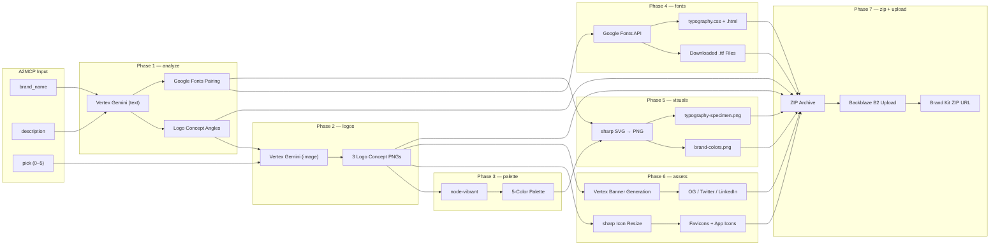

---

### End-to-End Sequence

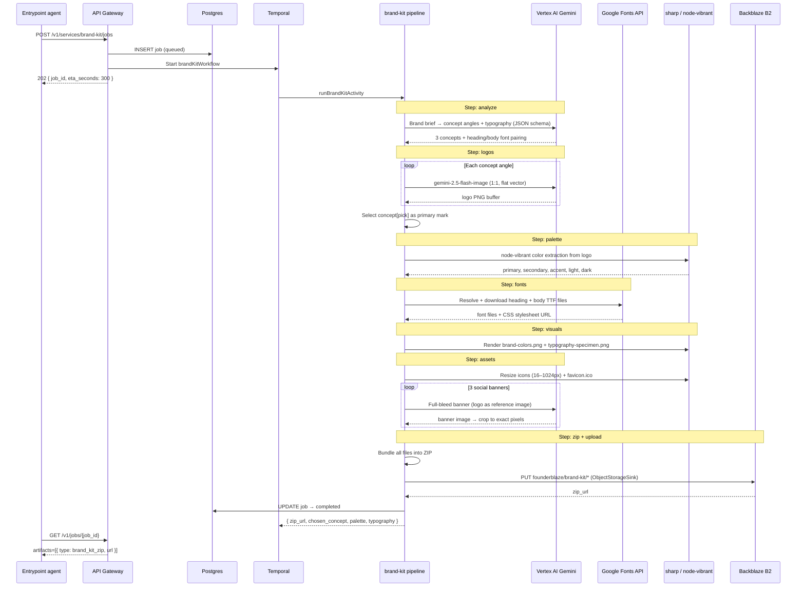

---

### How It Works — Phase by Phase

#### Phase 1: `analyze` — Brand Brief Analysis

The pipeline starts by turning your creative brief into structured creative direction.

**Vertex AI Gemini (text model: `gemini-3.1-flash-lite`)** receives the brand name and description with a senior brand designer prompt. Output is enforced via JSON schema:

```json
{
  "concepts": [
    {
      "id": "wordmark",
      "needsText": true,
      "style": "Clean geometric sans-serif wordmark with rounded terminals, evoking calm and breath..."
    },
    {
      "id": "lotus-mark",
      "needsText": false,
      "style": "Minimal single-line lotus icon, organic curves, flat vector..."
    },
    {
      "id": "initials-badge",
      "needsText": true,
      "style": "Circular badge with stylized 'S' monogram, wellness spa aesthetic..."
    }
  ],
  "typography": {
    "heading": "Fraunces",
    "body": "Source Sans 3",
    "mood": "calm-organic"
  }
}
```

**Concept rules:**
- Each concept must feel specific to *this* brand — not generic stock recipes
- Vary approaches (wordmark, symbol, monogram, emblem, pictorial, badge) when they fit
- `needsText: true` only when the logo must include readable brand name lettering
- `style` is a dense visual direction sentence for the image model

**Typography rules:**
- Heading and body fonts **must** come from a curated Google Fonts allowlist (~22 heading + ~18 body families)
- Enforced via JSON-schema `enum` — Gemini cannot hallucinate font names
- Near-misses are snapped to canonical allowlist names via `canonicalizeHeadingFont()` / `canonicalizeBodyFont()`

---

#### Phase 2: `logos` — AI Logo Generation

Each concept angle is rendered by **Vertex AI Gemini image model** (`gemini-2.5-flash-image`).

**Generation config:**

```typescript
{
  model: "gemini-2.5-flash-image",
  config: {
    responseModalities: ["TEXT", "IMAGE"],
    imageConfig: { aspectRatio: "1:1" },
  },
}
```

**Prompt variants:**

| `needsText` | Prompt focus |
|-------------|-------------|
| `true` | Brand name must appear exactly as spelled, legible lettering |
| `false` | Icon-only — no letters, words, or signatures |

Both variants enforce: square composition, flat vector aesthetic, high contrast, plain white background. No mockups, photography, 3D, or watermarks.

**Pacing:** `waitBetweenSteps()` pauses between image generations to respect Vertex rate limits.

**Concept selection:** The `pick` input (0–5) selects the primary mark for palette extraction and asset generation. **All concepts** are included in the ZIP under `concepts/`.

---

#### Phase 3: `palette` — Color Extraction

Colors are extracted from the **actual chosen logo pixels** — not invented by an LLM.

**node-vibrant** analyzes the logo PNG and maps swatches to brand roles:

| Role | Source Swatch |
|------|--------------|
| `primary` | Vibrant or DarkVibrant |
| `secondary` | Muted or LightVibrant |
| `accent` | DarkVibrant or Vibrant |
| `light` | LightMuted (fallback: `#F5F5F5`) |
| `dark` | DarkMuted (fallback: `#0A0A0A`) |

Typography from the analyst phase passes through unchanged — fonts were already locked to Google Fonts in Phase 1.

---

#### Phase 4: `fonts` — Google Fonts Resolution & Download

The pipeline resolves both heading and body fonts via the **Google Fonts CSS API**:

1. **Confirm availability** — fetch CSS stylesheet, verify `@font-face` blocks exist
2. **Build stylesheet URL** — `https://fonts.googleapis.com/css?family=...&display=swap`
3. **Download TTF files** — parse CSS, fetch `.ttf` sources for weights 400, 600, 700
4. **Generate deliverables:**
   - `typography.css` — ready-to-use `@font-face` declarations + CSS custom properties
   - `typography.html` — live preview page with both fonts rendered

Font files are included in the ZIP at `fonts/heading-*.ttf` and `fonts/body-*.ttf`.

If a font is not on Google Fonts (shouldn't happen due to allowlist), the pipeline logs a warning and continues with available fonts.

---

#### Phase 5: `visuals` — Brand Visual Specimens

Two shareable PNG images are rendered via **SVG → sharp rasterization**:

**`brand-colors.png`** (1600×520)
- Full-bleed equal-width color blocks
- Each block labeled with role name + hex code
- Text color auto-selected for contrast (black or white based on luminance)

**`typography-specimen.png`**
- Heading font sample at display size (uses downloaded TTF if available)
- Body font sample at readable size
- Brand name, font family names, and mood label

These are reference images for designers, pitch decks, and brand guidelines.

---

#### Phase 6: `assets` — Icons & Social Banners

**Icons (sharp resize from chosen logo):**

| File | Size |
|------|------|
| `favicon-16x16.png` | 16×16 |
| `favicon-32x32.png` | 32×32 |
| `favicon-48x48.png` | 48×48 |
| `favicon.ico` | Multi-size ICO (16+32+48) |
| `apple-touch-icon.png` | 180×180 |
| `android-chrome-192x192.png` | 192×192 |
| `app-icon-512x512.png` | 512×512 |
| `app-icon-1024x1024.png` | 1024×1024 |

**Social banners (Vertex AI image generation + sharp crop):**

| File | Dimensions | Aspect | Purpose |
|------|-----------|--------|---------|
| `og-image-1200x630.png` | 1200×630 | 16:9 → crop | Open Graph / social share |
| `twitter-banner-1500x500.png` | 1500×500 | 21:9 → crop | Twitter / X profile |
| `linkedin-banner-1584x396.png` | 1584×396 | 21:9 → crop | LinkedIn company banner |

Banner generation uses the **chosen logo as a reference image** (multimodal input) plus palette colors and typography mood. Prompts enforce full-bleed edge-to-edge compositions — no tiny centered logo on blank space. Generated at supported aspect ratio, then cropped to exact pixel dimensions via sharp.

---

#### Phase 7: `zip` + `upload` — Delivery

All assets are bundled into a single ZIP archive and uploaded to Backblaze B2.

**ZIP contents:**

```
solace-brand-kit.zip
├── assets/
│   ├── favicon-16x16.png
│   ├── favicon-32x32.png
│   ├── favicon-48x48.png
│   ├── favicon.ico
│   ├── apple-touch-icon.png
│   ├── android-chrome-192x192.png
│   ├── app-icon-512x512.png
│   ├── app-icon-1024x1024.png
│   ├── og-image-1200x630.png
│   ├── twitter-banner-1500x500.png
│   └── linkedin-banner-1584x396.png
├── concepts/
│   ├── wordmark.png
│   ├── lotus-mark.png
│   └── initials-badge.png
├── fonts/
│   ├── heading-Fraunces-400.ttf
│   ├── heading-Fraunces-600.ttf
│   ├── body-SourceSans3-400.ttf
│   └── body-SourceSans3-600.ttf
├── brand-colors.png
├── typography-specimen.png
├── typography.css
├── typography.html
├── brand-guide.json
└── analysis.json
```

**`brand-guide.json`** — machine-readable brand spec (palette, typography, chosen concept, font file paths, Google Fonts stylesheet URL).

**`analysis.json`** — raw analyst output (all concept angles, typography mood, rationale).

Uploaded under `founderblaze/brand-kit/…` via `build_b2_sink(service="brand-kit")` + `finalize_run_provenance` (sidecar).

---

### Internal Tools & Dependencies

| Tool | Role in Brand Kit | Module |
|------|------------------|--------|
| **Vertex AI Gemini (text)** | Brand brief analysis, concept angles, typography pairing | `agents/brandAnalyst.ts` |
| **Vertex AI Gemini (image)** | Logo generation + social banner generation | `agents/logoGenerator.ts`, `report/assetSizer.ts` |
| **node-vibrant** | Color palette extraction from logo pixels | `agents/paletteTypography.ts` |
| **Google Fonts API** | Font resolution, CSS URL, TTF download | `fonts/googleFonts.ts` |
| **sharp** | Icon resize, banner crop, SVG → PNG rasterization | `report/assetSizer.ts`, `report/brandVisuals.ts` |
| **png-to-ico** | Multi-size favicon.ico generation | `report/assetSizer.ts` |
| **archiver (ZIP)** | Brand kit bundling | `report/zipper.ts` |
| **Backblaze B2** | ZIP + provenance (`founderblaze/brand-kit/`) | [`brand_kit/pipeline.py`](https://github.com/Marshal-AM/founderblaze/blob/main/packages/founderblaze/src/founderblaze/brand_kit/pipeline.py), [`b2.py`](https://github.com/Marshal-AM/founderblaze/blob/main/packages/founderblaze/src/founderblaze/core/storage/b2.py) |
| **Temporal** | Single-activity durable workflow | `apps/orchestrator` |
| **PostgreSQL** | Job state, step tracking | `@founderblaze/db` |
| **Zod** | Input/output validation | `schema.ts`, `@founderblaze/schemas` |

#### Required Environment Variables

```bash
# Vertex AI — text + image generation
GOOGLE_SERVICE_ACCOUNT_JSON={"type":"service_account",...}
GOOGLE_CLOUD_PROJECT=your-project-id
GOOGLE_CLOUD_LOCATION=global
GEMINI_TEXT_MODEL=gemini-3.1-flash-lite
GEMINI_IMAGE_MODEL=gemini-2.5-flash-image

# Backblaze B2 — ZIP delivery
B2_KEY_ID=
B2_APP_KEY=
B2_BUCKET=
B2_REGION=us-east-005
```

---

### A2MCP Request Body

**Endpoint:** `POST /v1/services/brand-kit/jobs`


#### Full Request Example

```json
{
  "input": {
    "brand_name": "Solace",
    "description": "calm meditation app, minimalist, organic, wellness",
    "pick": 0
  },
  "callback_url": "https://your-app.com/webhooks/founderblaze",
  "priority": "normal"
}
```

#### Input Schema (`BrandKitInputSchema`)

| Field | Required | Type | Default | Constraints |
|-------|----------|------|---------|-------------|
| `brand_name` | **Yes** | `string` | — | 1–80 characters |
| `description` | **Yes** | `string` | — | 10–2,000 characters — creative brief for the brand (mood, audience, aesthetic, industry) |
| `pick` | No | `integer` | `0` | 0–5 — index of logo concept to use as primary mark (all concepts included in ZIP) |

#### Minimal Request

```json
{
  "input": {
    "brand_name": "Forge",
    "description": "AI-powered marketing suite for solo founders, bold and modern, developer-friendly"
  }
}
```

#### cURL Example (local dev)

```bash
curl -X POST http://localhost:4021/v1/services/brand-kit/jobs \
  -H "Content-Type: application/json" \
  -H "X-Idempotency-Key: bk-solace-$(date +%s)" \
  -d '{
    "input": {
      "brand_name": "Solace",
      "description": "calm meditation app, minimalist, organic, wellness",
      "pick": 0
    }
  }'
```

#### Create Response (`202 Accepted`)

```json
{
  "job_id": "f6a7b8c9-d0e1-2345-f012-456789012345",
  "eta_seconds": 300,
  "status_url": "/v1/jobs/f6a7b8c9-d0e1-2345-f012-456789012345",
  "status": "queued"
}
```

#### Poll Response — In Progress

```json
{
  "id": "f6a7b8c9-d0e1-2345-f012-456789012345",
  "service": "brand-kit",
  "status": "running",
  "step": "logos",
  "artifacts": [],
  "cost_breakdown": [],
  "error": null,
  "created_at": "2026-07-27T15:00:00.000Z",
  "updated_at": "2026-07-27T15:03:00.000Z",
  "eta_seconds": 300
}
```

The `step` field reflects the current pipeline phase: `analyze` → `logos` → `palette` → `fonts` → `visuals` → `assets` → `zip` → `upload`.

#### Poll Response — Completed

```json
{
  "id": "f6a7b8c9-d0e1-2345-f012-456789012345",
  "service": "brand-kit",
  "status": "completed",
  "step": "upload",
  "artifacts": [
    {
      "type": "brand_kit_zip",
      "url": "https://s3.us-east-005.backblazeb2.com/your-bucket/founderblaze/brandkit/2026-07-27T15-10-00-abc12345-solace-brand-kit.zip",
      "object_key": "brandkit/2026-07-27T15-10-00-abc12345-solace-brand-kit.zip",
      "mime_type": "application/zip"
    }
  ],
  "cost_breakdown": [],
  "error": null,
  "created_at": "2026-07-27T15:00:00.000Z",
  "updated_at": "2026-07-27T15:10:30.000Z",
  "eta_seconds": 300
}
```

The job output also includes `chosen_concept`, `palette`, and `typography` objects for programmatic use without unzipping.

---

### Temporal Orchestration

Brand Kit uses a **single-activity workflow** — one durable Temporal activity wraps the entire `runPipeline()` call, including multiple Vertex AI image generations.

```typescript
// apps/orchestrator/src/workflows/brandKit.ts
export async function brandKitWorkflow(input) {
  await short.markJobRunning(input.job_id);

  const result = await long.runBrandKitActivity({
    job_id: input.job_id,
    brand_name: input.brand_name,
    description: input.description,
    pick: input.pick,
  });

  await short.completeJob(input.job_id, {
    artifacts: [{
      type: "brand_kit_zip",
      url: result.zip_url,
      object_key: result.object_key,
      mime_type: "application/zip",
    }],
    cost_breakdown: result.cost_breakdown,
  });
}
```

| Activity Config | Value | Reason |
|-----------------|-------|--------|
| `startToCloseTimeout` | 5 minutes | Multiple Gemini image generations (logos + banners) |
| `heartbeatTimeout` | 2 minutes | Image generation calls |
| `maximumAttempts` | 1 | Avoid duplicate image generation on retry |
| Heartbeat interval | 30 seconds | Keeps activity alive during Vertex calls |

Inside the activity, `onStep` callbacks update the job's `step` field and emit heartbeats with the current phase.

---

### Error Handling & Edge Cases

| Scenario | Behavior |
|----------|----------|
| `GOOGLE_SERVICE_ACCOUNT_JSON` missing/invalid | Hard fail at pipeline start |
| Brand analyst returns non-JSON | Hard fail at `analyze` |
| Font name outside allowlist | Snapped to nearest canonical name |
| Vertex returns no image for a concept | Hard fail for that concept |
| `pick` index out of range | Falls back to first concept (`concepts[0]`) |
| Google Font not available | Logged warning; continues without TTF files for that font |
| Banner generation fails | Hard fail for that banner |
| Empty ZIP buffer | Hard fail at upload |
| Backblaze B2 not configured | Hard fail at `upload` |
| Vertex rate limit | `waitBetweenSteps()` + `generateContentWithRetry()` with backoff |
| Duplicate job (same idempotency key) | Returns existing job |

---

### The `pick` Parameter — Choosing Your Logo

Brand Kit generates **3 logo concepts** by default. The `pick` parameter selects which one drives palette extraction, icon generation, and banner composition.

| `pick` | Behavior |
|--------|----------|
| `0` (default) | First concept is the primary mark |
| `1` | Second concept is the primary mark |
| `2` | Third concept is the primary mark |

**All concepts are always included** in `concepts/` inside the ZIP — `pick` only affects which mark is used for downstream assets. To compare options, run once with `pick: 0`, review all three in the ZIP, then re-run with your preferred index if needed.

---

## Service 7 — App Kit

> **Product name + idea in. Desktop and mobile UI mock ZIP out.**

You have a brand. You have a pitch. What you still need is something that *looks like the product* — real screens, real navigation, desktop and phone layouts — before you hire a designer or open Figma for three weeks.

App Kit is FounderBlaze's **UI generation engine**. Send a product name and a short product idea. Gemini plans a complete mini information architecture (typically 6–10 screens). Optionally pass a downloadable **brand-kit ZIP URL** so every screen is conditioned on your real logos and palette; otherwise App Kit invents a cohesive visual system from the brief. Gemini's image model then generates a high-fidelity **desktop** and **mobile** designs for each planned screen. Everything is zipped (`desktop/`, `mobile/`, `manifest.json`) and uploaded to Backblaze B2.

No Figma retainer. No generic wireframe pack. **One API call. One ZIP. A full set of UI mocks.**

**SLA:** ~5 minutes · **Output:** Backblaze-hosted app kit ZIP (`app_kit_zip`)

### Genblaze usage

App Kit is a **four-step Genblaze DAG**: plan IA → resolve brand context → generate desktop/mobile UI mocks as an IMAGE step → zip. Entry: [`run_app_kit_pipeline`](https://github.com/Marshal-AM/founderblaze/blob/main/packages/founderblaze/src/founderblaze/app_kit/pipeline.py#L29).

**Pipeline graph** — [`from genblaze_core import Modality, Pipeline`](https://github.com/Marshal-AM/founderblaze/blob/main/packages/founderblaze/src/founderblaze/app_kit/pipeline.py#L8); sink [`build_b2_sink(service="app-kit")` L58](https://github.com/Marshal-AM/founderblaze/blob/main/packages/founderblaze/src/founderblaze/app_kit/pipeline.py#L58); [`Pipeline("app-kit")` L63](https://github.com/Marshal-AM/founderblaze/blob/main/packages/founderblaze/src/founderblaze/app_kit/pipeline.py#L63):

| # | Provider | Modality | `.step` / fan-in |
|---|----------|----------|------------------|
| 0 | `PlanScreensProvider` | [TEXT L77](https://github.com/Marshal-AM/founderblaze/blob/main/packages/founderblaze/src/founderblaze/app_kit/pipeline.py#L77) | [L68](https://github.com/Marshal-AM/founderblaze/blob/main/packages/founderblaze/src/founderblaze/app_kit/pipeline.py#L68) |
| 1 | `BrandContextProvider` | [TEXT L88](https://github.com/Marshal-AM/founderblaze/blob/main/packages/founderblaze/src/founderblaze/app_kit/pipeline.py#L88) | [L79](https://github.com/Marshal-AM/founderblaze/blob/main/packages/founderblaze/src/founderblaze/app_kit/pipeline.py#L79) (`input_from=[0]`) — download+unzip optional brand-kit ZIP or invent brand |
| 2 | `ScreensProvider` | [IMAGE L99](https://github.com/Marshal-AM/founderblaze/blob/main/packages/founderblaze/src/founderblaze/app_kit/pipeline.py#L99) | [L91](https://github.com/Marshal-AM/founderblaze/blob/main/packages/founderblaze/src/founderblaze/app_kit/pipeline.py#L91) (`input_from=[0,1]`) — desktop + mobile mocks per screen |
| 3 | `ZipProvider` | [TEXT L109](https://github.com/Marshal-AM/founderblaze/blob/main/packages/founderblaze/src/founderblaze/app_kit/pipeline.py#L109) | [L102](https://github.com/Marshal-AM/founderblaze/blob/main/packages/founderblaze/src/founderblaze/app_kit/pipeline.py#L102) (`input_from=[0,1,2]`) |

Run / Genblaze→B2 handoff: [`.run(sink=…)` L112](https://github.com/Marshal-AM/founderblaze/blob/main/packages/founderblaze/src/founderblaze/app_kit/pipeline.py#L112).

**SyncProviders:**

| Provider | Role | Links |
|----------|------|-------|
| `PlanScreensProvider` | Mini IA / screen list via `genblaze_google.chat` | [class](https://github.com/Marshal-AM/founderblaze/blob/main/packages/founderblaze/src/founderblaze/app_kit/plan_provider.py#L19), [capabilities](https://github.com/Marshal-AM/founderblaze/blob/main/packages/founderblaze/src/founderblaze/app_kit/plan_provider.py#L38), [`chat` import](https://github.com/Marshal-AM/founderblaze/blob/main/packages/founderblaze/src/founderblaze/app_kit/plan_provider.py#L12), [`chat(...)` L83](https://github.com/Marshal-AM/founderblaze/blob/main/packages/founderblaze/src/founderblaze/app_kit/plan_provider.py#L83) |
| `BrandContextProvider` | Brand ZIP extract or invent direction via `chat` | [class](https://github.com/Marshal-AM/founderblaze/blob/main/packages/founderblaze/src/founderblaze/app_kit/brand_context_provider.py#L24), [capabilities](https://github.com/Marshal-AM/founderblaze/blob/main/packages/founderblaze/src/founderblaze/app_kit/brand_context_provider.py#L45), [`chat` import](https://github.com/Marshal-AM/founderblaze/blob/main/packages/founderblaze/src/founderblaze/app_kit/brand_context_provider.py#L14), [`chat(...)` L226](https://github.com/Marshal-AM/founderblaze/blob/main/packages/founderblaze/src/founderblaze/app_kit/brand_context_provider.py#L226) |
| `ScreensProvider` | Genblaze IMAGE step; loops Gemini image gen per screen | [class](https://github.com/Marshal-AM/founderblaze/blob/main/packages/founderblaze/src/founderblaze/app_kit/screens_provider.py#L22), [capabilities](https://github.com/Marshal-AM/founderblaze/blob/main/packages/founderblaze/src/founderblaze/app_kit/screens_provider.py#L41), [`generate` L48](https://github.com/Marshal-AM/founderblaze/blob/main/packages/founderblaze/src/founderblaze/app_kit/screens_provider.py#L48) |
| `ZipProvider` | Pack `desktop/` + `mobile/` + manifest | [class](https://github.com/Marshal-AM/founderblaze/blob/main/packages/founderblaze/src/founderblaze/app_kit/zip_provider.py#L22), [capabilities](https://github.com/Marshal-AM/founderblaze/blob/main/packages/founderblaze/src/founderblaze/app_kit/zip_provider.py#L39) |

**`Asset` helpers** — [`from genblaze_core import Asset`](https://github.com/Marshal-AM/founderblaze/blob/main/packages/founderblaze/src/founderblaze/app_kit/_assets.py#L14), [`Asset(...)` L67](https://github.com/Marshal-AM/founderblaze/blob/main/packages/founderblaze/src/founderblaze/app_kit/_assets.py#L67).

**After run** — [`pick_final_zip_asset` call L123](https://github.com/Marshal-AM/founderblaze/blob/main/packages/founderblaze/src/founderblaze/app_kit/pipeline.py#L123) / [def L169](https://github.com/Marshal-AM/founderblaze/blob/main/packages/founderblaze/src/founderblaze/app_kit/pipeline.py#L169), [`finalize_run_provenance` L128](https://github.com/Marshal-AM/founderblaze/blob/main/packages/founderblaze/src/founderblaze/app_kit/pipeline.py#L128), [`merge_provenance` L137](https://github.com/Marshal-AM/founderblaze/blob/main/packages/founderblaze/src/founderblaze/app_kit/pipeline.py#L137).

### Backblaze usage

**Code:** `pick_final_zip_asset` in [`app_kit/pipeline.py`](https://github.com/Marshal-AM/founderblaze/blob/main/packages/founderblaze/src/founderblaze/app_kit/pipeline.py) → [`resolve_download_url`](https://github.com/Marshal-AM/founderblaze/blob/main/packages/founderblaze/src/founderblaze/core/storage/b2.py#L56) → [`finalize_run_provenance`](https://github.com/Marshal-AM/founderblaze/blob/main/packages/founderblaze/src/founderblaze/core/storage/provenance.py#L69) (`mode="sidecar"`) → [`merge_provenance`](https://github.com/Marshal-AM/founderblaze/blob/main/packages/founderblaze/src/founderblaze/core/storage/provenance.py#L289). Artifact type: `app_kit_zip`.

Prefix: `founderblaze/app-kit/…` (`desktop/`, `mobile/`, `manifest.json` inside the ZIP). Optional `brand_kit_url` is fetched over HTTP inside `BrandContextProvider` for styling only — it is **not** re-uploaded as the primary deliverable; the App Kit ZIP on B2 is.

---

### The Pitch

Imagine handing a designer a pack of production-quality UI screens — splash, auth, home, detail, settings, empty states — in both desktop and mobile layouts, under five minutes after describing the product in two sentences. Optionally style every screen from the Brand Kit ZIP you already generated.

That is App Kit.

You send:

```json
{
  "product_name": "Solace",
  "product_idea": "A calm meditation app with guided sessions, streaks, and a personal journal.",
  "brand_kit_url": null
}
```

Or, after Brand Kit completes, pass the ZIP URL:

```json
{
  "product_name": "Solace",
  "product_idea": "A calm meditation app with guided sessions, streaks, and a personal journal.",
  "brand_kit_url": "https://s3.us-east-005.backblazeb2.com/your-bucket/founderblaze/brand-kit/...-brand-kit.zip"
}
```

The pipeline plans the IA, resolves brand context (download + unzip brand kit, or invent palette/typography/voice), generates `{screen}-desktop.png` and `{screen}-mobile.png` for each screen, and packs the ZIP.

**This is the UI surface a solo founder needs before writing a line of frontend.**

---

### Pipeline Diagram

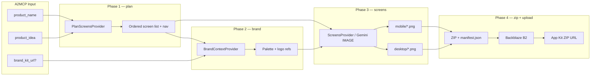

---

### A2MCP Request Body

**Endpoint:** `POST /v1/services/app-kit/jobs`

#### Full Request Example

```json
{
  "input": {
    "product_name": "Solace",
    "product_idea": "A calm meditation app with guided sessions, streaks, and a personal journal.",
    "brand_kit_url": null
  },
  "priority": "normal"
}
```

#### Input Schema (`AppKitInput`)

| Field | Required | Notes |
|-------|----------|-------|
| `product_name` | Yes | 1–80 chars |
| `product_idea` | Yes | 10–4000 chars — product brief / IA seed |
| `brand_kit_url` | No | Downloadable brand-kit ZIP URL; fail hard if download/unzip fails |

#### cURL Example (local dev)

```bash
curl -X POST http://localhost:4021/v1/services/app-kit/jobs \
  -H "Content-Type: application/json" \
  -H "X-Idempotency-Key: app-kit-solace-$(date +%s)" \
  -d '{
    "input": {
      "product_name": "Solace",
      "product_idea": "A calm meditation app with guided sessions, streaks, and a personal journal."
    }
  }'
```

#### Live CLI

```bash
uv run --package founderblaze founderblaze-app-kit-live \
  --product-name "Solace" \
  --product-idea "A calm meditation app with guided sessions, streaks, and a personal journal." \
  --no-b2
```

#### Create Response (`202 Accepted`)

```json
{
  "job_id": "uuid",
  "eta_seconds": 300,
  "status_url": "/v1/jobs/uuid",
  "status": "queued"
}
```

#### Poll Response — Completed

```json
{
  "id": "uuid",
  "service": "app-kit",
  "status": "completed",
  "artifacts": [
    {
      "type": "app_kit_zip",
      "mime_type": "application/zip",
      "url": "https://s3.us-east-005.backblazeb2.com/your-bucket/founderblaze/app-kit/...-app-kit.zip",
      "object_key": "app-kit/...-app-kit.zip"
    }
  ]
}
```

---

## Universal API Reference

All seven services share the same HTTP contract. Pay once on job creation; poll for free until artifacts are ready.

**Base URL:** `https://your-domain` (local dev: `http://localhost:4021`)

---

### Endpoints

| Method | Path | Paid? | Description |
|--------|------|-------|-------------|
| `GET` | `/health` | Free | Gateway health + service list |
| `GET` | `/v1/services` | Free | Catalog with prices and SLAs |
| `POST` | `/v1/services/{service}/jobs` | **Paid** (A2MCP) | Create async job → `202` |
| `GET` | `/v1/jobs/{jobId}` | Free | Poll status, step, artifacts |

---

### Headers

| Header | Required | Purpose |
|--------|----------|---------|
| `Content-Type: application/json` | On `POST` | Request body is JSON |
| `X-Idempotency-Key` | Recommended | Dedupes job creation per service on retry |

---

### Create Job — Request Envelope

Every job-create call uses the same outer body:

```json
{
  "input": { /* service-specific — see table below */ },
  "callback_url": "https://your-app.com/webhooks/founderblaze",
  "priority": "normal"
}
```

| Field | Required | Notes |
|-------|----------|-------|
| `input` | Yes | Validated per service (Pydantic) |
| `callback_url` | No | Optional webhook on completion |
| `priority` | No | `"low"` \| `"normal"` \| `"high"` (default `"normal"`) |

**Response (`202 Accepted`):**

```json
{
  "job_id": "uuid",
  "eta_seconds": 300,
  "status_url": "/v1/jobs/uuid",
  "status": "queued"
}
```

Use `X-Idempotency-Key` on create so a retried request does not enqueue duplicate jobs (dedup is handled by the gateway).

---

### Poll Job — Response

```json
{
  "id": "uuid",
  "service": "competitor-research",
  "status": "running",
  "step": "scrapePricing",
  "artifacts": [],
  "cost_breakdown": [],
  "error": null,
  "created_at": "2026-07-27T10:00:00.000Z",
  "updated_at": "2026-07-27T10:05:00.000Z",
  "eta_seconds": 300
}
```

**Job statuses:** `queued` → `running` → `completed` | `failed` | `cancelled`

When `status` is `completed`, `artifacts[]` holds download URLs (`video`, `pdf_report`, `report_pdf`, `brand_kit_zip`, `app_kit_zip`, etc.).

---

### Service Catalog & Input Schemas

| Service slug | SLA | `input` fields |
|--------------|-----|----------------|
| `promo-video` | 5 min | `product_url` · `duration?` · `resolution?` · `max_pages?` |
| `automated-product-demo` | 5 min | `website_url` · `script` |
| `social-listening` | 5 min | `product_url` · `max_posts?` |
| `outreach` | 5 min | `website_url` · `sheet_url` |
| `competitor-research` | 5 min | `product_name` · `product_url?` |
| `brand-kit` | 5 min | `brand_name` · `description` · `pick?` |
| `app-kit` | 5 min | `product_name` · `product_idea` · `brand_kit_url?` |

**Example — create + poll:**

```bash
# Create job
curl -X POST http://localhost:4021/v1/services/promo-video/jobs \
  -H "Content-Type: application/json" \
  -H "X-Idempotency-Key: my-job-1" \
  -d '{"input":{"product_url":"https://linear.app"}}'

# Poll status
curl http://localhost:4021/v1/jobs/{job_id}
```

**List discovery catalog:**

```bash
curl http://localhost:4021/v1/discovery
```

---

### Common Errors

| HTTP | `error` | Meaning |
|------|---------|---------|
| `400` | `invalid_body` | Malformed JSON envelope |
| `400` | `invalid_input` | Service `input` failed Pydantic validation |
| `404` | `unknown_service` | Bad `:service` slug |
| `404` | `not_found` | Unknown `job_id` |

Per-service request examples and artifact shapes are documented in each service section above.

---

## Conclusion

We are watching the birth of a new kind of company.

One person. One laptop. One product that should not be possible at that scale — and yet it ships, it grows, it wins. The solo founder is no longer a side project archetype. They are the fastest-moving builders on earth, backed by AI that collapsed the cost of code, design, and infrastructure overnight.

But the rest of the company did not collapse with them.

Brand, product UI, demos, competitive intel, community, and investor outreach still eat the calendar of every founder who tries to do it alone. Until now, the choice was brutal: hire a team you cannot afford, buy tools that do not talk to each other, or ship into silence and hope Product Hunt saves you.

**FounderBlaze ends that tradeoff.**

Seven services. One entrypoint agent. Genblaze pipelines. Backblaze deliverables.

| You need… | FounderBlaze gives you… |
|-----------|-------------------------|
| A launch video | Promo Video — cinematic ad from your URL |
| A product walkthrough | Automated Product Demo — narrated screen recording |
| Reddit distribution | Social Listening — threads + draft replies |
| Investor outreach | Outreach — intelligence report from site + revenue sheet |
| Competitive positioning | Competitor Research — feature matrix, pricing, SWOT, PDF |
| A visual identity | Brand Kit — logos, colors, fonts, banners, ZIP |
| UI mockups for the product | App Kit — desktop + mobile screen mocks, ZIP |

Every service is **agent-native** — discoverable via MCP and the agent API, executed as A2MCP jobs, and delivered as B2 artifacts. Human founders chat with the entrypoint agent. External tools call the same catalog through MCP. No agency retainers. No six-week creative cycle.

This is **company infrastructure for the multi-agent stack** — where the unit of work is a delegated pipeline run, and the unit of output is a file you can ship today.

The one-person billion-dollar company does not need a hundred-person org chart.

It needs FounderBlaze.

**The next big thing is not another tool. It is the entire company — callable through an agent, orchestrated by Genblaze, and deliverable from Backblaze in minutes.**

---

